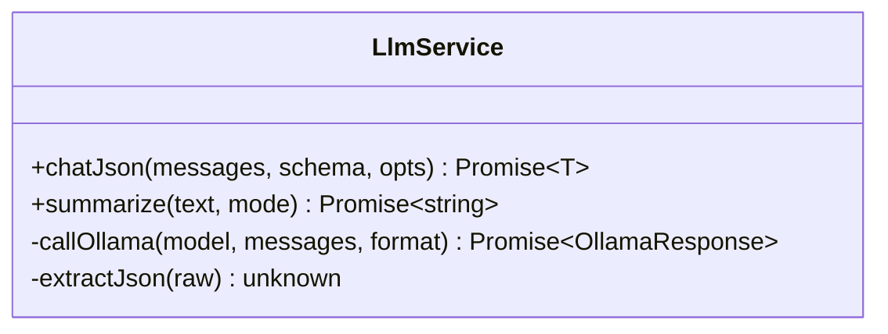
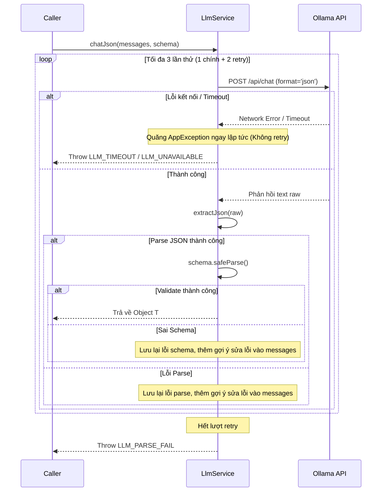

---
date: 2026-05-31
---
# Task P04.T5 — LlmService (Ollama JSON Mode + Retry)

## 1. Mô tả tính năng
Triển khai `LlmService` để giao tiếp với Ollama API. Dịch vụ hỗ trợ:
- Chế độ JSON (`chatJson`) để lấy phản hồi có cấu trúc từ LLM lớn (`qwen2.5:14b`), tự động validate bằng Zod schema, hỗ trợ retry tối đa 2 lần kèm theo hint sửa lỗi nếu LLM trả về JSON lỗi hoặc không đúng schema.
- Chế độ Tóm tắt (`summarize`) để tóm tắt văn bản bằng LLM nhỏ (`qwen2.5:3b`) lấy template hệ thống từ `@chatai/prompts`.
- Xử lý lỗi kết nối, timeout và map về các `AppException` chuẩn (`LLM_TIMEOUT`, `LLM_UNAVAILABLE`, `LLM_PARSE_FAIL`).

## 2. Chi tiết tính năng từng hàm

### `LlmService`
- **`constructor(configService)`**: Khởi tạo Axios instance kết nối tới Ollama URL, cấu hình timeout 60 giây. Lấy tên model lớn (`ollamaModelLarge`) và model nhỏ (`ollamaModelSmall`) từ config.
- **`chatJson(messages, schema, opts)`**: 
  - Thực hiện gọi Ollama API ở định dạng JSON.
  - Sử dụng vòng lặp retry tối đa 2 lần. Nếu gặp lỗi parse hoặc validate ở các vòng trước, thêm tin nhắn `system` gợi ý sửa lỗi cùng chi tiết lỗi trước đó vào payload gửi đi.
  - Trích xuất JSON từ phản hồi và thực hiện `schema.safeParse()`.
  - Nếu thành công, trả về dữ liệu đã parse. Nếu thất bại sau tất cả số lần thử, ném lỗi `LLM_PARSE_FAIL`.
- **`summarize(text, mode)`**:
  - Tải template tóm tắt tương ứng (`summary_plot`, `summary_session`, `summary_character`) qua `TemplateLoader.loadTemplate(...)`.
  - Gọi Ollama API với model nhỏ, không định dạng JSON để nhận văn bản thuần túy (plain text), cắt bỏ khoảng trắng thừa đầu cuối và trả về.
- **`callOllama(model, messages, format)`**:
  - Gửi yêu cầu HTTP POST đến `/api/chat`.
  - Bắt lỗi Axios để quăng đúng `AppException`:
    - `ECONNABORTED` / `ETIMEDOUT` -> `LLM_TIMEOUT`
    - `ECONNREFUSED` / No Response -> `LLM_UNAVAILABLE`
- **`extractJson(raw)`**:
  - Thực hiện loại bỏ khoảng trắng thừa.
  - Thử parse trực tiếp.
  - Thử trích xuất từ các khối code fenced block (ví dụ: ` ```json ... ``` `).
  - Thử tìm cặp ngoặc nhọn `{ ... }` hoặc ngoặc vuông `[ ... ]` ngoài cùng để parse.
  - Nếu tất cả đều thất bại, ném ngoại lệ lỗi.

## 3. Biểu đồ Mermaid cho Data Flow / Class Diagram




## 4. Lưu ý quan trọng (Gotchas, Bugs) và cách giải quyết
- **Lỗi strict-mode TypeScript**: Khi trích xuất regex match, `trimmed.match(...)` có thể trả về null, và phần tử `match[1]` có thể là `undefined`. Cần kiểm tra kỹ lưỡng `if (fencedMatch && fencedMatch[1])` trước khi gọi `.trim()` hoặc truy cập để tránh lỗi `TS2532: Object is possibly 'undefined'`.
- **Hành vi retry**: Cơ chế retry chỉ áp dụng khi LLM trả về cấu trúc JSON hỏng hoặc sai Zod schema. Nếu gặp lỗi hạ tầng mạng như Timeout hoặc Mất kết nối (`ECONNREFUSED`), hệ thống phải ném lỗi ngay lập tức mà không tiến hành retry để tránh lãng phí tài nguyên và làm tăng thời gian chờ của người dùng.
- **Thiếu thư viện Zod**: Project server chưa có sẵn dependency `zod` trong `package.json`, cần phải chạy cài đặt bằng lệnh `pnpm --filter @chatai/server add zod` trước khi tạo các schema Zod.
