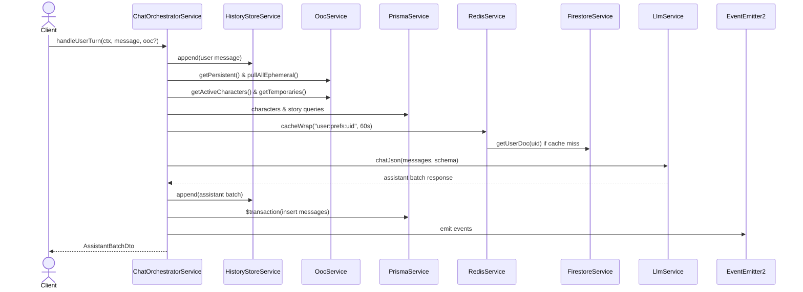

---
date: 2026-05-31
---
# Task P04.T6 — ChatOrchestratorService

Tài liệu này ghi lại chi tiết triển khai dịch vụ điều phối hội thoại `ChatOrchestratorService` và các bài học kinh nghiệm thu được.

## 1. Mô tả tính năng
`ChatOrchestratorService` chịu trách nhiệm điều phối toàn bộ vòng đời của một lượt chat từ phía người dùng (`handleUserTurn`). Dịch vụ này liên kết các thành phần khác bao gồm lịch sử chat (`HistoryStoreService`), OOC context (`OocService`), Prompt Builder (`PromptBuilderService`), kết nối LLM (`LlmService`), lưu trữ DB (`PrismaService`), lấy profile người dùng (`FirestoreService` & `RedisService`) và phát sự kiện cho hệ thống.

## 2. Chi tiết các hàm

### `handleUserTurn(ctx: ChatContext, userMessage: string, ephemeralOOC?: string): Promise<AssistantBatchDto>`
- **Đầu vào**: Bối cảnh chat (`ChatContext`), tin nhắn người dùng và tin nhắn OOC tạm thời (tùy chọn).
- **Quy trình xử lý**:
  1. Validate độ dài tin nhắn người dùng (1..2000) và OOC tạm thời (tối đa 500).
  2. Lưu tin nhắn người dùng vào tệp lịch sử `.jsonl`.
  3. Lấy các thông tin OOC (persistent + ephemeral).
  4. Lấy thông tin các nhân vật đang hoạt động (active) và tạm thời (temporary).
  5. Lấy thông tin bối cảnh câu chuyện (`story`).
  6. Lấy cấu hình ngôn ngữ/trình độ HSK của người dùng (có cache Redis 60s).
  7. Dựng System Prompt và chuỗi tin nhắn gửi LLM (bỏ đi lượt user vừa append để gửi riêng biệt).
  8. Gọi LLM ở chế độ JSON Mode với schema định nghĩa trước.
  9. Lưu kết quả phản hồi của LLM vào tệp lịch sử `.jsonl`.
  10. Bắt đầu transaction Prisma để lưu trữ tin nhắn User, Ephemeral OOC (nếu có) và danh sách phản hồi của Assistant.
  11. Phát sự kiện `USER_SENT_MESSAGE` và `ASSISTANT_REPLIED`.
  12. Trả về DTO cho client.

### `fetchUserPreferences(uid: string)`
- Truy vấn profile người dùng thông qua `FirestoreService.getUserDoc`.
- Sử dụng `RedisService.cacheWrap` để cache kết quả trong 60 giây với key `user:prefs:${uid}`.
- Có fallback về HSK3 và tiếng Việt nếu không tìm thấy profile.

### `getNextTurnOrder(sessionId: string)`
- Thực hiện gom nhóm (aggregate) tìm `turnOrder` lớn nhất hiện có trong phiên hội thoại và cộng thêm 1.

### `persistMessages(...)`
- Sử dụng prisma `$transaction` để đảm bảo tính toàn vẹn dữ liệu khi chèn đồng thời tin nhắn user và các tin nhắn phản hồi của assistant.
- Tự động so khớp tên nhân vật để lưu `characterId` chính xác cho từng tin nhắn trợ lý.

### `transformToDto(records: any[])`
- Chuyển đổi dữ liệu từ các bản ghi DB sang định dạng DTO cho client.
- Chuyển đổi trường `timestamp` kiểu `BigInt` sang `Number` để tránh lỗi tuần tự hóa JSON trên client.

## 3. Luồng dữ liệu (Data Flow)

## 4. Lưu ý quan trọng (Gotchas & Bugs)

1. **Lỗi typescript với các mock của Jest**:
   - *Vấn đề*: Khi mock các dependency và định nghĩa kiểu mock là `jest.Mocked<Partial<Service>>`, typescript compiler sẽ phàn nàn `mockRejectedValue` hoặc `mockResolvedValue` không tồn tại, hoặc biến có thể là `undefined`.
   - *Cách giải quyết*: Khai báo kiểu cho các biến mock là `any` ở đầu spec test để bypass kiểm tra kiểu tĩnh của compiler khi thiết lập mock behavior trong từng test case.

2. **Lưu trữ các trường JSON nullable trong Prisma**:
   - *Vấn đề*: Trường `words` và `shopEvent` trong DB có kiểu JSON và cho phép NULL. Nếu truyền trực tiếp `null` từ TypeScript, Prisma Client sẽ ném lỗi vì nó phân biệt JSON null (`JsonNull`) và database null (`DbNull`).
   - *Cách giải quyết*: Đối với bản ghi không có thông tin này, hãy loại bỏ trường đó ra khỏi payload chèn hoặc sử dụng `?? undefined`. Prisma sẽ tự động chèn giá trị database NULL vào các cột này.

3. **Chuyển đổi kiểu dữ liệu BigInt**:
   - *Vấn đề*: Prisma trả về trường `timestamp` với kiểu `BigInt` (do định nghĩa trong schema). Kiểu dữ liệu này không thể trực tiếp chuyển đổi qua JSON khi gửi về client (gây lỗi `Do not know how to serialize a BigInt`).
   - *Cách giải quyết*: Thực hiện chuyển đổi `Number(r.timestamp)` trong hàm `transformToDto`.

4. **Kiểu dữ liệu voiceName trong CharacterDto**:
   - *Vấn đề*: Trường `voiceName` trong Model DB `Character` có kiểu `string`, nhưng trong `CharacterDto` lại bị giới hạn enum hẹp hơn.
   - *Cách giải quyết*: Khi gọi `promptBuilder.buildSystemPrompt`, ta cast `characters as any` để tránh lỗi gán kiểu không khớp.
