---
date: 2026-05-31
---
# Bộ nhớ Dự án (Memori) - ChatController & Session Lock (P04.T7)

Tài liệu này lưu trữ bối cảnh thiết kế, đặc tả chức năng và các lưu ý kỹ thuật quan trọng của việc tích hợp `ChatController`, `ChatSessionService`, cơ chế khóa phiên (Redis Lock) và refactor `StoriesService` trong NestJS server.

## 1. Mô tả tính năng
Tích hợp các endpoint giao tiếp chat và bối cảnh Out Of Character (OOC):
- RESTful APIs cho việc bắt đầu session (`/chat/sessions`), lấy lịch sử chat (`/chat/sessions/:sid/history`), gửi tin nhắn (`/chat/sessions/:sid/message`), điều chỉnh OOC (`/chat/sessions/:sid/ooc`), bật/tắt nhân vật (`/chat/sessions/:sid/character-toggle`), và thêm nhân vật tạm thời (`/chat/sessions/:sid/temp-character`).
- Quản lý phiên hội thoại qua `ChatSessionService` (khởi tạo, phân quyền sở hữu và hydrate lịch sử từ tệp JSONL).
- Áp dụng cơ chế khóa Redis Lock (`withLock`) chống gửi request xử lý tin nhắn đồng thời trên cùng một session ID.
- Loại bỏ mock và triển khai thực tế hàm `hasActiveSession` kiểm tra phiên hoạt động của truyện.

## 2. Chi tiết cấu trúc và chức năng từng hàm

### `ChatSessionService`
- `findOrStart(userId, storyId)`: Kiểm tra quyền sở hữu truyện. Tìm session có trạng thái `active` của người dùng đối với câu chuyện đó. Nếu thấy mà Redis hết hạn (mảng active characters trống), thực hiện nạp lại danh sách nhân vật hoạt động từ DB vào Redis. Nếu chưa có session active, tạo mới trong cơ sở dữ liệu, khởi tạo danh sách nhân vật hoạt động trên Redis và ghi nhật ký system vào file `.jsonl`.
- `getSessionForUser(userId, sid)`: Truy vấn thông tin session trong database, ném lỗi `SESSION_NOT_FOUND` nếu không tồn tại hoặc `FORBIDDEN` nếu session không thuộc quyền sở hữu của `userId` hiện tại.
- `getHistoryHydrated(sid)`: Đọc và ánh xạ toàn bộ nhật ký file `.jsonl` của session thành danh sách `MessageDto[]` tương thích với client, đồng thời lấy bối cảnh persistent OOC và active characters hiện tại từ Redis.

### `ChatController`
- `sendMessage(user, sid, dto)`: Gửi tin nhắn của người dùng trong phiên hội thoại. Endpoint này được bao bọc bởi `@UseGuards(RedisThrottlerGuard)` để giới hạn tần suất gửi tin, và sử dụng khóa lock phân tán của Redis với TTL 30s (`chat:lock:${sid}`). Mọi request song song trên cùng session trong thời gian lock sẽ nhận về lỗi `SESSION_LOCKED` (409 Conflict).
- `setOoc(user, sid, dto)`: Thiết lập bối cảnh bọc (persistent hoặc ephemeral) và ghi nhận vào file lịch sử.
- `toggleCharacter(user, sid, dto)`: Bật/tắt nhân vật hoạt động trong phiên, thêm/xóa trong Redis và ghi nhận OOC event thông báo nhân vật vào/ra cảnh.
- `addTempCharacter(user, sid, dto)`: Tạo nhân vật tạm thời (Temporary Character) lưu vào Redis hash và đẩy tin nhắn OOC thông báo sự xuất hiện.

### `StoriesService`
- `hasActiveSession(storyId)`: Đếm trực tiếp số phiên hoạt động (`status: 'active'`) của câu chuyện trong database bằng Prisma client.

## 3. Biểu đồ luồng dữ liệu (Data Flow Diagram - Send Message with Lock)

```mermaid
sequenceDiagram
    actor Client
    participant Ctl as ChatController
    participant SS as ChatSessionService
    participant R as Redis (Lock)
    participant Orch as ChatOrchestratorService

    Client->>Ctl: POST /chat/sessions/:sid/message
    Ctl->>SS: getSessionForUser(uid, sid)
    SS-->>Ctl: session (hoặc ném 404/403)
    
    alt status !== 'active'
        Ctl-->>Client: 409 Conflict (SESSION_ALREADY_ENDED)
    end

    Ctl->>R: withLock(chat:lock:sid, 30s)
    alt Lấy lock thành công
        R-->>Ctl: lock token
        Ctl->>Orch: handleUserTurn(...)
        Orch-->>Ctl: AssistantBatchDto
        Ctl->>R: releaseLock
        Ctl-->>Client: 200 OK (AssistantBatchDto)
    else Trùng lock (Concurrent request)
        R-->>Ctl: ném ConflictException
        Ctl-->>Client: 409 Conflict (SESSION_LOCKED)
    end
```

## 4. Lưu ý quan trọng & Bài học kinh nghiệm (Gotchas & Bugs)

1. **Lỗi Strict Property Initialization trong DTO NestJS**:
   NestJS DTO sử dụng decorator của `class-validator` yêu cầu thuộc tính phải có giá trị hoặc được định nghĩa kiểu non-null. Để khắc phục lỗi build TypeScript khi config `strictPropertyInitialization: true`, ta sử dụng ký hiệu `!` sau tên thuộc tính (ví dụ: `storyId!: string`).

2. **Ánh xạ lỗi từ Redis lock**:
   `RedisService.withLock` tự động throw `ConflictException('SESSION_LOCKED')` khi thất bại. Nếu để nguyên, exception filter của NestJS sẽ trả về lỗi `HTTP_409` thay vì định dạng chuẩn `SESSION_LOCKED`. Vì vậy, trong `ChatController.sendMessage` chúng ta cần bắt `ConflictException` này và throw ra `AppException(ERR.SESSION_LOCKED)` để có message và mã lỗi thống nhất cho Client.

3. **Lỗi rò rỉ trạng thái Mock (Mock Leakage) trong Tests**:
   Khi mock hành vi cho service dùng chung (như `assertStoryOwner` của `OwnershipService`) bằng `mockRejectedValue` hoặc `mockResolvedValue` ở từng test case, trạng thái mock sẽ bị lưu lại và ảnh hưởng sang các test case tiếp theo trong cùng file spec. Luôn reset behavior mock về trạng thái pass mặc định (`mockResolvedValue(undefined)`) trong khối `beforeEach`.

4. **Bổ sung Prisma Session Mock trong Stories Service Spec**:
   Khi refactor hàm `hasActiveSession` để gọi `this.prisma.session.count()`, nếu trong file spec của `StoriesService` không bổ sung `session: { count: jest.fn() }` vào mock object Prisma, test suite sẽ bị crash do cố truy cập thuộc tính `count` của `undefined`.
