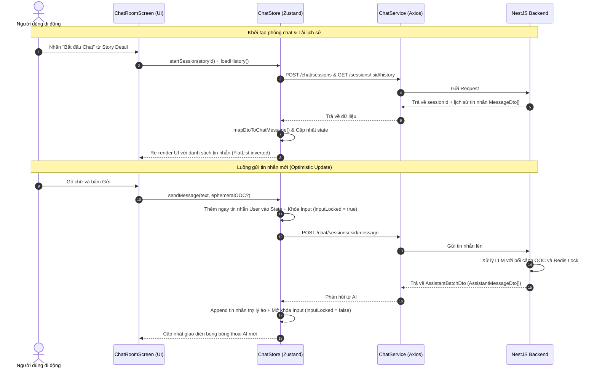

---
date: 2026-05-31
---
# Memori Documentation - P04.T8 — Client: ChatStore + ChatRoomScreen (Minimal)

## 1. Mô tả Tính Năng
Tính năng Client Chat Room cho phép người dùng mở một phòng chat AI với cốt truyện cụ thể. Phía client sử dụng Zustand để quản lý trạng thái phòng chat (tin nhắn, nhân vật hoạt động, bối cảnh OOC hiện tại, trạng thái khoá nhập liệu), Axios làm API client để giao tiếp với backend, và xây dựng giao diện phòng chat hỗ trợ:
- Hiển thị chữ Hán kèm Pinyin trên đầu để hỗ trợ học tiếng Trung.
- Phân loại bong bóng chat: Bong bóng User (bên phải), bong bóng Assistant (bên trái, hỗ trợ hiển thị avatar, cảm xúc, dịch tiếng Việt khi chạm), bong bóng OOC (bối cảnh cố định hoặc bối cảnh tạm thời), và bong bóng System (thông tin hệ thống).
- Bảng điều khiển bối cảnh (OocPanel) cho phép người dùng cập nhật Persistent OOC dài hạn và thêm nhân vật tạm thời.
- Bottom Sheet (CharacterToggleSheet) hỗ trợ bật/tắt nhanh các nhân vật hoạt động trong câu chuyện.

---

## 2. Chi Tiết Tính Năng Từng Hàm & Thành Phần

### 2.1. `chat.service.ts`
- `startSession(storyId)`: Gọi `POST /chat/sessions` để bắt đầu hoặc tiếp tục một phiên chat của cốt truyện. Trả về `SessionResultDto`.
- `getHistory(sid)`: Gọi `GET /chat/sessions/:sid/history` lấy lịch sử tin nhắn đã được sắp xếp và làm sạch. Trả về `HydratedHistoryDto`.
- `sendMessage(sid, userMessage, ephemeralOOC?)`: Gửi tin nhắn của người dùng kèm ngữ cảnh ngoài lề (nếu có) lên `POST /chat/sessions/:sid/message`. Trả về `AssistantBatchDto` gồm các phản hồi từ AI.
- `setOoc(sid, type, text)`: Cập nhật bối cảnh OOC dài hạn (persistent) hoặc bối cảnh tạm thời (ephemeral) lên `POST /chat/sessions/:sid/ooc`.
- `toggleCharacter(sid, characterId, on)`: Bật/tắt trạng thái hoạt động của nhân vật trong phiên chat qua `POST /chat/sessions/:sid/character-toggle`.
- `addTempCharacter(sid, name, description)`: Tạo thêm một nhân vật tạm thời chỉ xuất hiện trong cuộc trò chuyện này qua `POST /chat/sessions/:sid/temp-character`.

### 2.2. `ChatStore` (`chat.store.ts` - Zustand)
- `startSession(storyId)`: Khởi tạo phiên, lưu `sessionId` và danh sách nhân vật hoạt động ban đầu.
- `loadHistory()`: Tải lịch sử tin nhắn, map dữ liệu `MessageDto` của server sang cấu trúc `ChatMessage` của client di động qua hàm helper `mapDtoToChatMessage`.
- `sendMessage(text, ephemeralOOC?)`: Thực hiện cập nhật UI tức thời (Optimistic UI Update) bằng cách thêm bong bóng tin nhắn của user và ephemeral OOC (nếu có) vào danh sách tin nhắn trước khi gọi API, khoá input (`inputLocked: true`) để tránh gửi tin trùng lặp khi đang chờ phản hồi. Khi có phản hồi từ AI, thêm các câu thoại của trợ lý ảo vào store và mở khoá input.
- `setPersistentOOC(text)`: Lưu bối cảnh cốt truyện và chèn tin nhắn bối cảnh vào dòng chat tức thì.
- `toggleCharacter(charId, on)`: Thay đổi mảng `activeCharacters` để phản ánh các nhân vật đang tham gia.
- `addTempCharacter(name, desc)`: Thêm nhân vật tạm thời lên server và hiển thị một tin nhắn hệ thống thông báo sự xuất hiện của họ.
- `reset()`: Xóa sạch trạng thái phòng chat để chuẩn bị cho phiên tiếp theo (tránh rò rỉ dữ liệu).

---

## 3. Biểu đồ Luồng Dữ Liệu (Data Flow)

---

## 4. Lưu Ý Quan Trọng & Gotchas

1. **Thiếu id trong Lịch Sử (`MessageDto`)**:
   - *Vấn đề*: Đối tượng `MessageDto` lấy về từ lịch sử server không chứa trường `id` cho từng tin nhắn đơn lẻ, chỉ có trường `role`, `text`, `timestamp`,...
   - *Giải pháp*: Trong hàm helper `mapDtoToChatMessage`, chúng ta tự sinh một `id` độc nhất cho mỗi tin nhắn client theo công thức `${dto.role}_${dto.timestamp || Date.now()}_${index}` để làm key ổn định cho React Native `FlatList`.

2. **Thiếu characterId trong Lịch Sử (`MessageDto`)**:
   - *Vấn đề*: Server chỉ trả về `characterName` trong lịch sử của Assistant message, dẫn tới việc client di động không có `characterId` để so khớp lấy Avatar nhân vật gốc trong cốt truyện.
   - *Giải pháp*: Trong `MessageBubble`, chúng ta sinh Avatar đại diện bằng chữ cái đầu tiên của `characterName` làm fallback, hoặc so khớp tên này với danh sách nhân vật đã lấy để tìm hình ảnh đại diện thích hợp.

3. **Chữ Hán kèm Pinyin**:
   - *Vấn đề*: Cần hỗ trợ hiển thị Pinyin nhỏ ở ngay phía trên chữ Hán tương ứng để người dùng dễ theo dõi cách phát âm của từ ghép tiếng Trung.
   - *Giải pháp*: Sử dụng mảng `words` (dạng `{ hz, py, vn }` được phân tích sẵn từ server). Render các từ ghép thành một hàng ngang (`flexDirection: 'row', flexWrap: 'wrap'`), với mỗi từ ghép ta vẽ Pinyin (ở trên) và chữ Hán (ở dưới) đồng thời căn giữa theo cột.

4. **Lỗi chạy Jest Test trên Monorepo (Windows)**:
   - *Vấn đề*: Khi chạy lệnh `pnpm test` trong thư mục `apps/mobile`, Jest báo lỗi `'jest' is not recognized as an internal or external command`. Nguyên nhân là do dự án di động chỉ có `@types/jest` mà thiếu các package `jest` và `jest-expo` trong `devDependencies` cục bộ, khiến pnpm không thể tạo symlink lệnh chạy.
   - *Giải pháp*: Thêm `"jest": "^29.7.0"` và `"jest-expo": "~52.0.0"` vào `devDependencies` của `apps/mobile/package.json`, sau đó chạy `pnpm install` từ thư mục gốc để pnpm giải quyết symlink và chạy test thành công.
