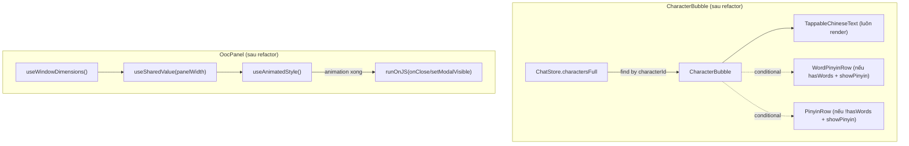

---
date: 2026-05-31
---
# Memori: Refactor Code Review & Fixes (P05.R)

## 1. Mô tả ngắn gọn

Refactor và vá các lỗi được phát hiện sau đợt rà soát mã nguồn (Code Review) Phase 5 — Chat UI & Playback. Mục tiêu chính là sửa lỗi nghiêm trọng khiến text bị mất khi hiển thị pinyin, chuẩn hóa thư viện animation về một mối (react-native-reanimated), loại bỏ hook N+1 pattern trong mỗi bubble, và cải thiện UX Android. Toàn bộ 30 unit tests vẫn pass sau refactor.

**Phạm vi file thay đổi:**
- `apps/mobile/src/features/chat/components/CharacterBubble.tsx`
- `apps/mobile/src/features/chat/components/OocPanel.tsx`
- `apps/mobile/src/features/chat/components/InputBar.tsx`
- `apps/mobile/src/features/chat/services/playback-queue.manager.ts`
- `apps/mobile/src/features/chat/components/WordPinyinRow.tsx` *(file mới)*

---

## 2. Chi tiết tính năng & Các hàm sửa đổi

### 2.1. `WordPinyinRow.tsx` *(tạo mới)*

Component mới tách riêng việc render pinyin + hanzi theo từng word-block ra khỏi `CharacterBubble`. Interface:

```tsx
interface WordPinyinRowProps {
  words: Word[];
  onWordTap: (w: Word) => void;
}
```

Render: `<View flexDirection="row" flexWrap="wrap">` với mỗi `<Pressable>` hiển thị pinyin (trên) và hanzi (dưới).

### 2.2. `CharacterBubble.tsx`

**BUG-01 — Fix layout text bị mất:**

- **TRƯỚC (Sai)**: Khi `showPinyinGlobal && hasWords`, component chỉ render các từ có trong `msg.words[]`, bỏ sót các ký tự không thuộc từ vựng.  
  Ví dụ: `msg.text = "我想喝奶茶"`, `msg.words = [{hz:"奶茶",...}]` → màn hình chỉ hiển thị "奶茶", mất "我想喝".
- **SAU (Đúng)**: `TappableChineseText` luôn luôn render full text. Pinyin row render riêng bên dưới:

```tsx
// Luôn render full text
<TappableChineseText text={msg.text} words={msg.words} onWordTap={setSelectedWord} baseStyle={styles.assistantText} />

// Pinyin: tách riêng
{showPinyinGlobal && (
  hasWords
    ? <WordPinyinRow words={words} onWordTap={setSelectedWord} />
    : <PinyinRow text={msg.text} />
)}
```

**SMELL-01 — Bỏ `useCharactersMap` hook:**

- **TRƯỚC**: `const charMap = useCharactersMap(storyId)` — mỗi bubble chạy useEffect kiểm tra cache → overhead React.
- **SAU**: `const charactersFull = useChatStore((s) => s.charactersFull)` — đọc trực tiếp từ store đã được load khi init session.

**Lưu ý**: `CharacterDto` **không có `avatarUrl`**. Field này không tồn tại trong shared-types. Code cũ dùng `char?.avatarUrl` luôn trả về `undefined`. Đã xóa Image branch, chỉ giữ placeholder với chữ cái đầu tên.

### 2.3. `InputBar.tsx`

**SMELL-04 — Keyboard avoidance Android:**

```tsx
// TRƯỚC: Android nhận undefined → input bị keyboard che
behavior={Platform.OS === 'ios' ? 'padding' : undefined}

// SAU: Android dùng 'height'
behavior={Platform.OS === 'ios' ? 'padding' : 'height'}
```

### 2.4. `OocPanel.tsx`

**SMELL-02 — Migrate từ `Animated` (react-native) sang `react-native-reanimated`:**

```tsx
// TRƯỚC (legacy):
import { Animated } from 'react-native';
const translateX = useRef(new Animated.Value(PANEL_WIDTH)).current;
Animated.timing(translateX, { toValue: 0, duration: 300, useNativeDriver: true }).start();

// SAU (reanimated):
import Animated, { useSharedValue, withTiming, useAnimatedStyle, runOnJS } from 'react-native-reanimated';
const translateX = useSharedValue(panelWidth);
const animStyle = useAnimatedStyle(() => ({ transform: [{ translateX: translateX.value }] }));

// Close với runOnJS callback:
translateX.value = withTiming(panelWidth, { duration: 250 }, (finished) => {
  if (finished) {
    runOnJS(setModalVisible)(false);
    runOnJS(onClose)();
  }
});
```

**SMELL-05 — Responsive panel width:**

```tsx
// TRƯỚC: module-level, không cập nhật khi rotation
const { width: windowWidth } = Dimensions.get('window');
const PANEL_WIDTH = windowWidth * 0.8;

// SAU: reactive bên trong component
import { useWindowDimensions } from 'react-native';
const { width } = useWindowDimensions();
const panelWidth = width * 0.8;
```

**SMELL-03 — Type-safe error handling:**

```typescript
// TRƯỚC:
} catch (e: any) {
  Alert.alert('Lỗi', e?.message || '...');
}

// SAU:
} catch (e: unknown) {
  const msg = e instanceof Error ? e.message : 'Đã xảy ra lỗi không xác định.';
  Alert.alert('Lỗi', msg);
}
```

### 2.5. `playback-queue.manager.ts`

**BUG-02 — Xóa comment sai và dòng redundant:**

```typescript
// TRƯỚC: dòng this.isStopped = false không bao giờ chạy khi isStopped=true (đã guard ở đầu hàm)
if (!this.isPlaying) {
  this.isPlaying = true;
  this.isStopped = false; // Reset stop status if enqueuing new batch ← SAI
  void this.playNext();
}

// SAU:
if (!this.isPlaying) {
  this.isPlaying = true;
  void this.playNext();
}
```

---

## 3. Sơ đồ kiến trúc



---

## 4. Lưu ý quan trọng (Gotchas & Bugs)

> [!WARNING]
> **`CharacterDto` không có `avatarUrl`**:
> - `CharacterDto` trong `packages/shared-types/src/character.ts` chỉ có: `id, storyId, name, age, personality, voiceName, pitch, createdAt`. **Không có `avatarUrl`**.
> - Code cũ sử dụng `char?.avatarUrl` nhưng field này không tồn tại → luôn `undefined`. Image branch đã bị xóa; chỉ dùng placeholder với chữ đầu tên.
> - Nếu cần thêm avatar cho character, cần update `CharacterDto` trong shared-types VÀ schema DB trước.

> [!WARNING]
> **Mixing animation libraries gây bridge overhead**:
> - Không dùng legacy `Animated` từ `react-native` trong bất kỳ component nào thuộc chat feature. Toàn bộ dùng `react-native-reanimated`.
> - Khi close panel với reanimated, cần `runOnJS` để gọi JS callbacks (`onClose`, `setModalVisible`) từ trong animation worklet. Không gọi JS functions trực tiếp trong worklet.

> [!NOTE]
> **`useCharactersMap` hook — chỉ dùng bên ngoài bubble**:
> - Hook `useCharactersMap(storyId)` vẫn tồn tại và có module-level cache. Không dùng trong từng bubble (N+1 pattern).
> - Trong bubble, luôn đọc `charactersFull` từ `useChatStore` — đã được load bởi `ChatRoomScreen` khi khởi tạo session.

> [!NOTE]
> **GAP-01 — English narrator không có audio (chưa fix)**:
> - `PlaybackQueueManager.fetchAudioUrl` chỉ check `containsChinese` để quyết định có fetch TTS cho Narrator không. Narrator tiếng Anh sẽ bị delay thay vì phát audio.
> - Acceptable cho MVP (narrator chủ yếu là tiếng Việt hoặc tiếng Trung). Cần xử lý khi có nhu cầu.

> [!NOTE]
> **Missing UI component tests (P4 — chưa làm)**:
> - `CharacterBubble`, `NarratorBubble`, `UserBubble`, `InputBar`, `WordTooltip`, `OocPanel` chưa có render tests.
> - Cần viết trước khi ship P06 theo danh sách trong `Task/WorkPlan/P05_R_review_refactor.md` mục 7.7.
