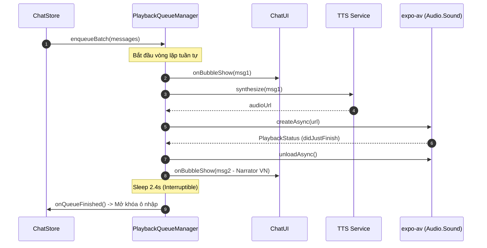

---
date: 2026-05-31
---
# Tài liệu Memori: PlaybackQueueManager & TtsFetchService (P05.T1)

Tài liệu này ghi lại kiến trúc, thiết kế chi tiết và các lỗi quan trọng đã giải quyết khi phát triển lớp `PlaybackQueueManager` quản lý hàng đợi phát âm thanh và hiển thị tin nhắn tuần tự phía client.

## 1. Mô tả tính năng
Hệ thống hàng đợi giúp hiển thị tin nhắn chat một cách mượt mà và premium bằng cách hiển thị từng tin nhắn một, kết hợp phát giọng đọc TTS (nếu có). Chỉ khi âm thanh hiện tại phát xong (hoặc hết thời gian chờ của lời dẫn chuyện Narrator), tin nhắn tiếp theo mới được hiển thị và phát. Trong suốt quá trình này, Input Bar của chat room sẽ được khóa để tránh xung đột.

## 2. Chi tiết tính năng từng hàm

### 2.1. `TtsFetchService`
- `synthesize(req)`: Gửi request `POST /tts/synthesize` thông qua `apiClient` để lấy link audio URL từ backend.

### 2.2. `PlaybackQueueManager`
- `enqueueBatch(msgs)`: Nhập một danh sách tin nhắn mới vào hàng đợi, bắt đầu phát tuần tự nếu manager đang rảnh.
- `stop()`: Dừng ngay lập tức âm thanh đang phát, hủy toàn bộ hàng đợi và giải phóng tài nguyên.
- `playNext()`: Lấy tin tiếp theo từ hàng đợi để xử lý. Nếu rỗng, kích hoạt callback `onQueueFinished` để mở khóa Input Bar.
- `playOne(msg)`: 
  - Kích hoạt callback `onBubbleShow(msg)` để UI render tin nhắn.
  - Nếu là tin nhắn thoại (Character/Narrator tiếng Anh hoặc Trung), lấy URL âm thanh và dùng `expo-av` để phát, đợi sự kiện kết thúc phát (`didJustFinish`).
  - Nếu là lời dẫn chuyện tiếng Việt, trì hoãn luồng trong khoảng thời gian ước lượng dựa vào độ dài ký tự (`estimateNarratorDelayMs`).
- `fetchAudioUrl(msg)`: Lọc tin nhắn để lấy URL TTS phù hợp. Nếu gặp lỗi TTS không phải giới hạn băng thông (`RATE_LIMIT`), ném lỗi lên tầng trên để gọi callback báo lỗi.
- `sleepInterruptible(ms)`: Trì hoãn luồng một cách an toàn. Vòng lặp kiểm tra trạng thái dừng mỗi `100ms` giúp thoát ngủ ngay lập tức khi gọi `stop()`.

## 3. Biểu đồ luồng dữ liệu (Mermaid Diagram)



## 4. Lưu ý quan trọng & Cách giải quyết lỗi (Gotchas & Bugs)

### 4.1. Lỗi xung đột Mock của expo-av (`createAsync` bị treo)
- **Vấn đề:** Preset `jest-expo` tự động cài đặt custom Getter cho class `Audio.Sound` của `expo-av`. Khi dùng `jest.mock('expo-av')` thông thường, mock của chúng ta sẽ bị preset ghi đè bằng một hàm noop rỗng không bao giờ resolve, làm cho `await Audio.Sound.createAsync` bị nghẽn vĩnh viễn (timeout).
- **Giải quyết:** Không dùng `jest.mock` ở mức module. Thay vào đó, import trực tiếp `Audio` và ghi đè trực tiếp thuộc tính static của class trong `beforeEach`:
  ```typescript
  Audio.Sound.createAsync = jest.fn().mockResolvedValue({ sound: mockSound, status: {} });
  ```
  Lưu lại bản gốc trong `beforeAll` và khôi phục lại trong `afterAll` để tránh ảnh hưởng các test suite khác.

### 4.2. Khối try-catch nuốt lỗi (Silent Swallow Error) trong `fetchAudioUrl`
- **Vấn đề:** Khi `TtsFetchService` được mock sai cấu trúc hoặc ném lỗi thực tế, block `catch (e)` trong `fetchAudioUrl` ban đầu bắt toàn bộ lỗi và trả về `null`. Điều này khiến `playOne` tưởng rằng tin nhắn đó không có âm thanh (nhánh Narrator VN) và chuyển sang trì hoãn thời gian thay vì kích hoạt luồng báo lỗi `onError` của manager.
- **Giải quyết:** Sửa đổi block catch để chỉ nuốt lỗi giới hạn lượt gọi (`RATE_LIMIT`), còn các lỗi khác thì `throw e` để chuyển tiếp lỗi lên `playNext` bắt giữ và báo cáo qua callback `onError`.

### 4.3. Sự cố nghẽn Promise do `setImmediate` trong JSDOM / React Native Jest environment
- **Vấn đề:** Khi sử dụng `jest.useFakeTimers()`, các timers bị mock khiến cho `setImmediate` hoặc `setTimeout` trong helper `flushPromises` không được chạy nếu không tua thời gian, dẫn đến test bị treo.
- **Giải quyết:** Sử dụng `process.nextTick` của Node hoặc `Promise.resolve()` thay thế cho `setImmediate` trong `flushPromises` để giải phóng microtask queue một cách tự nhiên và độc lập với fake timers.
