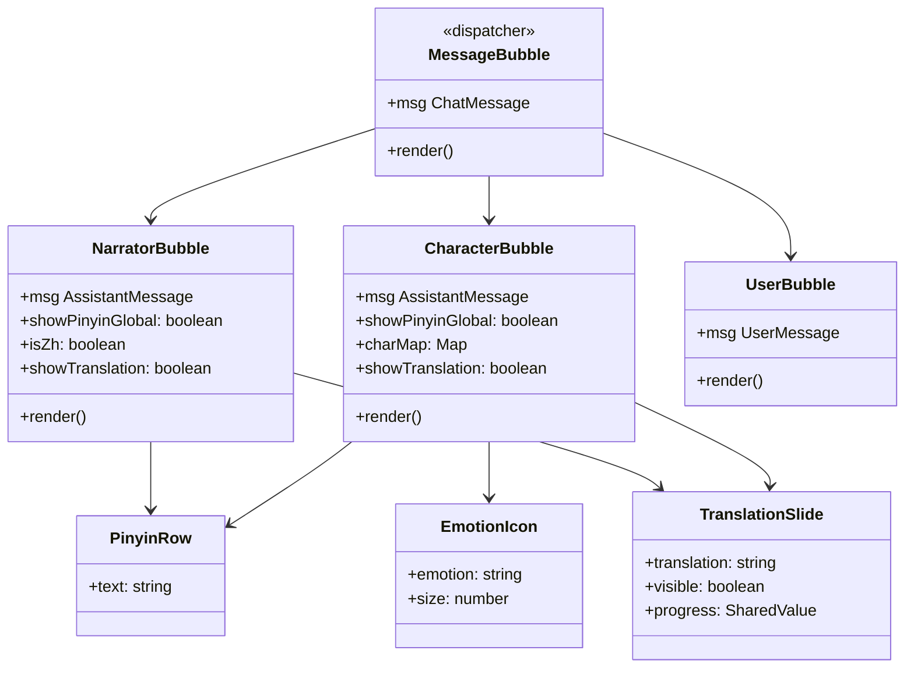

# Memori Documentation - P05.T2 — Client: MessageBubble Full UI

## 1. Mô tả Tính Năng
Giao diện bong bóng tin nhắn đầy đủ (MessageBubble Full UI) giúp hiển thị lịch sử và các lượt trò chuyện sinh động giữa người dùng di động với các nhân vật phụ tá AI.
- **Tách biệt và phân loại bong bóng chat**:
  - `UserBubble`: Tin nhắn của người dùng, căn phải, màu nền Primary, text trắng.
  - `NarratorBubble`: Tin nhắn của người dẫn chuyện (Narrator), căn trái, nền xám nhẹ, in nghiêng, hỗ trợ hiển thị Pinyin nếu văn bản là tiếng Trung.
  - `CharacterBubble`: Tin nhắn của nhân vật phụ tá AI, hiển thị avatar nhân vật (hoặc placeholder chữ cái đầu nếu không có hình), tên nhân vật đậm, emoji cảm xúc hiện tại (`EmotionIcon`), text chữ Hán kèm Pinyin tương ứng.
- **Hỗ trợ học tập tương tác**:
  - **Phiên âm Pinyin**: Hỗ trợ hiển thị Pinyin (dưới dạng mảng `words` phân tách dọc từng chữ hoặc dạng `PinyinRow` ở dưới nếu không có `words`). Cài đặt hiển thị Pinyin được đồng bộ thời gian thực theo cấu hình profile người dùng (`preferences.showPinyin`).
  - **Bản dịch tiếng Việt**: Nhấn vào bong bóng thoại Assistant/Narrator để trượt xuống hiển thị bản dịch tiếng Việt (`TranslationSlide`) một cách mượt mà thông qua thư viện `react-native-reanimated`.
- **Hiệu ứng chuyển cảnh**: Sử dụng `FadeInDown` từ `react-native-reanimated` để các tin nhắn mới xuất hiện mượt mà 60fps từ dưới lên.

---

## 2. Chi Tiết Tính Năng Từng Hàm & Thành Phần

### 2.1. Cấu trúc Dispatcher (`MessageBubble.tsx`)
- Phân phối tin nhắn dựa trên trường `msg.kind`:
  - `user` -> `<UserBubble msg={msg} />`
  - `assistant` -> Nếu `msg.characterName === 'Narrator' || msg.characterId == null` thì là `<NarratorBubble msg={msg} />`. Ngược lại là `<CharacterBubble msg={msg} />`.
  - `persistent_ooc`, `ephemeral_ooc`, `system` -> Render bong bóng bối cảnh ngoài hội thoại hoặc hệ thống tương ứng.

### 2.2. Các helpers & hooks mới
- **`toPinyin(text)`** (`utils/pinyin.ts`): Chuyển đổi văn bản chữ Hán sang Pinyin có dấu (tone symbol) sử dụng thư viện `pinyin-pro`. Sử dụng một Map cache ở cấp độ module (tối đa 1000 phần tử) để tránh tính toán lại Pinyin cho các từ lặp lại.
- **`emojiFor(emotion)`** (`utils/emotion-emoji.ts`): Ánh xạ 12 cảm xúc (Angry, Shy, Happy, Sad, v.v.) sang emoji tương ứng, trả về '🙂' cho cảm xúc không xác định.
- **`useCharactersMap(storyId)`** (`hooks/useCharactersMap.ts`): Lấy danh sách nhân vật thông qua API `characterApi.listByStory(storyId)` và cache Map kết quả theo `storyId` trên toàn cục nhằm tránh gửi lại API request khi render nhiều bong bóng thoại cùng lúc.

### 2.3. Các Component con
- **`EmotionIcon`**: Component hiển thị Emoji tương ứng dựa vào tên cảm xúc.
- **`PinyinRow`**: Hiển thị dòng Pinyin cho nội dung chữ Hán khi người dùng bật cấu hình Pinyin.
- **`TranslationSlide`**: Hiển thị dịch nghĩa tiếng Việt dạng trượt xuống. Sử dụng `useSharedValue` và `useAnimatedStyle` để animate `maxHeight` và `opacity` từ `0` sang giá trị tự nhiên mượt mà.

---

## 3. Biểu đồ Thành phần & Luồng Tương tác (Component & Interaction Diagram)

---

## 4. Lưu Ý Quan Trọng & Gotchas

1. **Lỗi Union Types của `ChatMessage`**:
   - *Vấn đề*: Khi tách các component chuyên biệt như `CharacterBubble` hay `NarratorBubble`, nếu truyền kiểu dữ liệu chung `msg: ChatMessage` cho chúng, TypeScript compiler sẽ báo lỗi `Property 'characterId' does not exist on type 'ChatMessage'` do union type chứa các loại tin nhắn `user` hay `system` vốn không có trường này.
   - *Giải pháp*: Sử dụng tiện ích loại trừ của TypeScript: `Extract<ChatMessage, { kind: 'assistant' }>` làm kiểu dữ liệu đầu vào cho `msg` của `CharacterBubble` và `NarratorBubble`. Điều này giúp bộ biên dịch hiểu chính xác các trường đặc thù của tin nhắn từ trợ lý AI.

2. **Lỗi `implicit any` khi `map` qua `msg.words`**:
   - *Vấn đề*: Do trường `words` trong kiểu dữ liệu assistant có thể là `Word[] | null | undefined`, khi ta thực hiện `.map((w, idx) => ...)` trực tiếp từ `msg.words`, TypeScript không tự suy luận được kiểu của `w` và `idx`, gây lỗi biên dịch.
   - *Giải pháp*: Định nghĩa một hằng số trung gian `const words = msg.words || []` để đảm bảo kiểu dữ liệu luôn là một mảng `Word[]` thuần túy trước khi thực hiện `.map()`.

3. **Lỗi TypeScript của `CharacterDto` thiếu trường `description`**:
   - *Vấn đề*: Component `CharacterToggleSheet.tsx` trước đây sử dụng thuộc tính `item.description` để hiển thị mô tả nhân vật, nhưng interface `CharacterDto` thực tế chỉ có thuộc tính tính cách là `item.personality`. Việc này gây ra lỗi typecheck `Property 'description' does not exist on type 'CharacterDto'`.
   - *Giải pháp*: Đổi `item.description` thành `item.personality` trong `CharacterToggleSheet.tsx` để khớp chuẩn kiểu dữ liệu dùng chung.

4. **Hiệu ứng Slide-down chiều cao động của Bản dịch**:
   - *Vấn đề*: React Native không hỗ trợ animation trượt chiều cao tự nhiên (`auto` height) bằng Shared Value một cách trực tiếp nếu không biết trước chiều cao thật sau khi render text.
   - *Giải pháp*: Trong `TranslationSlide.tsx`, chúng ta nội suy (`interpolate`) tiến trình animation `progress` (0 -> 1) sang thuộc tính `maxHeight` giới hạn (0 -> 200px) và `opacity` (0 -> 1). Cách tiếp cận này đảm bảo giao diện trượt xuống vô cùng mượt mà và không bao giờ bị lỗi giật khung hình.
