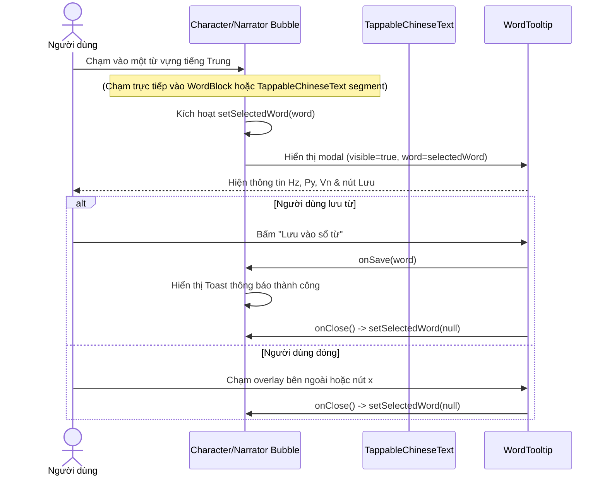

---
date: 2026-05-31
---
# Tài liệu Memori: Tap-to-Show Word Tooltip (P05.T3)

## 1. Mô tả tính năng
Cho phép người dùng chạm vào các chữ Hán trong tin nhắn chat (cả Character và Narrator) để mở một Modal Tooltip giải nghĩa nhanh từ vựng bao gồm: Chữ Hán, Phiên âm Pinyin và dịch nghĩa tiếng Việt. Tích hợp nút lưu vào sổ từ vựng (vocab book).

## 2. Chi tiết cấu trúc và chức năng các hàm

### 2.1. Utility `splitTextByWords`
* **File:** `apps/mobile/src/features/chat/utils/split-words.ts`
* **Chức năng:** Tách câu chữ Hán thô thành danh sách các segment (từ vựng hoặc ký tự không phải từ vựng).
* **Thuật toán:** Greedy longest-match (sắp xếp mảng từ vựng giảm dần theo độ dài ký tự `hz` để ưu tiên ghép từ ghép dài nhất trước).
* **Signature:**
  ```typescript
  export function splitTextByWords(
    text: string,
    words: Word[] | null | undefined
  ): Segment[]
  ```

### 2.2. Component `TappableChineseText`
* **File:** `apps/mobile/src/features/chat/components/TappableChineseText.tsx`
* **Chức năng:** Nhận diện các từ vựng tương tác được từ `splitTextByWords` và hiển thị chúng dưới dạng inline text có gạch chân chấm (`textDecorationLine: 'underline'`, `textDecorationStyle: 'dotted'`).
* **Sự kiện:** Nhấn vào từ sẽ kích hoạt callback `onWordTap(word)`.

### 2.3. Component `WordTooltip`
* **File:** `apps/mobile/src/features/chat/components/WordTooltip.tsx`
* **Chức năng:** Modal bán trong suốt hiển thị thông tin giải nghĩa từ vựng được chọn, hỗ trợ nút "Lưu vào sổ từ" và đóng khi bấm ra ngoài overlay hoặc bấm nút "×".

### 2.4. Integration `CharacterBubble` & `NarratorBubble`
* **CharacterBubble:** 
  - Nếu ở chế độ `showPinyinGlobal && hasWords` (hiển thị từng khối từ gồm Pinyin ở trên và Chữ Hán ở dưới), wrap các khối từ trong `Pressable` để người dùng tap trực tiếp vào khối từ đó mở tooltip.
  - Nếu ở chế độ hiển thị chữ Hán thông thường, dùng `TappableChineseText`.
* **NarratorBubble:** Dùng `TappableChineseText` nếu văn bản chứa tiếng Trung (`isZh`).

---

## 3. Sơ đồ luồng dữ liệu (Data Flow)



---

## 4. Lưu ý quan trọng & Lỗi từng gặp (Gotchas & Bugs)

1. **Strict Typecheck trong TypeScript (`noUncheckedIndexedAccess`)**:
   * *Lỗi:* Khi truy cập kí tự theo index trong chuỗi `text[i]`, TypeScript cảnh báo kiểu trả về có thể là `string | undefined`. Gán trực tiếp vào kiểu `string` sẽ gây lỗi build.
   * *Giải pháp:* Thay thế bằng `text[i] || ''` để đảm bảo an toàn kiểu dữ liệu.

2. **Xung đột chạm sự kiện (Touch Conflict)**:
   * *Lỗi:* Do bong bóng chat (`bubble`) có `Pressable` bao bọc bên ngoài để mở/tắt bản dịch thoại, khi người dùng chạm vào text chữ Hán bên trong, React Native có xu hướng trigger cả hai hoặc gây ra UX không đồng nhất (vừa hiện tooltip giải nghĩa vừa trượt bản dịch xuống).
   * *Giải pháp:* Loại bỏ `Pressable` bọc ngoài cùng của bong bóng thoại. Thay vào đó, thiết lập một nút bấm nhỏ `"Xem bản dịch ▼" / "Ẩn bản dịch ▲"` tinh tế ở góc dưới để kiểm soát việc trượt bản dịch một cách độc lập.
