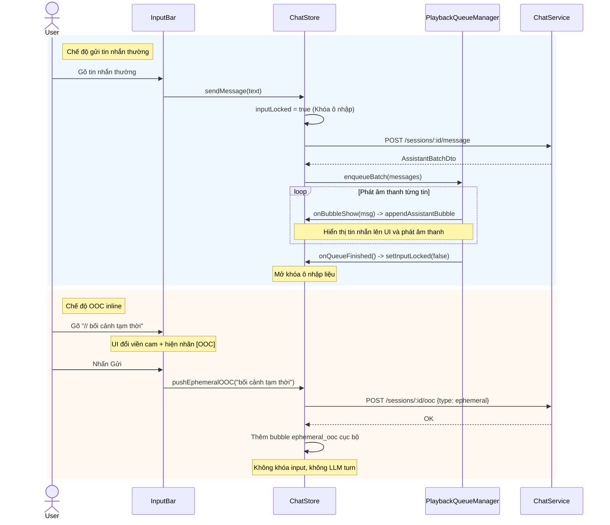

# Memori Document: InputBar Lock/Unlock + OOC Inline (P05.T4)

## 1. Mô tả tính năng
Tính năng này tích hợp luồng phát TTS từ `PlaybackQueueManager` vào `ChatStore` để quản lý trạng thái khóa ô nhập liệu (`inputLocked`) của client khi AI đang phản hồi và phát âm thanh.
Ngoài ra, tính năng này hỗ trợ người dùng nhập ngữ cảnh OOC tạm thời (ephemeral OOC) trực tiếp bằng cách gõ tiền tố `//` ở ô chat chính (OOC inline). Giao diện sẽ đổi màu viền cam và hiện nhãn OOC, khi gửi sẽ gọi API lưu bối cảnh cục bộ mà không kích hoạt LLM tạo phản hồi mới, giúp tối ưu hóa lượt tương tác.

---

## 2. Chi tiết các hàm & API

### 2.1. `playback-queue.manager.ts`
- **`getPlaybackManagerSingleton()`**: Lấy instance hiện tại của `PlaybackQueueManager` đang hoạt động trong phòng chat.
- **`setPlaybackManagerSingleton(mgr)`**: Đăng ký hoặc hủy đăng ký instance manager.

### 2.2. `chat.store.ts`
- **`setInputLocked(v)`**: Thay đổi trạng thái khóa/mở khóa của ô nhập liệu (`inputLocked: boolean`).
- **`appendAssistantBubble(msg)`**: Nhận tin nhắn assistant từ manager phát âm thanh và đưa vào danh sách `messages` hiển thị trên màn hình.
- **`enqueueAssistantBatch(messages)`**: Đưa một batch tin nhắn assistant từ server trả về vào hàng đợi phát âm thanh của manager. Nếu không có manager, chạy cơ chế fallback render trực tiếp và tự động mở khóa.
- **`pushEphemeralOOC(text)`**: Gọi API `chatService.setOoc` kiểu `ephemeral` để lưu ngữ cảnh tạm thời lên server và hiển thị bong bóng bối cảnh tạm thời locally trong log.
- **`sendMessage(text, ephemeralOOC)`**: Refactor để gửi tin nhắn thường, khi có response thì chuyển tiếp danh sách tin nhắn assistant qua `enqueueAssistantBatch` thay vì render trực tiếp.

### 2.3. `ChatRoomScreen.tsx`
- **`useEffect` khởi động**: Tải danh sách characters từ cốt truyện để thiết lập cấu hình giọng phát cho `PlaybackQueueManager`. Khởi tạo manager và đăng ký singleton. Hàm cleanup đảm bảo gọi `mgr.stop()`, hủy đăng ký singleton và reset store.
- **`handleSend`**: Phân loại nếu tin nhắn bắt đầu bằng `//` thì gọi `pushEphemeralOOC(ephemeralOOC)`, ngược lại gửi tin nhắn thông thường.

### 2.4. `InputBar.tsx`
- Đọc `inputLocked` từ `useChatStore`.
- Xác định `isOocMode` nếu text bắt đầu bằng `//`.
- Khóa toàn bộ input khi `inputLocked = true`.
- Gửi dữ liệu qua `onSend('', ephOOC)` khi ở OOC mode hoặc `onSend(text)` ở chế độ thường.

---

## 3. Biểu đồ luồng dữ liệu (Data Flow)

---

## 4. Lưu ý quan trọng (Gotchas & Bugs)

1. **Vấn đề đồng bộ và unlock input**:
   - *Lỗi ban đầu*: Nếu mở khóa input ở block `finally` của hàm `sendMessage` trong store, input sẽ bị mở khóa ngay lập tức khi API phản hồi, mặc dù âm thanh TTS vẫn đang được phát ở hàng đợi. điều này làm user có thể gõ tiếp và gửi tin nhắn mới làm đè/gián đoạn hàng đợi âm thanh.
   - *Cách giải quyết*: Loại bỏ hoàn toàn dòng `set({ inputLocked: false })` khỏi block `finally` của `sendMessage`. Việc mở khóa sẽ hoàn toàn do `PlaybackQueueManager` gọi qua callback `onQueueFinished` sau khi phát xong toàn bộ tin nhắn.
   - *Đề phòng lỗi API*: Nếu API gặp lỗi (ví dụ LLM timeout), hàng đợi sẽ không được kích hoạt, dẫn đến input bị khóa mãi mãi. Vì vậy, trong block `catch` của `sendMessage` **bắt buộc** phải set `inputLocked: false`.

2. **Kiểm thử Unit Test và Singleton**:
   - Khi chạy Jest tests, UI component không mount nên `PlaybackQueueManager` không được khởi tạo (singleton là `null`).
   - *Giải pháp*: Thiết lập cơ chế fallback trong `enqueueAssistantBatch` của store. Nếu singleton là `null`, tự động append toàn bộ tin nhắn assistant vào state và mở khóa input. Điều này vừa giúp các test case cũ pass bình thường mà không cần mock phức tạp, vừa đảm bảo tính an toàn cao của code.
