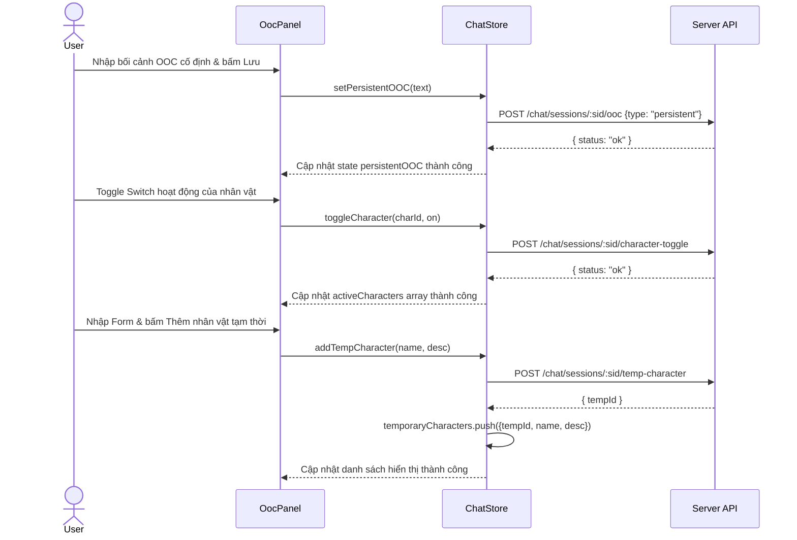

# Tính năng con: OOC Sidebar Panel (Persistent + Active Chars + Temp Chars)

Tài liệu này đặc tả chi tiết thiết kế, cấu trúc hàm, sơ đồ dữ liệu và những lưu ý kỹ thuật khi triển khai thanh Sidebar OOC (`OocPanel`) trượt từ bên phải trên ứng dụng di động.

---

## 1. Mô tả hoạt động

Thanh Sidebar OOC (`OocPanel`) được kích hoạt khi người dùng nhấn biểu tượng ⚙️ ở góc phải tiêu đề phòng chat (`ChatRoomScreen`). Giao diện Sidebar hiển thị dạng Drawer trượt từ bên phải chiếm 80% chiều rộng màn hình, 20% bên trái là lớp phủ Backdrop tối màu có thể bấm vào để đóng Sidebar.

Sidebar tích hợp 3 section quản lý bối cảnh & nhân vật:
1. **Persistent OOC**: Cho phép cấu hình, lưu trữ hoặc xóa bối cảnh cố định toàn cục của phiên chat.
2. **Active Characters**: Hiển thị danh sách các nhân vật chính thức của Story có kèm Switch để bật/tắt (Toggle) trạng thái hoạt động của nhân vật trong phòng chat.
3. **Temporary Characters**: Hiển thị danh sách nhân vật phụ tạm thời được tạo riêng cho lượt chat này và cung cấp Form thêm nhanh nhân vật mới.

---

## 2. Chi tiết kỹ thuật & Các hàm chính

### A. Zustand Chat Store (`chat.store.ts`)
- `temporaryCharacters`: Lưu trữ mảng nhân vật tạm thời dưới dạng `{ tempId, name, description }[]`.
- `charactersFull`: Lưu trữ danh sách đầy đủ các nhân vật của cốt truyện hiện tại dưới dạng `CharacterDto[]`.
- `loadStoryCharacters`: Hàm không đồng bộ tải toàn bộ danh sách nhân vật qua `characterApi.listByStory(storyId)` và cập nhật vào `charactersFull`.
- `addTempCharacter`: Gửi yêu cầu thêm nhân vật tạm thời lên server, khi thành công (nhận về `tempId`) sẽ tự động lưu thông tin nhân vật vào `temporaryCharacters` đồng thời đẩy tin nhắn hệ thống thông báo nhân vật xuất hiện.
- `reset`: Reset toàn bộ các trạng thái về giá trị ban đầu, bao gồm dọn sạch `temporaryCharacters` và `charactersFull`.

### B. UI Components
- `CharacterRow`: Component hiển thị thông tin chi tiết một nhân vật bao gồm Avatar (hoặc placeholder kí tự đầu), Tên, Switch và Spinner loading cục bộ khi đang thực hiện toggle trạng thái.
- `TempCharacterForm`: Form nhập tên và mô tả nhân vật tạm thời có validation (Tên: 1-50 kí tự, Mô tả: 1-500 kí tự), vô hiệu hóa nút bấm và hiển thị loading spinner khi gửi.
- `OocPanel`:
  - Quản lý hiệu ứng slide từ phải qua `Animated.timing` dịch chuyển thuộc tính `translateX` từ `PANEL_WIDTH` về `0` khi hiển thị, và ngược lại khi đóng.
  - Kết nối trực tiếp tới `useChatStore` để tương tác với bối cảnh và các nhân vật, giúp hạn chế prop drilling.

---

## 3. Sơ đồ luồng dữ liệu (Data Flow)

---

## 4. Lưu ý quan trọng (Gotchas & Bugs)

- **Tránh Race Condition và Double Fetch**: Khi vào phòng chat `ChatRoomScreen`, danh sách nhân vật `charactersFull` được load ngay lập tức qua store action `loadStoryCharacters`. Điều này đảm bảo khi người dùng mở `OocPanel`, danh sách nhân vật đã sẵn sàng hiển thị mà không cần gửi thêm yêu cầu HTTP dư thừa, đồng thời tránh việc `OocPanel` tự động gọi fetch trùng lặp nhiều lần.
- **Quản lý đóng mở Modal mượt mà**: Bản thân `Modal` của React Native mặc định không hỗ trợ trượt từ bên phải. Để xử lý hiệu ứng Drawer mượt mà 60fps, ta dùng Modal trong suốt kết hợp với `Animated.View` cùng `useNativeDriver: true`. Lưu ý: Khi đóng Sidebar, ta cần trượt Drawer ra ngoài trước bằng `Animated.timing`, sau khi trượt xong mới thay đổi trạng thái đóng (`modalVisible = false`) để ẩn Modal hoàn toàn, tránh tình trạng UI bị giật hoặc tắt đột ngột.
