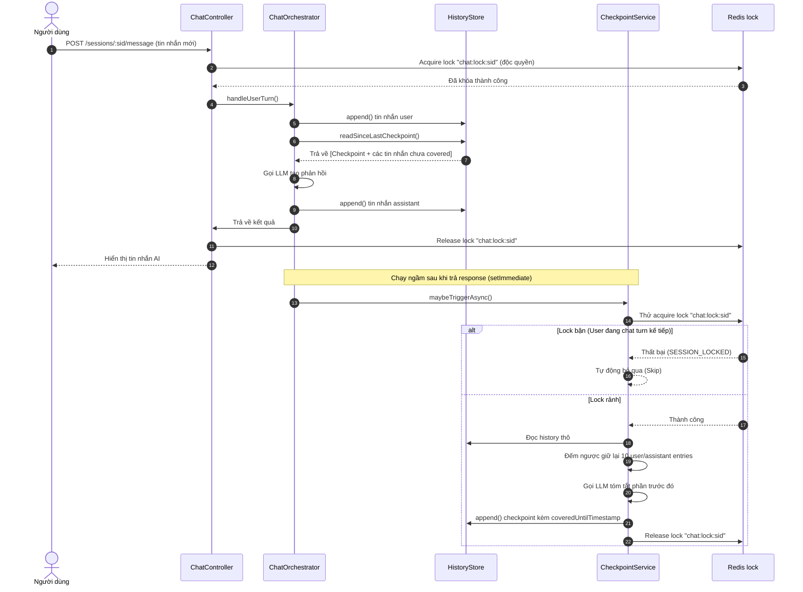

# Task P06 Refactor — Checkpoint & Chat History Refactoring

## 1. Mô Tả Tính Năng
Thực hiện refactor toàn diện hệ thống quản lý lịch sử chat và tự động checkpoint để khắc phục các hạn chế phát hiện trong quá trình code review:
- Giải quyết xung đột ghi/đọc lịch sử chat (race condition) do tiến trình checkpoint chạy bất đồng bộ bằng cách sử dụng chung mutex lock chính `chat:lock:${sid}` với luồng chat của người dùng.
- Giữ lại 10 tin nhắn user/assistant gần nhất (khoảng 5 lượt chat thô) sau khi checkpoint để duy trì độ mượt mà và bối cảnh chi tiết cho AI nhân vật.
- Tích hợp thêm sự kiện bật/tắt nhân vật (`character_toggle`) vào thống kê token của `TokenCounterService` và nội dung tóm tắt gửi lên LLM của `CheckpointService`.
- Sắp xếp và định hình lại thứ tự hiển thị bối cảnh trong system prompt theo đúng đặc tả WorkPlan.
- Tăng cường kiểm thử tự động, bao gồm kiểm tra khả năng khóa đồng thời (concurrency) và các giới hạn tham số cấu hình môi trường.

## 2. Chi Tiết Các Hàm & Sửa Đổi

### `HistoryStoreService` (`apps/server/src/modules/chat/services/history-store.service.ts`)
*   `readSinceLastCheckpoint(sid)`: Cải tiến logic đọc lịch sử trò chuyện. Nếu checkpoint gần nhất có chứa `coveredUntilTimestamp`, hàm sẽ chỉ lọc lấy các tin nhắn thô được tạo ra **sau** mốc thời gian đó (các tin nhắn chưa được tóm tắt) và gộp chung với checkpoint cũ. Nhờ vậy, giữ lại được các tin nhắn thô gần nhất (tail entries).

### `CheckpointService` (`apps/server/src/modules/chat/services/checkpoint.service.ts`)
*   `maybeTriggerAsync(sid)`: Hàm chạy ngầm không chặn luồng chính thông qua `setImmediate` để gọi đến `maybeTrigger(sid)`.
*   `maybeTrigger(sid)`: Sử dụng Redis Lock chính `chat:lock:${sid}` thay thế cho `chat:ckpt-lock:${sid}`. Tiến trình sẽ bỏ qua nếu lock bận (giúp tránh việc checkpoint xung đột khi user gõ liên tục).
*   `createCheckpoint(sid)`: Tách danh sách lịch sử thành 2 phần dựa trên hằng số `RETAINED_TURNS = 10` (quét từ cuối danh sách lên để giữ lại 10 entries user/assistant gần nhất):
    - Phần tóm tắt (`summarizeEntries`): được gửi lên LLM để rút gọn.
    - Phần giữ lại (`retainedEntries`): không tóm tắt, vẫn nằm trong history thô.
    - Ghi nhận tham số `coveredUntilTimestamp` lưu mốc thời gian của entry được tóm tắt cuối cùng.
*   `formatHistoryForSummary(entries)`: Bổ sung xử lý định dạng cho `character_toggle` dưới dạng `[Nhân vật: <tên> xuất hiện trong cảnh / rời khỏi cảnh]` để LLM nắm bắt được trạng thái nhân vật.

### `TokenCounterService` (`apps/server/src/modules/chat/services/token-counter.service.ts`)
*   `estimateHistoryTokens(entries)`: Bổ sung tính toán token cho loại entry `character_toggle` dựa trên độ dài tên nhân vật cộng với 8 tokens overhead.

### `PromptBuilderService` (`apps/server/src/modules/chat/services/prompt-builder.service.ts`)
*   `buildLlmMessages(...)`: Thay đổi thứ tự gộp system prompt để đưa `memoryContext` (Ký ức liên quan) lên trước `persistentOOC` (Bối cảnh cố định) theo đúng yêu cầu thiết kế.

## 3. Quy Trình Hoạt Động (Data Flow)

## 4. Lưu Ý Quan Trọng (Gotchas & Bugs)

- **Nguy cơ lỗi Strict Null Check**:
  Khi duyệt mảng ngược từ cuối lên trong TypeScript (`for (let i = length - 1; i >= 0; i--)`), việc truy cập trực tiếp `contentEntries[i].type` sẽ bị compiler báo lỗi `Object is possibly 'undefined'` dưới chế độ strict null check. Luôn gán vào hằng số `const entry = contentEntries[i]` và kiểm tra `if (entry)` trước khi đọc thuộc tính.
- **Race Condition do Lock Riêng Biệt**:
  Nếu checkpoint chạy bất đồng bộ dùng một khóa lock riêng, nó sẽ không đồng bộ được với hành vi ghi tin nhắn mới của người dùng, dẫn đến khả năng tóm tắt dở dang hoặc ghi đè sai lệch. Việc sử dụng chung khóa lock chính `chat:lock:${sid}` đảm bảo sự an toàn tuyệt đối cho tệp tin JSONL.
- **Duy trì bối cảnh hội thoại gần nhất (continuity)**:
  Tóm tắt (summarize) của LLM tuy thu gọn được token nhưng sẽ làm mất đi sắc thái từ ngữ và thông tin chi tiết trong các câu chat gần nhất. Việc thiết lập `RETAINED_TURNS = 10` bảo vệ tối thiểu 10 entries thô giúp AI duy trì luồng hội thoại mạch lạc.
- **Tương thích ngược**:
  Hàm `readSinceLastCheckpoint` cần fallback sử dụng index slice nếu gặp các checkpoint định dạng cũ không chứa trường `coveredUntilTimestamp`.
