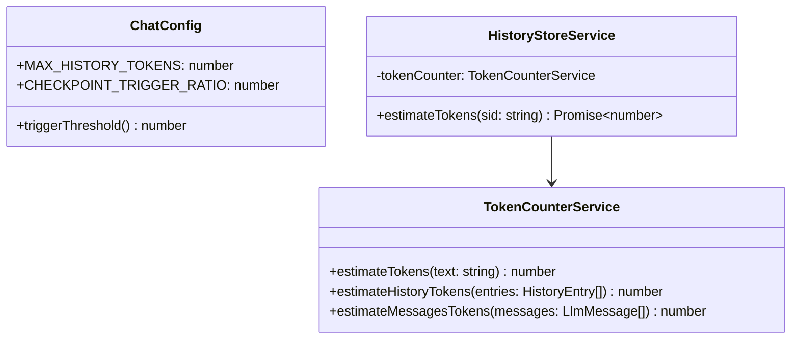

# Task P06.T1 — TokenCounterService + Threshold Config

## 1. Mô tả ngắn gọn tính năng
Triển khai dịch vụ `TokenCounterService` thực hiện ước lượng số lượng token bằng heuristic và cấu hình ngưỡng giới hạn token cho lịch sử chat (`MAX_HISTORY_TOKENS` mặc định 6000, `CHECKPOINT_TRIGGER_RATIO` mặc định 0.8). Refactor `HistoryStoreService` để tích hợp dịch vụ tính toán token mới này.

## 2. Chi tiết tính năng từng hàm

### `ChatConfig` (trong `apps/server/src/config/chat.config.ts`)
- `constructor(cfg: ConfigService)`: Đọc và gán `MAX_HISTORY_TOKENS` (từ key `maxHistoryTokens`, mặc định là `6000`) và `CHECKPOINT_TRIGGER_RATIO` (từ key `checkpointTriggerRatio`, mặc định là `0.8`).
- `triggerThreshold()`: Trả về ngưỡng kích hoạt checkpoint thực tế (`Math.floor(MAX_HISTORY_TOKENS * CHECKPOINT_TRIGGER_RATIO)`).

### `TokenCounterService` (trong `apps/server/src/modules/chat/services/token-counter.service.ts`)
- `estimateTokens(text)`: 
  - Đếm số ký tự tiếng Trung qua Regex `/[\u4E00-\u9FFF]/g`.
  - Số ký tự còn lại = `text.length - chineseChars`.
  - Kết quả = `Math.ceil(chineseChars / 1.5 + otherChars / 4)`.
  - Hỗ trợ xử lý chuỗi rỗng/null/undefined trả về `0`.
- `estimateHistoryTokens(entries)`:
  - Cộng dồn token của các history entries kể từ checkpoint gần nhất:
    - `user`: `text` + `ephemeralOOC` (nếu có).
    - `assistant_batch`: tất cả tin nhắn con `text` + `translation` (nếu có).
    - `persistent_ooc` / `ephemeral_ooc`: `text`.
    - `checkpoint`: `summary`.
    - `system`: cộng cố định `50`.
    - Mọi entry type khác: cộng `0`.
- `estimateMessagesTokens(messages)`:
  - Cộng dồn token của `content` trong từng message, cộng thêm `4` token overhead cho mỗi message.

### `HistoryStoreService` (trong `apps/server/src/modules/chat/services/history-store.service.ts`)
- `estimateTokens(sid)`: Đọc các entry từ checkpoint gần nhất, uỷ nhiệm việc đếm token cho `this.tokenCounter.estimateHistoryTokens(entries)`.

## 3. Class Diagram & Data Flow

## 4. Lưu ý quan trọng (Gotchas, bugs)
- **Lỗi thiếu dấu ngoặc nhọn trong code gốc**: Trong hàm `cleanup` của `HistoryStoreService`, block `catch` ban đầu thiếu dấu ngoặc nhọn `}` đóng lại dẫn đến lỗi biên dịch TS1128 khi bắt đầu chạy các kiểm thử tự động. Lỗi này đã được vá bằng cách thêm ngoặc nhọn đóng block `catch`.
- **Heuristic Token Ratio**:
  - Tiếng Trung: 1.5 ký tự / token.
  - Các ký tự khác (bao gồm Tiếng Anh, khoảng trắng, ký tự đặc biệt): 4 ký tự / token.
  - Lấy cận trên bằng `Math.ceil` khi kết thúc quá trình ước lượng của từng chuỗi.
- **Overhead**:
  - Mỗi message trong `LlmMessage[]` có overhead cố định là `4` token.
  - `system` entry trong lịch sử chat có overhead cố định là `50` token.
