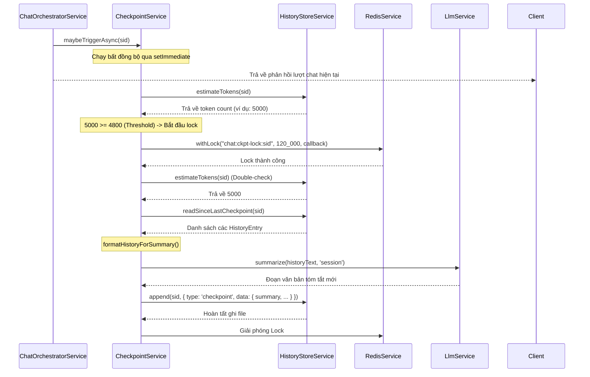

---
date: 2026-05-31
---
# Task P06.T2 — Checkpoint Writer (Small AI Summarize)

## 1. Mô Tả Tính Năng
Cơ chế tự động tạo điểm checkpoint tóm tắt lịch sử hội thoại khi số lượng token vượt quá ngưỡng giới hạn (`triggerThreshold()`, mặc định là 80% của `MAX_HISTORY_TOKENS`). Điểm checkpoint này giúp nén lịch sử chat cũ thành một đoạn tóm tắt tiếng Việt ngắn gọn (200-400 từ), từ đó tối ưu hóa prompt gửi lên LLM Ollama và tăng hiệu quả KV Cache.

## 2. Chi Tiết Các Hàm

### `CheckpointService` (`apps/server/src/modules/chat/services/checkpoint.service.ts`)

*   `maybeTriggerAsync(sid: string): void`:
    *   Sử dụng `setImmediate` để chạy logic checkpoint bất đồng bộ mà không tăng latency cho client.
    *   Tính toán số token hiện tại bằng `historyStore.estimateTokens`. Nếu nhỏ hơn `triggerThreshold`, thoát sớm.
    *   Nếu vượt ngưỡng, sử dụng Redis lock (`chat:ckpt-lock:${sid}`) với TTL 120,000ms để tránh việc 2 turn gửi liên tiếp tạo 2 checkpoint trùng nhau.
    *   Bên trong lock, double-check số token lần nữa. Nếu vẫn vượt ngưỡng, gọi `createCheckpoint(sid)`.
    *   Bắt lỗi `ConflictException` (với message `'SESSION_LOCKED'`) để log debug thay vì log error nghiêm trọng.

*   `createCheckpoint(sid: string): Promise<void>`:
    *   Đọc toàn bộ lịch sử từ checkpoint gần nhất bằng `historyStore.readSinceLastCheckpoint`.
    *   Loại bỏ dòng checkpoint cũ ở đầu (nếu có) để chỉ tóm tắt các hội thoại mới phát sinh.
    *   Tính toán số token của phần hội thoại mới bằng `tokenCounter.estimateHistoryTokens`.
    *   Định dạng lịch sử thành dạng văn bản trần bằng `formatHistoryForSummary`.
    *   Gọi `llmService.summarize` với mode `'session'` sử dụng mô hình LLM nhỏ (`smallModel`) để sinh ra đoạn tóm tắt tiếng Việt.
    *   Giới hạn độ dài tóm tắt tối đa là 4000 ký tự.
    *   Ghi một entry `type: 'checkpoint'` mới vào file JSONL của session thông qua `historyStore.append`.

*   `formatHistoryForSummary(entries: HistoryEntry[]): string`:
    *   Chuyển đổi mảng `HistoryEntry` thành văn bản dạng text thuần:
        *   `user`: chuyển thành `User: <nội dung>` và kèm ngữ cảnh OOC tạm thời (nếu có).
        *   `assistant_batch`: duyệt từng message trong batch và ghi `<characterName> (<emotion>): <nội dung>`.
        *   `persistent_ooc`: chuyển thành `[Bối cảnh: <nội dung>]`.
        *   `ephemeral_ooc`: chuyển thành `[OOC tạm: <nội dung>]`.
        *   Các loại entry khác (system, checkpoint, character_toggle) được bỏ qua.

### `ChatOrchestratorService` (`apps/server/src/modules/chat/services/chat-orchestrator.service.ts`)
*   Inject `CheckpointService` vào constructor.
*   Gọi `this.checkpointService.maybeTriggerAsync(ctx.sessionId)` ở cuối hàm `handleUserTurn` (ngay trước khi trả về kết quả DTO) theo mô hình fire-and-forget.

## 3. Quy Trình Chạy Checkpoint (Sequence Diagram)

## 4. Lưu Ý Quan Trọng & Cách Giải Quyết Lỗi (Gotchas & Bugs)

1.  **Lỗi Biên Dịch NestJS Logger**:
    *   *Gotcha*: Sử dụng `this.logger.info(...)` gây lỗi compiler do lớp `Logger` của NestJS mặc định không có hàm `info`.
    *   *Giải pháp*: Sửa thành `this.logger.log(...)`.

2.  **Lỗi Tương Thích `findLastIndex`**:
    *   *Gotcha*: Việc sử dụng `Array.prototype.findLastIndex` gây ra lỗi compiler TypeScript trên target `ES2022` và lỗi parameter `m` implicitly has an `any` type do TypeScript không có type definitions đầy đủ cho API này trên các target phiên bản cũ.
    *   *Giải pháp*: Viết lại bằng một vòng lặp `for` ngược thông thường từ cuối mảng lên đầu. Giải pháp này vừa đảm bảo tương thích 100% môi trường runtime và compile-time, vừa không cần thay đổi file cấu hình `tsconfig.json`.

3.  **Lỗi Thiếu Mock Dependency Trong Test**:
    *   *Gotcha*: Khi thêm constructor parameter `CheckpointService` vào `ChatOrchestratorService`, test suite `chat-orchestrator.service.spec.ts` bị lỗi compile do thiếu provider Mock cho `CheckpointService`.
    *   *Giải pháp*: Khai báo thêm provider mock cho `CheckpointService` trong `Test.createTestingModule` của file test.

4.  **Lỗi Biên Dịch TS Cũ Trong ChatOrchestrator**:
    *   *Gotcha*: Lỗi ép kiểu `Character[]` từ Prisma sang `CharacterDto[]` trong prompt builder do sự không tương thích thuộc tính `voiceName` (prisma là `string`, dto là một union type giới hạn các voice).
    *   *Giải pháp*: Thực hiện cast kiểu `characters as any` khi truyền vào prompt builder.
    *   *Gotcha*: Lỗi `TS18048: 'm' is possibly 'undefined'` do cấu hình `noUncheckedIndexedAccess: true` khi duyệt qua các assistant messages.
    *   *Giải pháp*: Sử dụng non-null assertion `assistantMsgs[i]!` khi gán biến `m`.

5.  **Lỗi Lỗi Thời (Outdated) Của Các Test Case Khác**:
    *   *Gotcha*: Test case `toggleCharacter` của `ChatController` bị fail vì mong muốn kiểm tra xem có append `persistent_ooc` không, trong khi thực tế code đã được cập nhật gửi `character_toggle` từ trước. Lỗi `llm.service.spec.ts` mong đợi messages list có độ dài là 3 trong khi logic sửa correction message mới nhất chỉ cho phép độ dài tối đa là 2.
    *   *Giải pháp*: Cập nhật lại các xác nhận mong đợi (assertions) của các test case này cho chính xác với logic code hiện tại của dự án.
