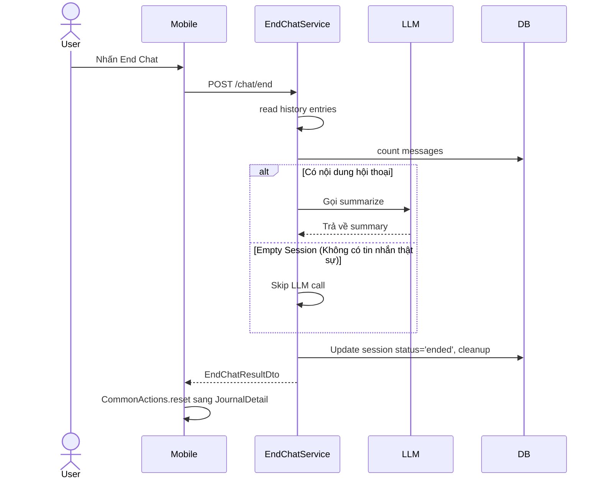

---
date: 2026-05-31
---
# Task P07 Refactor - End Chat & Journal

## 1. Mô tả
Tái cấu trúc (refactor) luồng kết thúc phiên chat (End Chat) và hiển thị nhật ký (Journal) trong Phase 07, nhằm giải quyết các vấn đề liên quan đến việc render sai nhân vật thành narrator, lỗi pagination trùng timestamp, điều hướng sai sau khi kết thúc phiên, và các session trống (empty session) gây lãng phí LLM.

## 2. Chi tiết thực hiện

### 2.1. Shared Types & DTOs
- **JournalMessageDto**: Tạo type mới kế thừa `MessageDto` nhưng bổ sung rõ ràng các trường `id`, `characterId`, và `turnOrder`. Type này được dùng ở `SessionDetailDto` (Journal).
- **EndChatResultDto**: Chuẩn hóa DTO trả về của API `/chat/end` gồm: `journalSessionId`, `summary`, `messageCount`, `alreadyEnded`.

### 2.2. Mobile
- **chat.store.ts**: Sửa đổi hàm `mapDtoToChatMessage` để lấy đúng `id` và `characterId` thay vì ghi đè bằng `null`. Khắc phục lỗi render lịch sử journal bị biến thành `NarratorBubble`.
- **MessageBubble.tsx**: Sửa điều kiện nhận diện Narrator. Thay vì kiểm tra `characterId == null`, giờ kiểm tra rành mạch `characterName === 'Narrator'`.
- **ChatRoomScreen.tsx**: 
  - Khóa input (`disabled={inputLocked || ending}`) và hiển thị Overlay Loading khi đang gọi API end chat.
  - Sử dụng `CommonActions.reset` thay vì `navigate` đơn thuần sau khi kết thúc phiên chat, đảm bảo ChatRoom cũ bị gỡ khỏi navigation stack, ngăn người dùng vuốt quay lại phòng chat đã đóng.
- **chat.service.ts**: Cập nhật kiểu trả về thành `EndChatResultDto`.

### 2.3. Server
- **end-chat.service.ts**:
  - Tối ưu cho empty session: Kiểm tra mảng history entry xem có tin nhắn `user` hoặc `assistant_batch` thực sự nào không. Kết hợp với `msgCount === 0` trong DB.
  - Nếu là empty session: Bỏ qua quá trình tóm tắt bằng LLM, gán status = 'ended', dọn dẹp Redis (cả history và OOC), và phát sự kiện `SESSION_ENDED` (nhưng KHÔNG phát `MEMORY_TRIGGER`).
- **journal.service.ts**:
  - Cải tiến cursor pagination để không bị lặp hoặc sót record khi có nhiều session trùng thời gian kết thúc (`endedAt`).
  - Gộp chung `endedAt` và `id` vào trong một base64 cursor.
  - Sửa câu truy vấn Prisma sang `OR` condition (`endedAt < cursor.endedAt OR (endedAt == cursor.endedAt AND id < cursor.id)`) với `orderBy: [{ endedAt: 'desc' }, { id: 'desc' }]`.

## 3. Sơ đồ Luồng (Data Flow) - Empty Session

## 4. Lưu ý quan trọng (Gotchas & Bugs)

- **Gotcha 1 - Typecast mất DTO property**: Mặc dù backend lưu `characterId` vào DB, nhưng `MessageDto` cũ của Chat thiếu property này, và client tự ý đặt `characterId: null` khi parse. Dẫn đến render sai UI. **Giải pháp**: Phân chia `JournalMessageDto` rõ ràng cho journal, và giữ nguyên data của server khi map.
- **Gotcha 2 - Condition Narrator lỏng lẻo**: Dùng `characterId == null` để tự động suy ra đó là Narrator là sai lầm dễ gây vỡ logic khi mapping mất data. Nên dựa vào role cụ thể hoặc tên cố định (`characterName === 'Narrator'`).
- **Gotcha 3 - Cursor Pagination dính Timestamp**: `endedAt` bằng millisecond cực kỳ dễ trùng nhau (đặc biệt khi mock data hoặc lưu nhanh). **Luôn luôn sử dụng composite cursor** (kết hợp timestamp + Unique ID) cho các danh sách sắp xếp theo thời gian để đảm bảo phân trang ổn định.
- **Gotcha 4 - Navigation Reset**: `navigate` trong Stack Navigation không gỡ màn hình hiện tại ra khỏi history, do đó End Chat xong người dùng vẫn có thể "Back" về phòng chat. Hãy dùng `CommonActions.reset` hoặc `.replace`.
- **Gotcha 5 - Strict Type check**: Trong test `chat.store.test.ts`, các mock object cần phải tuân thủ chuẩn xác DTO interface (ví dụ thêm mock `characterId`), nếu không Typecheck sẽ lỗi (Exit status 2). Luôn chạy `typecheck` sau khi sửa type hệ thống.
