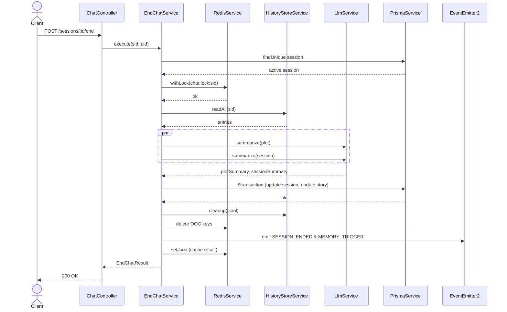

---
date: 2026-05-31
---
# Memori - Task P07.T1: EndChatService (Đóng phiên chat & Tóm tắt cốt truyện)

Tài liệu này ghi nhận quá trình hiện thực tính năng kết thúc chat và tóm tắt tiến trình câu chuyện làm bộ nhớ cho hệ thống VectorDB.

## 1. Mô tả tính năng
Tính năng **Kết thúc chat** giúp kết thúc phiên trò chơi roleplay, thực hiện:
1. Đọc cache JSONL để lấy toàn bộ lịch sử.
2. Tóm tắt cốt truyện cốt lõi bằng ngôi thứ 3 (Plot Summary) và tóm tắt toàn bộ phiên (Session Summary) thông qua LLM.
3. Commit cập nhật trạng thái session thành `ended` và append Plot Summary vào `Story.currentProgress` trong database PostgreSQL.
4. Dọn dẹp cache JSONL và các key Redis OOC (out-of-character).
5. Phát các domain event `session.ended` và `memory.trigger` để các worker khác (chẳng hạn Memory worker ở Phase 8) xử lý tiếp.
6. Hỗ trợ Idempotency (gọi lại phiên chat đã đóng thì trả về kết quả cache trên Redis hoặc dựng lại từ database).

---

## 2. Chi tiết các hàm

### `EndChatService.execute(sid, uid)`
- **Input**: `sid` (sessionId), `uid` (userId).
- **Mô tả**:
  1. Gọi `loadAndValidateSession(sid, uid)` để kiểm tra quyền sở hữu.
  2. Nếu session đã kết thúc, kiểm tra cache Redis `endchat:result:${sid}`. Nếu có thì trả về kèm `alreadyEnded: true`, nếu không có thì gọi `reconstructFromDB` để đếm message và dựng lại kết quả từ DB.
  3. Tiến hành khóa session bằng `redis.withLock` với key `chat:lock:${sid}`.
  4. Bên trong lock, tải lại session một lần nữa để tránh race condition.
  5. Đọc lịch sử thông qua `HistoryStoreService.readAll(sid)`.
  6. Nếu lịch sử trống (empty session), cập nhật status thành `ended`, cleanup OOC, trả về kết quả trống, bỏ qua LLM.
  7. Gọi LLM song song tóm tắt plot và session thông qua `llmService.summarize`.
  8. Thực hiện cập nhật Database bằng transaction (`prisma.$transaction`).
  9. Gọi `cleanup(sid)` để dọn dẹp file JSONL và Redis OOC. Bọc try-catch riêng để không rollback DB nếu cleanup lỗi.
  10. Phát domain events bằng `eventEmitter`.
  11. Lưu kết quả kết thúc chat vào Redis với TTL 1h và trả về kết quả.

### `EndChatService.formatForPlot(entries)`
- **Mô tả**: Trích xuất lịch sử để LLM tóm tắt cốt truyện ngôi thứ 3. Bỏ qua OOC, system và character toggle.
- **Logic**: Duyệt qua entries. Nếu gặp checkpoint thì `unshift` vào đầu mảng. Nếu gặp `user` hoặc `assistant_batch` thì `push` vào mảng.

### `EndChatService.formatForOverview(entries)`
- **Mô tả**: Định dạng toàn bộ hội thoại và bối cảnh (bao gồm OOC, toggle nhân vật) tương tự `CheckpointService.formatHistoryForSummary` để LLM tóm tắt session.

---

## 3. Biểu đồ luồng dữ liệu (Data Flow)

---

## 4. Lưu ý quan trọng & Cách giải quyết (Gotchas & Bugs)

- **Vấn đề đồng bộ (Race Condition)**: Nếu người dùng gửi tin nhắn hoặc kích hoạt checkpoint cùng lúc với việc bấm kết thúc chat, có thể dẫn đến việc ghi đè file JSONL hoặc DB bị xung đột.
  - *Giải quyết*: Dùng chung khóa lock `chat:lock:${sid}` với Send Message và Checkpoint. Đồng thời kiểm tra lại trạng thái session ngay khi vừa sở hữu lock (double check status).
- **Lỗi Mock trong Unit Test**: Khi thêm `EndChatService` vào constructor của `ChatController`, file test cũ `chat.controller.spec.ts` bị crash do thiếu provider mock.
  - *Giải quyết*: Cập nhật `chat.controller.spec.ts` để mock và register `EndChatService`, đồng thời bổ sung suite test `endSession` để phủ sóng 100%.
- **Bắt lỗi Typescript trong Mock**: Lỗi implicit any type khi viết implementation cho mock.
  - *Giải quyết*: Khai báo tường minh kiểu dữ liệu cho tham số mock (ví dụ: `text: string`, `mode: 'plot' | 'session' | 'character'`).
- **An toàn Cleanup**: Các thao tác xóa file vật lý và xóa Redis keys có thể bị lỗi do phân quyền hoặc mất kết nối, nhưng DB đã commit thì không được rollback.
  - *Giải quyết*: Bao bọc riêng từng tác vụ cleanup trong block `try-catch`, ghi log cảnh báo và không ném lỗi ra ngoài làm hỏng transaction DB.
