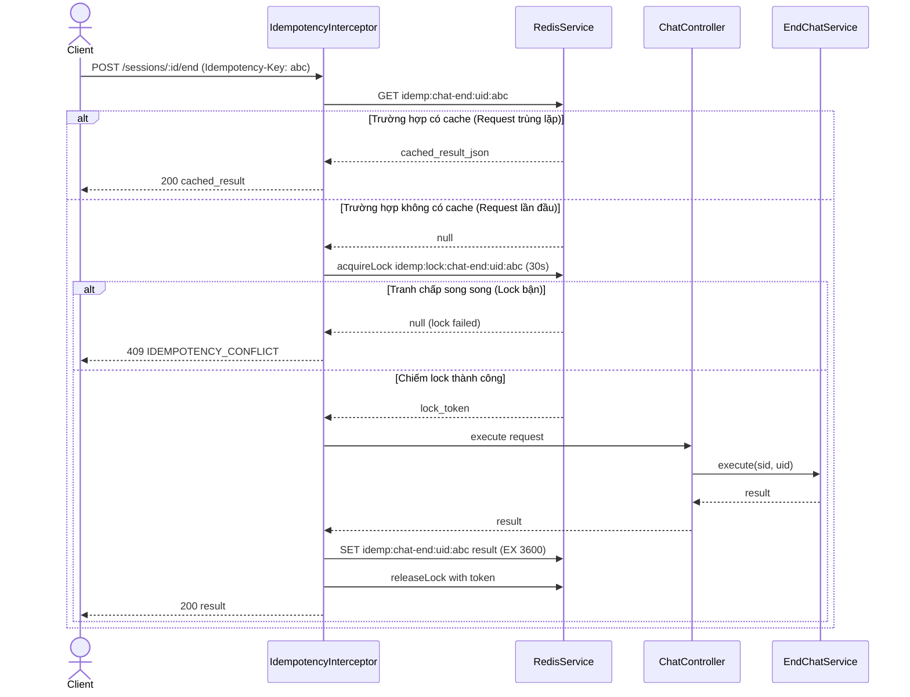

---
date: 2026-05-31
---
# Memori - Task P07.T2: Chat Controller End Endpoint & Idempotency-Key

Tài liệu này ghi nhận quá trình hiện thực hóa cơ chế chống trùng lặp yêu cầu (Idempotency) dựa trên header `Idempotency-Key` và tích hợp vào API kết thúc hội thoại chat (`POST /chat/sessions/:sid/end`).

## 1. Mô tả tính năng
Để tránh việc client gửi lặp lại các request do sự cố mạng hoặc double-click (đặc biệt đối với các tác vụ tốn kém tài nguyên hoặc thay đổi trạng thái quan trọng như kết thúc chat và tóm tắt bằng LLM), chúng tôi triển khai cơ chế chống trùng lặp yêu cầu generic:
- **Idempotency-Key**: Client gửi kèm header `Idempotency-Key` (ví dụ: một UUID duy nhất cho hành động đó).
- **Concurrency Locking**: Khi nhận được request, hệ thống sẽ cố gắng chiếm lock trên Redis (`idemp:lock:${scope}:${uid}:${key}`). Nếu không chiếm được lock (do request song song đang chạy), trả về lỗi `409 Conflict` (IDEMPOTENCY_CONFLICT).
- **Caching**: Sau khi request chạy xong lần đầu, kết quả sẽ được lưu cache trên Redis (`idemp:${scope}:${uid}:${key}`) với TTL chỉ định (mặc định 1 giờ).
- **Retry**: Khi có request tiếp theo chứa cùng key gửi lên, hệ thống sẽ trả về ngay lập tức kết quả từ cache mà không chạy lại logic xử lý.

---

## 2. Chi tiết các hàm và thành phần

### Decorator `@Idempotent(scope: string, ttlSec?: number)`
- Gắn cấu hình metadata `idempotent` (chứa `scope` và `ttlSec`) cho handler.
- Áp dụng `IdempotencyInterceptor` cho controller method.

### Interceptor `IdempotencyInterceptor`
1. Lấy thông tin metadata `idempotent` từ handler thông qua `Reflector`.
2. Kiểm tra sự tồn tại của header `idempotency-key` từ request. Nếu không có, bỏ qua và chuyển tiếp xử lý cho handler thông thường.
3. Tạo key Redis định danh duy nhất theo cấu trúc: `idemp:${scope}:${userId}:${idempotencyKey}`.
4. Kiểm tra sự tồn tại của key trên Redis. Nếu đã được cache, parse JSON và trả về dạng Observable kết quả ngay lập tức (`of(JSON.parse(cached))`).
5. Nếu chưa có cache, chiếm lock phân tán trong 30 giây: `idemp:lock:${scope}:${userId}:${idempotencyKey}` thông qua `redis.acquireLock`.
   - Nếu chiếm lock thất bại, ném ra lỗi `AppException(ERR.IDEMPOTENCY_CONFLICT)`.
6. Thực thi request thực tế bằng cách chuyển đổi Observable thành Promise (`await firstValueFrom(next.handle())`).
7. Lưu kết quả thành công vào Redis cache dạng chuỗi JSON và thiết lập thời gian hết hạn (TTL).
8. Luôn luôn giải phóng lock trong block `finally` bằng `redis.releaseLock`.

---

## 3. Biểu đồ luồng hoạt động (Data Flow)

---

## 4. Lưu ý quan trọng & Bài học kinh nghiệm (Gotchas & Bugs)
- **LockToken của RedisService**: Khác với một số thư viện lock thông thường trả về boolean, phương thức `RedisService.acquireLock` trong hệ thống trả về một đối tượng `LockToken | null` (chứa `{ key, token }`). Vì vậy, khi giải phóng lock, bắt buộc phải truyền cả `key` và `token` của lock đó: `redis.releaseLock(lockKey, lock.token)`. Nếu truyền sai hoặc bỏ qua token, lock sẽ không được giải phóng đúng cách và gây treo tài nguyên cho tới khi lock tự động hết hạn (30s).
- **Phân biệt User (Multi-tenant Caching)**: Phải đưa `userId` (hoặc `uid` của user) vào trong cấu trúc key cache và lock. Nếu không đưa vào, 2 user khác nhau vô tình hoặc cố ý sử dụng cùng một `Idempotency-Key` sẽ bị nhiễm chéo dữ liệu hoặc bị lock nhầm lẫn. Key chuẩn: `idemp:${scope}:${uid}:${rawKey}`.
- **Express Header Lowercasing**: Trong Express/NestJS, mọi tên header gửi lên đều được tự động chuyển thành chữ thường. Nên truy xuất thông qua `req.headers['idempotency-key']` (chữ thường) thay vì `req.headers['Idempotency-Key']`.
