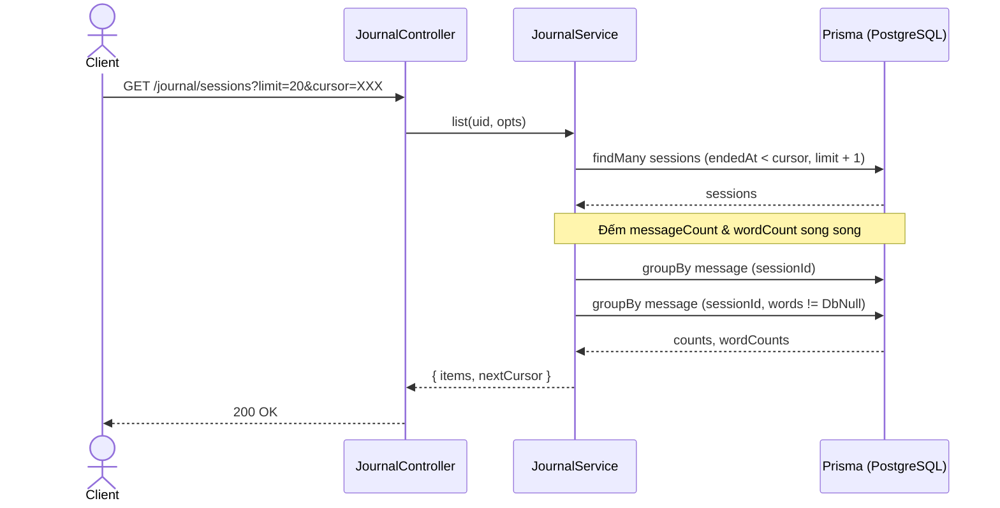

# Tài liệu Memori: JournalModule (Nhật ký & Lưu trữ vĩnh viễn)

Tài liệu này ghi lại kiến thức thiết kế và triển khai của `JournalModule` (Phase 7 - Task P07.T3).

## 1. Mô tả tính năng
`JournalModule` cung cấp giao diện API để xem lại lịch sử các phiên hội thoại đã kết thúc (`status = 'ended'`).
- `GET /api/v1/journal/sessions`: Lấy danh sách các phiên chat của người dùng kèm phân trang bằng cursor base64url theo thời gian kết thúc giảm dần (`endedAt DESC`). Hỗ trợ lọc theo `storyId`.
- `GET /api/v1/journal/sessions/:sid`: Xem chi tiết phiên chat đã kết thúc bao gồm danh sách tin nhắn được sắp xếp theo `turnOrder ASC`.

## 2. Chi tiết các hàm

### `JournalService.list(uid: string, opts: ListSessionsDto)`
- **Input**:
  - `uid`: ID người dùng (Firebase UID).
  - `opts`: Đối tượng DTO chứa `storyId`, `cursor`, `limit`.
- **Luồng hoạt động**:
  1. Giải mã `cursor` từ định dạng base64url sang timestamp (ms) dưới dạng BigInt.
  2. Truy vấn danh sách session từ Prisma với điều kiện `userId = uid`, `status = 'ended'` và `endedAt < cursor`. Sử dụng `take: limit + 1` để xác định trang tiếp theo.
  3. Gom nhóm song song (`Promise.all`):
     - Đếm tổng số message (`messageCount`) cho từng `sessionId`.
     - Đếm số lượng message có `words != null` (`wordCount`) bằng cách dùng điều kiện `{ words: { not: Prisma.DbNull } }`.
  4. Trả về mảng các `SessionSummaryDto` và `nextCursor` (nếu còn trang kế tiếp).

### `JournalService.detail(uid: string, sid: string)`
- **Input**:
  - `uid`: ID người dùng.
  - `sid`: ID phiên chat (UUID).
- **Luồng hoạt động**:
  1. Tìm kiếm session bằng `id`. Nếu không tìm thấy, ném lỗi `SESSION_NOT_FOUND` (404).
  2. Xác minh quyền sở hữu: Nếu `session.userId !== uid`, ném lỗi `FORBIDDEN` (403).
  3. Xác minh trạng thái: Nếu `session.status !== 'ended'`, ném lỗi `SESSION_ENDED_REQUIRED` (422).
  4. Truy vấn toàn bộ tin nhắn thuộc session, sắp xếp tăng dần theo `turnOrder`.
  5. Tính toán `messageCount` và `wordCount` trực tiếp trên mảng kết quả.
  6. Trả về `SessionDetailDto` chứa thông tin tóm tắt và danh sách `MessageDto`.

## 3. Sơ đồ Mermaid (Data Flow & Class Diagram)

## 4. Lưu ý quan trọng & Lỗi từng gặp (Gotchas & Bugs)

1. **Lỗi Typescript đối với Nullable Json**:
   - Khi truy vấn các cột kiểu `Json` (như cột `words`) trong Prisma và muốn lọc khác null, không được so sánh trực tiếp với `null` trong điều kiện `where` (ví dụ `{ words: { not: null } }`).
   - Giải pháp: Sử dụng `Prisma.DbNull` từ `@prisma/client`. Truy vấn đúng: `words: { not: Prisma.DbNull }`.
2. **BigInt trong Prisma**:
   - Cột `startedAt` và `endedAt` được định nghĩa là `BigInt` trong Prisma schema. Để tránh lỗi serialize JSON khi phản hồi cho client, các giá trị này cần được chuyển đổi sang kiểu `number` dạng timestamp (milisecond) bằng `Number(value)`.
3. **Cursor Optional Chaining**:
   - Khi lấy phần tử cuối cùng của mảng `page[page.length - 1]`, TypeScript có thể cảnh báo `Object is possibly 'undefined'` mặc dù đã kiểm tra độ dài mảng. Cần lưu biến tạm thời và kiểm tra giá trị bằng optional chaining trước khi truy cập thuộc tính.
