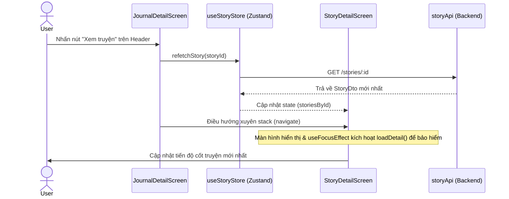

# Memori Document — Client: Story Progress Display (P07.T5)

## 1. Mô tả tính năng
Hiện thực hóa việc hiển thị tiến độ cốt truyện (`currentProgress`) trên màn hình chi tiết truyện (`StoryDetailScreen`) của ứng dụng di động. Tiến độ được chia thành nhiều phân đoạn ngăn cách bởi `---` (được render kèm nét đứt hoặc thanh ngang mỏng). Với nội dung dài (> 500 ký tự), nội dung sẽ tự động thu gọn và chỉ hiển thị đoạn mới nhất kèm nút "Xem thêm". Tích hợp nút "Xem truyện" tại header của màn hình chi tiết nhật ký (`JournalDetailScreen`) để điều hướng quay lại màn hình truyện và tự động tải lại tiến độ cốt truyện mới nhất qua store.

## 2. Chi tiết kỹ thuật & API của các hàm/component

### 2.1. Zustand Store: `useStoryStore`
- **`refetchStory: (id: string) => Promise<void>`**
  - Thực hiện gọi API `storyApi.getById(id)` để lấy thông tin story đầy đủ mới nhất từ server.
  - Cập nhật state `storiesById` để kích hoạt render lại tại các screen lắng nghe.

### 2.2. Component: `StoryProgressSection`
- **Props**: `{ progress: string | null | undefined }`
- **State**: `expanded: boolean` (mặc định là `false`)
- **Logic**:
  - Nếu không có tiến độ, hiển thị empty state.
  - Chuẩn hóa ký tự xuống dòng (`\r\n` thành `\n`), sau đó sử dụng regex `/\\n\\n---\\n+/` để chia nhỏ thành mảng các đoạn văn bản.
  - Nếu tổng độ dài chuỗi tiến độ dài hơn 500 ký tự:
    - Khi ở trạng thái thu gọn (`expanded === false`): chỉ hiển thị đoạn văn cuối cùng (đoạn mới nhất) cắt ngắn tối đa 300 ký tự kèm theo dấu `...` và nút "Xem thêm (N đoạn)".
    - Khi được mở rộng (`expanded === true`): Hiển thị tất cả các đoạn, xen kẽ nét đứt `divider` và nút "Thu gọn".
  - Nếu chuỗi ngắn (<= 500 ký tự): Hiển thị tất cả các đoạn, xen kẽ nét đứt `divider`.

### 2.3. Screen: `StoryDetailScreen`
- Sử dụng hook `useFocusEffect` và `useCallback` từ `@react-navigation/native` để gọi `loadDetail()` mỗi khi người dùng quay lại/mở màn hình, giúp tự động tải tiến độ mới nhất nếu trước đó vừa kết thúc phiên chat.
- Đồng bộ dữ liệu cục bộ với store qua `useEffect` lắng nghe `cachedStory` từ Zustand.
- Tích hợp component `<StoryProgressSection progress={story.currentProgress} />` nằm ở giữa phần Bối cảnh ban đầu và danh sách nhân vật.

### 2.4. Screen: `JournalDetailScreen`
- Cấu hình `navigation.setOptions` bổ sung thuộc tính `headerRight` để render nút "Xem truyện".
- Khi nhấn "Xem truyện":
  1. Gọi `useStoryStore.getState().refetchStory(storyId)` để tải lại dữ liệu chạy ngầm.
  2. Gọi `navigation.navigate('Main', { screen: 'Stories', params: { screen: 'Detail', params: { id: storyId } } })` để điều hướng quay lại.

## 3. Biểu đồ luồng dữ liệu (Data Flow)



## 4. Lưu ý quan trọng (Gotchas & Bugs)

1. **TypeScript Array Undefined Check**:
   - Khi thực hiện lấy đoạn cuối cùng của mảng bằng chỉ mục `paragraphs[paragraphs.length - 1]`, TypeScript sẽ cảnh báo lỗi `possibly 'undefined'` nếu không thể xác định độ dài mảng lúc compile.
   - *Cách khắc phục*: Sử dụng toán tử fallback `paragraphs[paragraphs.length - 1] || ''` để đảm bảo luôn nhận kiểu `string`.

2. **Đồng bộ Zustand và Local State**:
   - `StoryDetailScreen` sử dụng kết hợp `useState` cục bộ cho `story` và `useStoryStore` cho cache. Nếu chỉ cập nhật Zustand store (`refetchStory`), local state `story` sẽ không được kích hoạt re-render nếu không được đồng bộ.
   - *Cách khắc phục*: Thêm một `useEffect` để liên tục đồng bộ `story` local state mỗi khi `cachedStory` từ store thay đổi.

3. **Điều hướng xuyên Stack (Nested Navigation)**:
   - Vì `JournalDetailScreen` và `StoryDetailScreen` nằm ở hai stack khác nhau của Bottom Tab Navigator (`Journal` stack và `Stories` stack), việc gọi `navigation.navigate('Detail')` trực tiếp sẽ không hoạt động hoặc gây lỗi định tuyến.
   - *Cách khắc phục*: Sử dụng cú pháp nested navigation đầy đủ của React Navigation để truyền qua Tab chính:
     ```typescript
     navigation.navigate('Main', {
       screen: 'Stories',
       params: {
         screen: 'Detail',
         params: { id: storyId },
       },
     });
     ```
