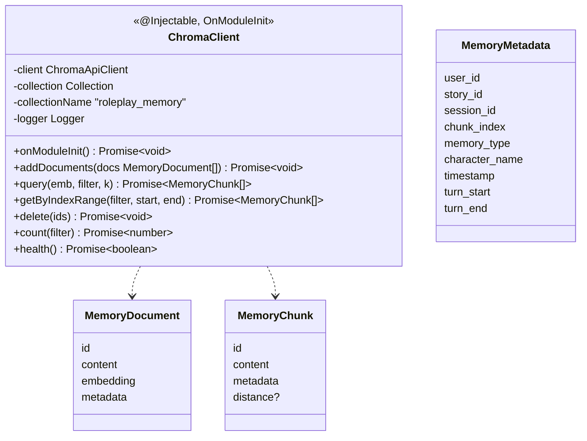

# P08.T1: Thiết lập ChromaDB Client và Collection cho Memory

## 1. Mô tả ngắn gọn
Tính năng này tập trung vào việc thiết lập `MemoryModule` và `ChromaClient` trong NestJS server để kết nối với ChromaDB, chuẩn bị cho quá trình RAG (Retrieval-Augmented Generation) và ghi nhớ dài hạn (Memory). Các types về document và module đã được khai báo hoàn chỉnh, đồng thời cấu hình Docker và Dependency (`chromadb`) cũng đã được thêm vào.

## 2. Chi tiết tính năng từng hàm trong `ChromaClient`
- `onModuleInit`: Tự động khởi tạo kết nối tới ChromaDB sử dụng biến môi trường `CHROMA_URL`. Nó gọi `getOrCreateCollection` cho collection `roleplay_memory` với `hnsw:space` là `cosine`. Nếu lỗi sẽ ném ra exception `CHROMA_UNAVAILABLE`.
- `addDocuments(docs)`: Nhận vào danh sách `MemoryDocument`, validate id, embedding, content, metadata sau đó thực thi `collection.add`. Nếu Chroma lỗi, ném `CHROMA_WRITE_FAIL`.
- `query(emb, filter, k)`: Nhận vào embedding vector (1 mảng số thực), điều kiện lọc `ChromaFilter` và số kết quả `k`. Sử dụng `collection.query` và trả về `MemoryChunk[]` kèm theo `distance`.
- `getByIndexRange(filter, startIdx, endIdx)`: Truy xuất dữ liệu lân cận bằng query `$and` gồm các object metadata kết hợp với `$gte` và `$lte` trên thuộc tính `chunk_index`.
- `delete(ids)`: Xóa danh sách chunk bằng IDs thông qua `collection.delete`.
- `count(filter)`: Đếm số lượng theo filter do Chroma không hỗ trợ đếm trực tiếp, nên sử dụng `collection.get` không kèm trường include (`include: []`) để lấy số id, từ đó tính độ dài.
- `health()`: Ping Chroma qua `this.client.heartbeat()` để check health, trả về boolean.

## 3. Biểu đồ Class Diagram

## 4. Lỗi đã gặp (Gotchas, Bugs) và Cách giải quyết
1. **Lỗi Dependency**: Yêu cầu cài đặt thêm package `chromadb`. *Cách giải quyết*: chạy `pnpm add chromadb --filter @chatai/server`.
2. **Lỗi `AppLogger` không tồn tại**: Trong spec design ban đầu sử dụng `AppLogger` (custom), tuy nhiên thư mục `shared/logger/` sử dụng `nestjs-pino`, không có class export `AppLogger`. *Cách giải quyết*: Dùng `new Logger(ChromaClient.name)` gốc từ `@nestjs/common`.
3. **Lỗi TS `Object is possibly undefined` trong spec**: Mảng trả về từ `collection.query` hoặc `get` có thể chứa giá trị `undefined` ở một số field như mảng phụ trợ. *Cách giải quyết*: Thêm toán tử Optional Chaining `?.` và sử dụng null checks `!== null` kết hợp ép kiểu (`as number`, `as any`).
4. **Lỗi Test Mocking**: Do `client = new ChromaApiClient(...)` được gán trực tiếp bên trong `onModuleInit`, việc gán biến property mock không hoạt động với logic tạo object mới liên tục từ jest mock block. *Cách giải quyết*: Định nghĩa các biến mock `mockGetOrCreateCollection`, `mockHeartbeat` global ở ngoài `jest.mock()`, sau đó spyOn trực tiếp vào các hàm này trong test thay vì spy vào instance.
