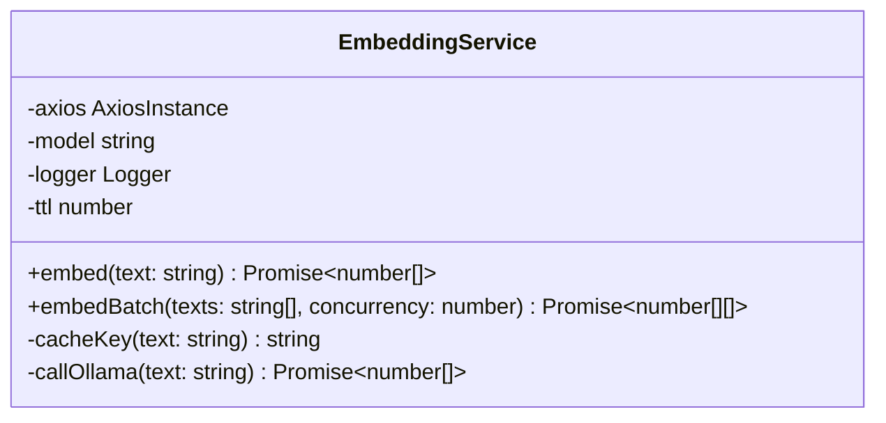
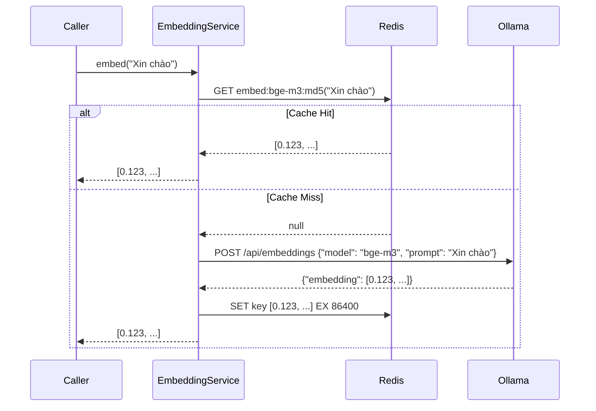

---
date: 2026-05-31
---
# Memori Doc: EmbeddingService (Ollama bge-m3 + Redis Cache)

Tài liệu này lưu trữ bối cảnh thực hiện cho task `P08.T2 — EmbeddingService` để hệ thống Memori tự động lưu trữ và sử dụng trong tương lai.

## 1. Mô tả tính năng
Hiện thực hóa `EmbeddingService` nhằm chuyển đổi các đoạn văn bản (text) thành các vector số (embedding vectors) sử dụng mô hình `bge-m3` của Ollama. Dịch vụ hỗ trợ lưu trữ đệm (caching) trên Redis để giảm tải và tăng tốc độ xử lý cho các văn bản trùng lặp, đồng thời cung cấp khả năng xử lý hàng loạt (batch embedding) với cơ chế giới hạn số lượng xử lý song song (concurrency limit) thông qua `p-limit`.

## 2. Chi tiết các hàm

### `embed(text: string): Promise<number[]>`
- **Đầu vào**: Một chuỗi văn bản `text`.
- **Logic xử lý**:
  1. Validate kiểu dữ liệu phải là `string` và thực hiện `trim()` đầu vào.
  2. Cắt ngắn chuỗi (`slice(0, 8000)`) nếu vượt quá 8000 ký tự (do giới hạn tối đa của hầu hết các mô hình embedding hiện nay).
  3. Nếu chuỗi sau khi xử lý rỗng, quăng lỗi `INVALID_PAYLOAD`.
  4. Tạo cache key dạng `embed:{model_name}:{md5(trimmed_text)}`.
  5. Kiểm tra Redis cache bằng hàm `getJson`. Nếu có dữ liệu trong cache (cache hit), lập tức parse và trả về kết quả vector.
  6. Nếu cache miss, gọi Ollama API `/api/embeddings` để lấy vector.
  7. Lưu vector mới tạo được vào Redis cache với thời gian sống (TTL) là 24 giờ (86400 giây) bằng hàm `setJson`.
  8. Trả về vector.
- **Dự phòng**: Nếu Redis bị lỗi (ví dụ ngắt kết nối), service sẽ log warning và tự động bỏ qua cache để gọi trực tiếp Ollama, tránh làm gián đoạn toàn bộ hệ thống.

### `embedBatch(texts: string[], concurrency = 3): Promise<number[][]>`
- **Đầu vào**: Mảng các chuỗi văn bản `texts` và mức độ song song `concurrency` (mặc định bằng 3).
- **Logic xử lý**:
  - Sử dụng thư viện `p-limit` để giới hạn số lượng tác vụ xử lý song song.
  - Áp dụng hàm `embed` cho mỗi chuỗi trong mảng đầu vào và gom kết quả lại bằng `Promise.all`.

### `cacheKey(text: string): string`
- Trả về key cache Redis dựa trên tên mô hình (`ollamaEmbedModel`) và mã băm MD5 của văn bản đầu vào.

### `callOllama(text: string): Promise<number[]>`
- Thực hiện request HTTP POST tới `baseURL` của Ollama (cấu hình từ `ollamaBaseUrl`) tại endpoint `/api/embeddings`.
- Gửi payload `{ model: this.model, prompt: text }`.
- Nếu gặp các lỗi kết nối phổ biến như `ECONNREFUSED`, `ECONNABORTED` hoặc request bị timeout, quăng lỗi `EMBED_UNAVAILABLE` (mã HTTP 503).

---

## 3. Sơ đồ Data Flow & Class Diagram

### Class Diagram

### Sequence Diagram

---

## 4. Lưu ý quan trọng (Gotchas & Bugs)

1. **Phiên bản `p-limit`**: Các phiên bản mới nhất của `p-limit` là Pure ESM, gây lỗi khi import trong NestJS sử dụng môi trường CommonJS mặc định nếu không cấu hình ts-node/jest kỹ lưỡng. Chúng ta đã cố định sử dụng phiên bản `p-limit@3.1.0` hỗ trợ tốt CommonJS để tránh lỗi import.
2. **Khóa Cấu hình (Config Keys)**: File cấu hình `configuration.ts` của NestJS sử dụng các khóa `ollamaBaseUrl` và `ollamaEmbedModel` thay vì `OLLAMA_URL` và `EMBED_MODEL` như mô tả nguyên bản trong task file. Cần đọc cấu hình dựa trên file schema thực tế của dự án.
3. **Quản lý Lỗi kết nối**: Lỗi Axios cần kiểm tra trực tiếp mã code (`e.code` hoặc `e.response.code`) để xác định đúng trạng thái `ECONNREFUSED` hoặc `ECONNABORTED` và chuyển đổi thành lỗi hệ thống `EMBED_UNAVAILABLE`.
