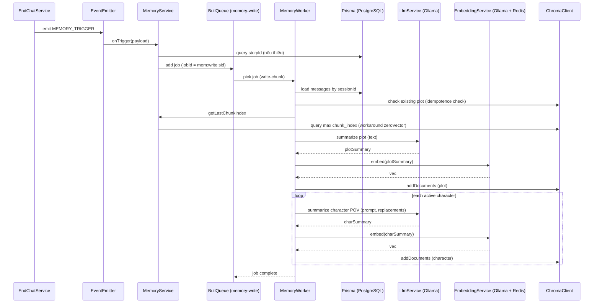

# Memori Doc: MemoryWriter (BullMQ Async Worker Pipeline)

Tài liệu này lưu trữ bối cảnh thực hiện cho task `P08.T3 — Memory Writer` để hệ thống Memori tự động lưu trữ và sử dụng trong tương lai.

## 1. Mô tả tính năng
Hiện thực hóa cơ chế ghi nhớ bộ nhớ dài hạn bất đồng bộ sau khi phiên chat kết thúc (`MEMORY_TRIGGER`). Dịch vụ sử dụng một hàng đợi BullMQ tên là `memory-write` kết nối tới Redis, giao công việc tóm tắt và ghi nhớ cốt truyện cùng góc nhìn của từng nhân vật hoạt động cho tiến trình nền (`MemoryWorker`). Tiến trình nền thực hiện lấy lịch sử tin nhắn, kiểm tra tính trùng lặp (idempotency check), tóm tắt bằng LLM, nhúng vector bằng EmbeddingService và lưu trữ vào ChromaDB.

## 2. Chi tiết các hàm

### `MemoryService.onTrigger(payload)`
- **Đầu vào**: Một payload dạng `{ sessionId, userId, storyId?, type? }`.
- **Logic xử lý**:
  - Nhận sự kiện `memory.trigger`.
  - Tự động truy vấn database để lấy `storyId` nếu payload truyền thiếu `storyId`.
  - Gọi `enqueueWrite` để đẩy công việc vào hàng đợi.

### `MemoryService.enqueueWrite(payload)`
- **Logic xử lý**:
  - Đẩy một `MemoryJob` vào queue `memory-write` với tên công việc `write-chunk`.
  - Đặt `jobId` cố định là `mem:write:${sessionId}` để đảm bảo tính duy nhất (idempotency), ngăn ngừa việc ghi nhớ trùng lặp nếu sự kiện được kích hoạt nhiều lần.
  - Cấu hình số lần thử lại (attempts = 3) và cơ chế giãn cách exponential delay (30 giây).

### `MemoryService.getLastChunkIndex(userId, storyId, type)`
- **Logic xử lý**:
  - Lấy chỉ mục chunk lớn nhất đã lưu của cốt truyện nhằm duy trì thứ tự tuần tự của các chunk ghi nhớ (`chunk_index` tăng dần).
  - Tra cứu Redis cache `mem:lastidx:${userId}:${storyId}:${type}` trước để giảm tải cho ChromaDB.
  - Nếu cache miss, thực hiện truy vấn ChromaDB bằng `zeroVector` (mảng 1024 số 0 do model `bge-m3` có vector size là 1024) kết hợp bộ lọc metadata (`user_id`, `story_id`, `memory_type`).
  - Lấy giá trị lớn nhất từ các chunk trả về, lưu vào Redis cache với TTL 60s và trả về.

### `MemoryWorker.process(job)`
- **Logic xử lý**:
  - Tải toàn bộ tin nhắn của phiên chat từ Prisma theo thứ tự `turnOrder` tăng dần. Nếu không có tin nhắn, bỏ qua.
  - Thực hiện kiểm tra tính trùng lặp trong ChromaDB: Query ChromaDB để tìm xem đã tồn tại bộ nhớ loại `'plot'` cho `sessionId` này hay chưa. Nếu đã có, bỏ qua (idempotency check thành công).
  - Lấy chỉ mục chunk tiếp theo (`nextIdx = lastIdx + 1`).
  - Ghi nhận bộ nhớ cốt truyện: Gọi LLM summarize plot, cắt ngắn nội dung nếu vượt quá 2000 ký tự, thực hiện embed, lưu vào ChromaDB với metadata chứa `turn_start`, `turn_end`, và `memory_type: 'plot'`.
  - Ghi nhận bộ nhớ góc nhìn nhân vật: Tìm tất cả các nhân vật có tin nhắn phản hồi (`assistant`) trong phiên chat. Với từng nhân vật, xây dựng prompt cá nhân hóa dựa trên template `summary_character.md` (được replace các placeholder), gọi LLM summarize, cắt ngắn nếu > 1500 ký tự, embed và lưu vào ChromaDB.
  - Quá trình tóm tắt các nhân vật được xử lý tuần tự (sequential) để tránh gây nghẽn hoặc quá tải cho dịch vụ Ollama.

### `LlmService.summarize(text, mode, replacements?)`
- **Logic xử lý**:
  - Nâng cấp để hỗ trợ truyền thêm `replacements` thay thế các placeholder (như `{{CHAR_NAME}}`) trong prompt template.
  - Tự động phát hiện nếu template chứa placeholder hội thoại (`{{HISTORY_TEXT}}` hoặc `{{MESSAGES_BLOCK}}`), thực hiện replace bằng hội thoại `text` truyền vào và chuyển đổi user prompt thành `"Hãy tóm tắt."` nhằm tránh việc gửi trùng lặp hội thoại trong cả system và user prompt.

## 3. Data Flow Diagram

## 4. Lưu ý quan trọng & Bẫy lập trình (Gotchas)

- **Cấu hình Redis của BullMQ:**
  - Tránh cấu hình tĩnh cứng nhắc `REDIS_HOST` và `REDIS_PORT`. Thay vào đó, cần sử dụng biến `redisUrl` có sẵn trong hệ thống (dạng `redis://...`), sử dụng class `URL` của Node.js để parse chính xác `host`, `port`, `username`, `password` từ URL này.
- **Tránh trùng lặp token hội thoại (Token Overhead):**
  - Prompt template `summary_character.md` có chứa placeholder `{{HISTORY_TEXT}}`. Nếu ta gửi hội thoại vào đó, đồng thời trong `LlmService.summarize` ta lại gửi hội thoại đó làm `user message` thì Ollama sẽ nhận gấp đôi số lượng token hội thoại không cần thiết.
  - **Cách giải quyết:** Trong `LlmService.summarize`, ta tự động phát hiện xem system template có chứa placeholder hội thoại hay không. Nếu có, ta thay thế nó trong system template luôn và đặt `user message` thành một câu lệnh ngắn gọn `"Hãy tóm tắt."`.
- **Tránh quá tải Ollama (Concurrency Limit):**
  - Khi xử lý tóm tắt nhiều nhân vật cùng lúc, **tuyệt đối không dùng `Promise.all`** hoặc xử lý song song. Việc gọi Ollama song song cho các request tóm tắt nặng có thể gây tràn bộ nhớ GPU/OOM hoặc crash Ollama. Cần xử lý tuần tự (sequential loop) từng nhân vật một.
- **Workaround cho query metadata trong ChromaDB:**
  - ChromaDB `query` API bắt buộc phải truyền vector nhúng (`queryEmbeddings`). Khi cần lọc document thuần túy theo metadata (ví dụ tìm `max chunk_index`), ta phải dùng một vector mốc `zeroVector` (độ dài 1024 khớp với mô hình `bge-m3`). Điều này sẽ giúp lấy ra tất cả document khớp bộ lọc metadata mà không quan tâm đến độ tương đồng ngữ nghĩa.
