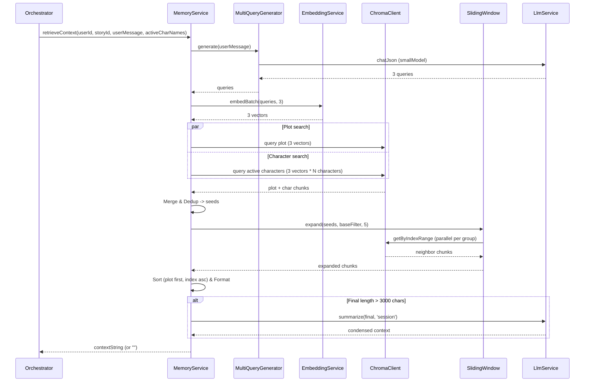

# Memori Document — P08.T4: Memory Reader

Tài liệu thiết kế và lưu ý kỹ thuật khi triển khai tính năng **Memory Reader** trong bộ nhớ dài hạn của dự án.

## 1. Mô tả tính năng
Hệ thống RAG dài hạn (`MemoryService.retrieveContext`) tự động trích xuất các mảnh ký ức liên quan đến tin nhắn mới nhất của người chơi. RAG sử dụng kết hợp các kỹ thuật nâng cao:
- **Multi-Query**: Sinh ra 3 câu truy vấn khác nhau từ tin nhắn gốc để bao quát ngữ cảnh tốt hơn.
- **Parallel Search**: Tìm kiếm đồng thời ChromaDB cho thông tin cốt truyện (`plot`) và thông tin của các nhân vật đang hoạt động (`character_name`).
- **Sliding Window**: Mở rộng phạm vi ngữ cảnh lấy thêm các chunk lân cận có index trong khoảng `[index - 5, index + 5]`.
- **Condense Context**: Tự động tóm tắt nội dung khi tổng độ dài của text vượt quá 3000 ký tự qua Small AI để tránh tràn context window của mô hình LLM chính.

## 2. Chi tiết các hàm & API

### 2.1. `MultiQueryGenerator`
- `generate(userMessage: string): Promise<string[]>`
  Sinh 3 câu truy vấn khác nhau. Sử dụng Zod Schema `z.object({ queries: z.array(z.string().min(1)).min(1).max(5) })` và gọi `LlmService.chatJson` với mô hình nhỏ `smallModel`.
  - *Fallback*: Nếu gọi LLM lỗi, hàm tự động trả về `[userMessage]` để đảm bảo tính sẵn sàng cao.

### 2.2. `SlidingWindow`
- `expand(seeds: MemoryChunk[], baseFilter: ChromaFilter, window = 5): Promise<MemoryChunk[]>`
  Nhận danh sách các `seeds` (kết quả RAG trực tiếp từ Chroma) và gom nhóm chúng theo cặp `(memory_type, character_name)`. Sau đó xác định index lớn nhất/nhỏ nhất và truy vấn lân cận bằng `chroma.getByIndexRange` với filter tương ứng. Gom nhóm và loại bỏ các chunk trùng lặp.

### 2.3. `MemoryService.retrieveContext`
- `retrieveContext(userId: string, storyId: string, userMessage: string, activeCharNames: string[]): Promise<string>`
  Điều phối toàn bộ quá trình RAG: sinh queries -> embedBatch -> song song tìm kiếm Chroma -> gộp & dedup -> mở rộng sliding window -> sắp xếp (plot trước, character sau, index tăng dần) -> định dạng output.
  - Tự động rút gọn qua `llmService.summarize(final, 'session')` nếu độ dài kết quả vượt quá 3000 ký tự.
  - *Graceful degrade*: Toàn bộ quá trình chạy trong block `try-catch`. Nếu có bất kỳ lỗi nào từ Chroma, VectorDB hay LLM, hệ thống ghi log warning và trả về chuỗi rỗng `""` để chatbot không bị crash.

## 3. Data Flow Diagram

## 4. Lưu ý quan trọng & Gotchas
- **Mức độ ưu tiên Sort**: Để giữ cho mạch truyện logic, các chunk bắt buộc phải được sắp xếp theo đúng thứ tự thời gian (`chunk_index` tăng dần), và thông tin của Cốt truyện (`plot`) phải xuất hiện trước thông tin chi tiết của Nhân vật (`character`).
- **Parallelism**: ChromaDB và Ollama API hỗ trợ truy vấn song song rất tốt. Việc sử dụng `Promise.all` giúp giảm thiểu tối đa latency của RAG xuống dưới 3s.
- **Tính an toàn cao (Graceful Degradation)**: RAG không được phép làm hỏng trải nghiệm chat chính. Nếu ChromaDB ngắt kết nối hoặc Ollama bị nghẽn mạng, context trả về là `""` và log warning chi tiết chứ không throw exception.
