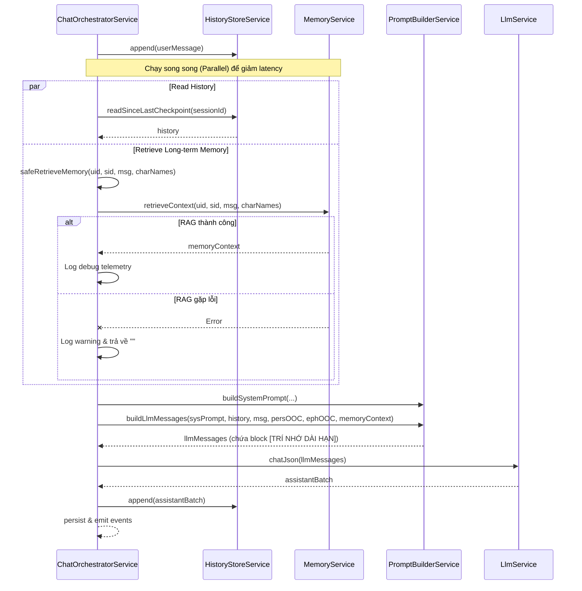

---
date: 2026-05-31
---
# Memori Document — P08.T5: Wire Memory vào ChatOrchestrator

Tài liệu thiết kế và lưu ý kỹ thuật khi tích hợp dịch vụ **MemoryService** vào **ChatOrchestratorService** nhằm cung cấp bối cảnh trí nhớ dài hạn (Plot & Character Memory) cho mô hình ngôn ngữ lớn (LLM).

## 1. Mô tả tính năng

Để giúp nhân vật AI nhớ lại các sự kiện đã xảy ra trong quá khứ sau khi một session kết thúc, chúng ta kết nối dịch vụ RAG dài hạn (`MemoryService`) vào luồng điều phối hội thoại chính (`ChatOrchestratorService`):

- **Parallel Querying**: Truy vấn bối cảnh bộ nhớ dài hạn song song với quá trình đọc lịch sử hội thoại gần đây từ JSONL (`HistoryStore`) để tối ưu hóa latency.
- **Context Injection**: Trí nhớ dài hạn sau khi lấy ra sẽ được định dạng và đưa vào phương thức `promptBuilder.buildLlmMessages` dưới dạng block `[TRÍ NHỚ DÀI HẠN]`.
- **Graceful degradation**: Nếu bộ nhớ dài hạn gặp lỗi hoặc ChromaDB bị mất kết nối, hệ thống sẽ tự động hạ cấp xuống chuỗi rỗng `""` và tiếp tục cuộc trò chuyện bình thường thay vì gây crash.
- **Telemetry logging**: Log chi tiết thời gian truy xuất (`retrievalTimeMs`) và độ dài của bối cảnh (`contextLength`) để giám sát hiệu năng.

## 2. Chi tiết các hàm

### 2.1. `ChatOrchestratorService.handleUserTurn`

- Nhận tin nhắn mới từ người dùng, lưu vào JSONL.
- Gọi song song hai tác vụ qua `Promise.all`:
  1. `historyStore.readSinceLastCheckpoint(ctx.sessionId)` (Đọc lịch sử hội thoại).
  2. `safeRetrieveMemory(ctx.userId, ctx.storyId, userMessage, activeCharNames)` (Truy vấn bộ nhớ dài hạn).
- Đưa kết quả `memoryContext` vào `promptBuilder.buildLlmMessages(...)` để dựng prompt gửi lên LLM.

### 2.2. `ChatOrchestratorService.safeRetrieveMemory`

- **Signature**: `private async safeRetrieveMemory(userId: string, storyId: string, userMessage: string, activeCharNames: string[]): Promise<string>`
- Thực thi gọi `memoryService.retrieveContext(...)`.
- Bọc toàn bộ trong khối `try-catch`:
  - **Success**: Ghi nhận log debug telemetry dạng `{ msg: 'Memory context retrieved successfully', retrievalTimeMs, contextLength }` và trả về context.
  - **Failure**: Bắt mọi lỗi xảy ra, ghi nhận log warning kèm thông tin lỗi và duration, sau đó trả về chuỗi rỗng `""`.

## 3. Data Flow Diagram

## 4. Lưu ý quan trọng & Gotchas

- **Circular Dependency (Phụ thuộc vòng)**:
  `MemoryModule` cần `ChatModule` (để dùng `LlmService`), trong khi `ChatModule` lại cần `MemoryModule` (để dùng `MemoryService`).
  - _Giải pháp_: Sử dụng `forwardRef(() => MemoryModule)` trong `chat.module.ts` và `forwardRef(() => ChatModule)` trong `memory.module.ts` của NestJS.
  - Tại constructor của `ChatOrchestratorService`, ta bắt buộc phải inject bằng `@Inject(forwardRef(() => MemoryService))`.
- **Latency Control**:
  RAG đòi hỏi việc sinh query bằng LLM, tạo embedding và tìm kiếm vector trên ChromaDB. Bằng cách chạy song song việc gọi RAG và đọc file JSONL (I/O), chúng ta tiết kiệm được đáng kể tổng thời gian xử lý một lượt chat của người dùng.
