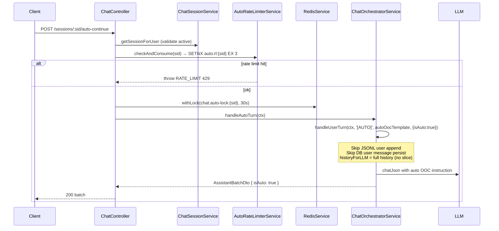

# P09.T1 — Auto Chat Orchestrator + Endpoint

## Tóm tắt
Thêm chế độ AUTO vào chat pipeline: endpoint `POST /chat/sessions/:sid/auto-continue` cho phép server tự tiếp tục câu chuyện mà không cần user input thực sự.

## Files thay đổi

| File | Loại | Mô tả |
|------|------|-------|
| `packages/prompts/v1/auto_turn_ooc.md` | NEW | Template OOC hướng dẫn LLM tự đóng vai và tiếp tục cốt truyện |
| `packages/prompts/src/template-loader.ts` | MODIFIED | Thêm `'auto_turn_ooc'` vào union type |
| `packages/shared-types/src/chat.ts` | MODIFIED | Thêm `isAuto?: boolean` vào `AssistantBatchDto` |
| `apps/server/src/modules/chat/services/auto-rate-limiter.service.ts` | NEW | Per-session 3s cooldown dùng Redis SETNX |
| `apps/server/src/modules/chat/services/chat-orchestrator.service.ts` | MODIFIED | Thêm `handleAutoTurn`, cập nhật `handleUserTurn` với `opts.isAuto` |
| `apps/server/src/modules/chat/chat.controller.ts` | MODIFIED | Thêm endpoint `autoContinue` |
| `apps/server/src/modules/chat/chat.module.ts` | MODIFIED | Đăng ký `AutoRateLimiterService` |
| `apps/server/src/modules/chat/chat-auto.spec.ts` | NEW | Unit tests cho AutoRateLimiterService và auto turn logic |

## Data Flow



## Thiết kế quan trọng

### `handleUserTurn` với `opts.isAuto=true`
- Skip input validation (user message là system-generated)
- **Không append** entry user vào JSONL file
- `historyForLLM = history` (không `slice(0, -1)` vì không có user entry mới)
- `persistMessages(..., isAuto=true)` → skip INSERT user message và ephemeral_ooc vào DB
- Assistant messages vẫn được persist bình thường
- Response có `isAuto: true` field

### `AutoRateLimiterService` (per-session cooldown)
```
key = auto:rl:{sid}
SETNX key '1' EX 3  →  null = đang trong cooldown
```
Khác với `@Throttle` (per-user, per-route) — cái này là per-session, 1 req / 3s.

### Lock key riêng biệt
- Manual: `chat:lock:{sid}` 
- Auto: `chat:auto-lock:{sid}`
Dùng key riêng để manual và auto không block lẫn nhau.

## Gotchas / Regression Risks

1. **`historyForLLM` slice logic**: Khi `isAuto=true`, KHÔNG slice `history.slice(0, -1)` vì không có user entry mới được append. Nếu nhầm, LLM sẽ bị mất 1 message cuối cùng trong history.

2. **`persistMessages` turn order**: Khi `isAuto=true`, assistant messages bắt đầu từ `startOrder` (không phải `startOrder + 1`) vì không có user message row trước đó.

3. **Template length**: `auto_turn_ooc.md` ~250 chars, dưới giới hạn 500 chars validation của ephemeralOOC. Nếu template được mở rộng quá 500 chars, phải bỏ validation check khi `isAuto=true` (đã xử lý rồi — validation bị skip hoàn toàn cho auto turns).

4. **Rate limit vs Lock**: `AutoRateLimiter.checkAndConsume` chạy TRƯỚC lock. Nếu rate limit throw, lock không được acquire → tránh lãng phí Redis lock.
