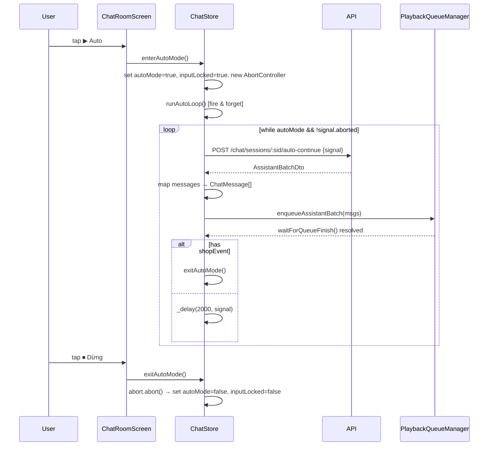
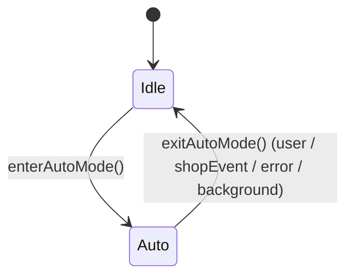
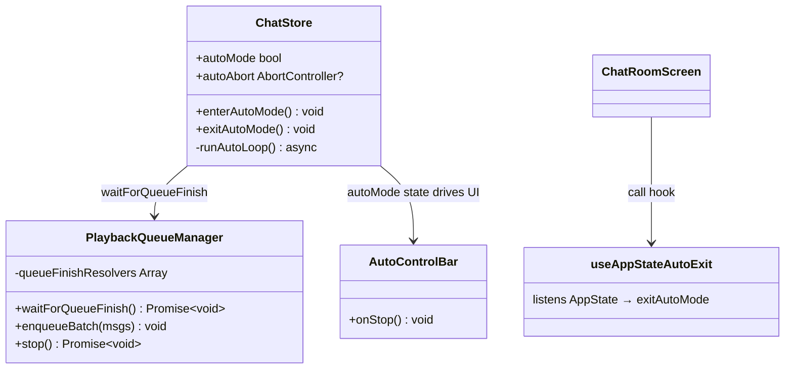

# task_p09_t2_auto_mode_ui

## 1. Mô tả tính năng
Thêm **Auto Mode** vào màn hình chat (P09.T2): khi người dùng nhấn nút "▶ Auto", client tự động gọi server theo vòng lặp để tiếp tục câu chuyện mà không cần nhập liệu thủ công. Mỗi vòng lặp: gọi API → enqueue batch → đợi playback xong → delay 2s → lặp lại. Dừng khi user nhấn "⏹ Dừng", có shop event, có lỗi, hoặc app vào background.

---

## 2. Các module/file đã thay đổi

| File | Thay đổi |
|------|----------|
| `apps/mobile/src/features/chat/services/playback-queue.manager.ts` | Thêm `waitForQueueFinish(): Promise<void>` — trả về Promise resolve khi queue rỗng và phát xong; dùng resolver array được flush ở cả `playNext()` (queue empty) và `stop()` |
| `apps/mobile/src/features/chat/store/chat.store.ts` | Thêm state `autoMode: boolean`, `autoAbort: AbortController \| null`; thêm actions `enterAutoMode()`, `exitAutoMode()`; thêm helper `_delay()` và `_raceAbort()`; cập nhật `reset()` để clear autoMode |
| `apps/mobile/src/features/chat/services/chat.service.ts` | Thêm `postAutoContinue(sid, signal?)` → `POST /chat/sessions/:sid/auto-continue` |
| `apps/mobile/src/features/chat/components/AutoControlBar.tsx` | **Mới** — thanh thay thế InputBar khi autoMode=true; hiển thị ActivityIndicator + "Đang tự động..." + nút "⏹ Dừng" |
| `apps/mobile/src/features/chat/hooks/useAppStateAutoExit.ts` | **Mới** — hook lắng nghe `AppState.change`; khi nextState !== 'active' và autoMode=true → gọi `exitAutoMode()` |
| `apps/mobile/src/features/chat/components/InputBar.tsx` | Thêm prop `rightExtra?: React.ReactNode` — render sau nút Gửi (dùng để đặt nút Auto) |
| `apps/mobile/src/features/chat/screens/ChatRoomScreen.tsx` | Import `AutoControlBar`, `useAppStateAutoExit`; subscribe `autoMode`, `enterAutoMode`, `exitAutoMode` từ store; toggle `<InputBar rightExtra={<AutoButton/>}>` ↔ `<AutoControlBar>`; thêm styles `autoBtn` |

---

## 3. Data Flow

---

## 4. State Machine

---

## 5. Class diagram (bổ sung)

---

## 6. Gotcha & Regression Risk

- **`waitForQueueFinish()` phải flush cả khi `stop()` được gọi** — nếu không, `runAutoLoop` bị treo vĩnh viễn khi user nhấn Dừng giữa lúc đang chờ queue. Resolver array được flush trong cả `stop()` và `playNext()` (queue empty branch).
- **Không có 2 loop song song**: `enterAutoMode()` có guard `if (get().autoMode) return` ở đầu.
- **AbortController signal** truyền vào `postAutoContinue` để hủy in-flight HTTP khi exitAutoMode.
- **`_raceAbort`** wrap `waitForQueueFinish` để abort ngay khi signal fired, tránh leak Promise.
- **reset()** phải clear `autoMode` và `autoAbort` — nếu không, khi navigate ra khỏi màn hình rồi vào lại, state cũ có thể còn.
- **`exitAutoMode` trong cleanup của ChatRoomScreen** không cần gọi riêng vì `reset()` đã được gọi khi unmount — nhưng nên gọi `abort()` qua store trước khi `reset()` nếu muốn chắc chắn cancel HTTP request. (Hiện tại `reset()` chỉ set về null, không abort — nếu cần cancel mid-flight thì gọi `exitAutoMode()` trước `reset()` trong cleanup.)
- **AppState listener** chỉ dừng auto mode, không dừng playback — nên kết hợp với `mgr.stop()` nếu muốn dừng hoàn toàn âm thanh khi background (có thể thêm sau).
- **Shop event detection** xảy ra trước khi enqueue batch để giữ audio của batch đó phát xong trước khi dừng.
