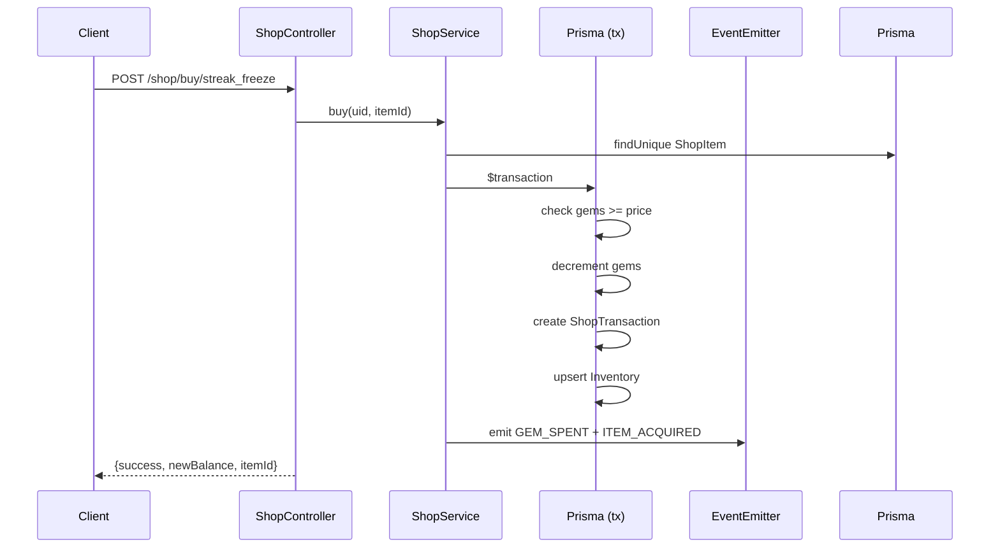

# P09.T3 — ShopModule (Contextual + System Shop)

## Tổng quan

Triển khai ShopModule hoàn chỉnh cho server NestJS: mua vật phẩm từ system shop và contextual event trong chat, với giao dịch Postgres atomic.

## Các thay đổi

### Prisma Schema (`apps/server/prisma/schema.prisma`)
- Thêm field `gems Int @default(0)` vào `UsersMeta`.
- Thêm 3 model mới: `ShopItem`, `ShopTransaction`, `Inventory`.
- Quan hệ: `UsersMeta` → `ShopTransaction[]` + `Inventory[]` (onDelete: Cascade).
- Migration: `20260601041619_add_shop_tables`.

### Shared Types (`packages/shared-types/src/shop.ts`)
- Định nghĩa: `ShopItemDto`, `InventoryItemDto`, `BuyResultDto`, `BalanceDto`.

### Events (`apps/server/src/shared/events/event-names.ts`)
- Thêm `GEM_SPENT = 'shop.gem_spent'` và `ITEM_ACQUIRED = 'shop.item_acquired'`.

### ShopModule (`apps/server/src/modules/shop/`)
- `shop.module.ts` — NestJS module, export ShopService.
- `shop.service.ts` — Logic nghiệp vụ chính.
- `shop.controller.ts` — 4 endpoints: GET /items, GET /balance, POST /buy/:itemId, GET /inventory.
- `dto/buy.dto.ts` — DTO đơn giản.
- `shop.service.spec.ts` — 7 unit tests (mock prisma.$transaction).

### Seed (`apps/server/prisma/seed.ts`)
- Upsert 4 items: streak_freeze (50g), gem_pack_small (IAP placeholder, inactive), love_ring (15g), shield_charm (25g).

### App Module
- Đăng ký `ShopModule` vào `app.module.ts`.

## Lưu ý kiến trúc

**Gems lưu ở 2 nơi:**
- Firestore `UserDoc.gems` — dùng cho profile display (đọc bởi UsersService).
- Postgres `UsersMeta.gems` — dùng cho shop transactions (atomic Prisma `$transaction`).
- Hai trường này cần được sync: khi mission/event cộng gems, phải update cả 2. Đây là kỹ thuật nợ cần giải quyết ở P10/P11.

**`doPurchase` — private method:**
Chứa toàn bộ Prisma `$transaction`: check balance → decrement gems → insert ShopTransaction → upsert Inventory. Event emitter (`GEM_SPENT`, `ITEM_ACQUIRED`) được emit **sau** khi transaction commit thành công.

**`applyContextualEvent`:**
- `choice === 'decline'` → không thay đổi state, chỉ trả về balance hiện tại.
- Item chưa tồn tại trong DB → auto-create với category='contextual'. Price lấy từ LLM event, không phải `item.priceGems`.

**UsersMeta PK:**
Prisma field là `userId` (mapped `user_id`), không phải `uid`. Khi query phải dùng `{ where: { userId: uid } }`.

## Sequence Diagram

## Gotchas / Regression Risks

- `gems` trong Postgres bắt đầu = 0. Cần đảm bảo mission reward hoặc top-up phải cập nhật `UsersMeta.gems` để shop hoạt động đúng.
- `applyContextualEvent` dùng `price` từ LLM event (không phải `item.priceGems`), vì item được tạo auto với `priceGems = price` nhưng lần sau LLM có thể suggest giá khác.
- Controller không dùng `@UseGuards(FirebaseAuthGuard)` riêng vì đã có global `AuthGuard` trong `AppModule`.
