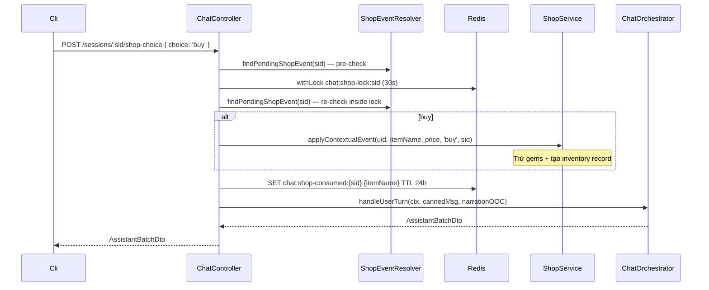

# P09.T4 — Chat Shop-Choice Endpoint + Narration Branch

## Tóm tắt
Thêm endpoint `POST /chat/sessions/:sid/shop-choice` để xử lý quyết định mua/từ chối vật phẩm trong shop event. Sau khi xử lý, orchestrator tiếp tục truyện với canned message và narration OOC tương ứng.

## Files thay đổi

| File | Thay đổi |
|------|----------|
| `apps/server/src/shared/errors/app-exception.ts` | Thêm `NO_PENDING_SHOP_EVENT` (400), `SHOP_EVENT_ALREADY_RESOLVED` (409) |
| `packages/prompts/v1/shop_choice_branches.md` | NEW — Template narration cho buy/decline branch |
| `packages/prompts/src/template-loader.ts` | Thêm `shop_choice_branches` vào union type |
| `apps/server/src/modules/chat/dto/shop-choice.dto.ts` | NEW — `ShopChoiceDto { choice: 'buy' | 'decline' }` |
| `apps/server/src/modules/chat/dto/index.ts` | Export `ShopChoiceDto` |
| `apps/server/src/modules/chat/services/history-store.service.ts` | Thêm `getLastAssistantBatch(sid)` |
| `apps/server/src/modules/chat/services/shop-event-resolver.service.ts` | NEW — `ShopEventResolverService` |
| `apps/server/src/modules/chat/chat.controller.ts` | Thêm `shopChoice` endpoint + inject dependencies |
| `apps/server/src/modules/chat/chat.module.ts` | Register `ShopEventResolverService` + import `ShopModule` |

## Data Flow



## Thiết kế quan trọng

### msgId = itemName
JSONL `AssistantMessage.shopEvent` không có `id` field (chỉ có `itemName` + `price`). Do đó `msgId` được map sang `itemName` để dùng làm key Redis idempotency:
```
chat:shop-consumed:{sid}:{itemName}
```
Cách này idempotent per item per session — nếu cùng item xuất hiện lại thì cũng đúng behavior.

### itemDisplayName = itemName
LLM sinh ra `itemName` là tên hiển thị tiếng Việt (e.g. "Chiếc váy hồng"), không phải canonical ID. Template narration dùng `itemName` trực tiếp làm display name.

### Template Parsing
```
---BUY---
...<buy text>...
---DECLINE---
...<decline text>...
```
Parse trong constructor của ChatController (load một lần, cache trong instance field `shopChoiceTemplates`).

### Canned Messages
- Buy: `好，我买了`
- Decline: `不用了，谢谢`

Được truyền vào `handleUserTurn` như user message thật (không dùng `isAuto`), nên sẽ lưu vào history và DB như một user turn bình thường.

### Concurrent Safety
1. Pre-check trước khi acquire lock (fail fast)
2. Re-check sau lock (double-check pattern)
3. `markConsumed` TRƯỚC khi gọi orchestrator để prevent re-entry nếu orchestrator bị retry

## Gotchas & Regression Risks

- `ShopModule` phải được import vào `ChatModule` để inject `ShopService`. `ShopModule` đã export `ShopService`.
- `applyContextualEvent` với `choice='buy'` có thể throw `NOT_ENOUGH_GEMS` (402) — event vẫn pending vì `markConsumed` chưa được gọi khi throw, user có thể retry với `decline`.
- `getLastAssistantBatch` scan từ cuối history file — nếu session rất dài (nhiều turns) thì sẽ đọc toàn bộ file JSONL. Acceptable vì chat session thường < vài trăm turns.
- Nếu assistant batch có nhiều messages với `shopEvent`, chỉ message đầu tiên được lấy (loop `for...of` với return sớm). Thực tế LLM chỉ sinh 1 shopEvent per batch.
