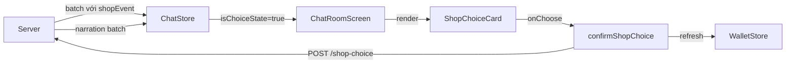

# task_p09_t5_shop_choice_card_ui.md

## Tổng quan

Implement ShopChoiceCard UI và tích hợp vào ChatRoom. Khi server trả về batch có `shopEvent`, client hiển thị card chọn mua/không. Sau khi chọn, server trả về narration batch tiếp theo.

## Modules / Files thay đổi

| File | Loại thay đổi |
|------|--------------|
| `apps/mobile/src/features/wallet/store/wallet.store.ts` | **Tạo mới** |
| `apps/mobile/src/features/chat/services/chat.service.ts` | Thêm `postShopChoice` |
| `apps/mobile/src/features/chat/store/chat.store.ts` | Thêm shop state + `confirmShopChoice` |
| `apps/mobile/src/features/chat/components/ShopChoiceCard.tsx` | **Tạo mới** |
| `apps/mobile/src/features/chat/screens/ChatRoomScreen.tsx` | Cập nhật renderItem + InputBar |

## Kiến trúc



## State mới trong ChatStore

```ts
isChoiceState: boolean        // true khi đang chờ user chọn mua/không
pendingShopEvent: {           // event đang pending
  msgId: string;
  itemName: string;
  price: number;
} | null
choiceLoading: boolean        // đang POST tới server
insufficientGems: boolean     // 402 từ server
```

## Shop detection flow

Shop detection xảy ra trong `enqueueAssistantBatch`: khi có message với `shopEvent != null`, store tự set `isChoiceState: true` và `inputLocked: true`. Không cần caller biết về shop.

## Auto mode coupling

- `enterAutoMode` đã detect `hasShopEvent` và gọi `exitAutoMode()` trước khi break
- `exitAutoMode()` set `inputLocked: false` — tuy nhiên `isChoiceState: true` vẫn giữ input disabled trong UI vì `ChatRoomScreen` dùng `disabled={inputLocked || isChoiceState || ending}`
- Không sửa `exitAutoMode` — UI double-guard là đủ

## WalletStore

- `balance`: số gem hiện tại
- `refresh()`: GET `/shop/balance` → cập nhật balance
- Được gọi khi: vào ChatRoom, sau `confirmShopChoice('buy')`

## Gotchas / Regression risks

1. **FlatList inverted**: ShopChoiceCard được render DƯỚI MessageBubble trong View wrapper. Do FlatList inverted, cell xuất hiện ở cuối màn hình — thứ tự bubble-then-card trong View là đúng.
2. **Fallback (no PlaybackQueueManager)**: Trong `enqueueAssistantBatch` fallback path (test env), `inputLocked` được set `true` nếu có shopMsg.
3. **Idempotency**: `postShopChoice` không cần Idempotency-Key vì server đã có guard `SHOP_EVENT_ALREADY_RESOLVED`.
4. **Toast từ store**: Dùng `Platform.OS === 'android' ? ToastAndroid : Alert.alert` — cùng pattern với `CharacterBubble`.
5. **insufficientGems reset**: Khi `confirmShopChoice` thành công hoặc `SHOP_EVENT_ALREADY_RESOLVED`, `insufficientGems` được reset về false.
