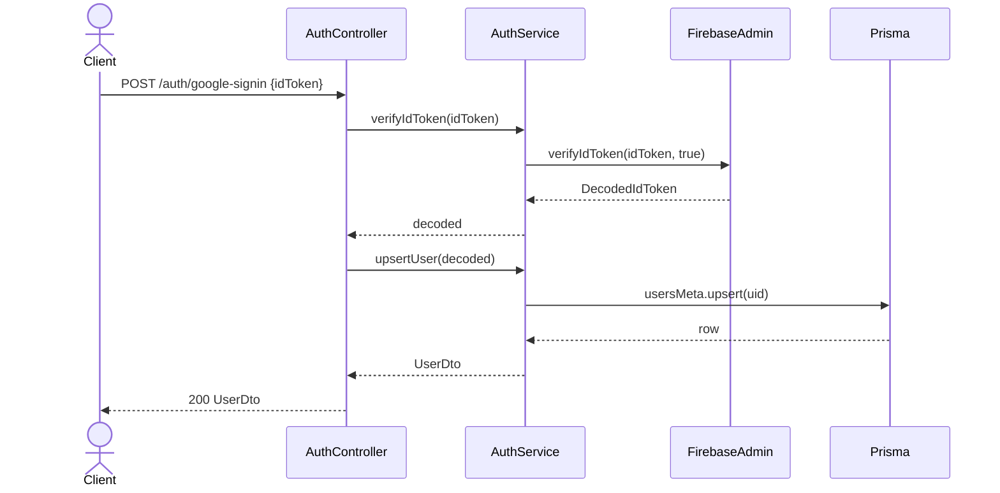

---
date: 2026-05-30
---
# Task: Server AuthModule (Firebase Admin SDK)

## 1. Mô tả ngắn gọn
Triển khai hệ thống xác thực (Authentication) trên server sử dụng Firebase Admin SDK. 
- Khởi tạo package `@chatai/shared-types` chứa các DTO và loại dữ liệu dùng chung.
- Tạo `AuthModule` trên server NestJS bao gồm `FirebaseAdminProvider`, `AuthService`, `AuthController`.
- Triển khai `AuthGuard` mặc định bảo vệ tất cả endpoint. Hỗ trợ decorator `@Public()` để bypass.
- Tạo endpoint `/auth/google-signin` để xác minh Google ID token và upsert thông tin người dùng vào bảng `users_meta`.
- Tạo endpoint `/auth/logout` để thu hồi token.

## 2. Cấu trúc và Chức năng chi tiết (Classes & Methods)

### 2.1. `AuthService` (`auth.service.ts`)
- `verifyIdToken(idToken: string): Promise<admin.auth.DecodedIdToken>`: Nhận vào Google ID token từ client, gọi qua Firebase Admin SDK để xác thực chữ ký và tính hợp lệ. Ném lỗi `INVALID_TOKEN` nếu token sai hoặc `USER_DISABLED` nếu tài khoản đã bị khoá.
- `upsertUser(decoded: admin.auth.DecodedIdToken): Promise<UserDto>`: Dựa trên token hợp lệ, truy vấn hoặc tạo mới bản ghi người dùng trong CSDL Postgres (bảng `users_meta`). Trả về cấu trúc `UserDto` chuẩn hóa.
- `invalidateSession(uid: string): Promise<void>`: Thu hồi toàn bộ refresh token hiện có của người dùng trên Firebase để ép user phải đăng nhập lại (Logout).

### 2.2. `AuthController` (`auth.controller.ts`)
- `googleSignin(dto: GoogleSigninDto): Promise<UserDto>`: Endpoint `POST /auth/google-signin` cho phép client gửi token. Được gắn mác `@Public()` để miễn kiểm tra header `Authorization`.
- `logout(user: AuthUser): Promise<void>`: Endpoint `POST /auth/logout` giúp người dùng đăng xuất. Yêu cầu request phải có Bearer token hợp lệ.

### 2.3. `AuthGuard` (`auth.guard.ts`)
- `canActivate(context: ExecutionContext): Promise<boolean>`: Middleware Guard thực hiện: (1) Kiểm tra metadata có phải là route `@Public()` không để bỏ qua; (2) Trích xuất Bearer Token; (3) Giải mã token bằng Firebase Admin SDK; (4) Gắn thông tin `AuthUser` vào request context cho các handler phía sau sử dụng.
- `extractBearer(req: any): string | null`: Hàm phụ trợ trích xuất JWT từ chuỗi header `Authorization`.

### 2.4. Decorators & Providers
- `FirebaseAdminProvider` (`firebase-admin.provider.ts`): Cung cấp `admin.app.App` theo kiểu Singleton (Provider). Khởi tạo kết nối với Firebase service account từ file cấu hình `.env` cho toàn bộ ứng dụng.
- `@Public()` (`public.decorator.ts`): Gắn metadata `isPublic = true` để báo hiệu cho `AuthGuard` không cần kiểm tra quyền truy cập.
- `@CurrentUser()` (`current-user.decorator.ts`): Tự động trích xuất thuộc tính `user` từ HTTP Request object để truyền vào controller, giúp code controller sạch gọn.

## 3. Sequence Diagram (Sign-in Flow)

## 4. Lưu ý quan trọng (Gotchas & Giải pháp)
- **Gotcha 1 (TypeScript 6059 Error)**: Khi import `@chatai/shared-types` vào `apps/server`, TypeScript compiler báo lỗi *File is not under 'rootDir'*. Nguyên nhân do file cấu hình `apps/server/tsconfig.json` có `"rootDir": "./src"`, giới hạn scope trong `apps/server/src` trong khi paths lại point đến `packages/shared-types`.
  - **Giải pháp**: Xóa bỏ thuộc tính `"rootDir": "./src"` trong file `tsconfig.json` của server, cho phép TypeScript tự định nghĩa root directory chung lớn nhất (common root).
- **Gotcha 2 (Strict type of Error Codes)**: Biến hằng số `ERR` (từ `Object.fromEntries`) trong `app-exception.ts` được ép kiểu thành `Record<..., string>`, khi check index qua `noUncheckedIndexedAccess`, nó trở thành type `string | undefined`. Điều này gây ra lỗi Type Error TS2345 khi throw `AppException` (vốn yêu cầu `code` phải là `string`).
  - **Giải pháp**: Phải ép kiểu rõ ràng tại thời điểm ném lỗi (`ERR.INVALID_TOKEN as string`) để thỏa mãn compiler mà không cần thay đổi file `app-exception.ts`.
- **Gotcha 3 (Class Validator Initialization)**: Thuộc tính `idToken` của `GoogleSigninDto` khi dùng `--strictPropertyInitialization` sẽ báo lỗi thiếu giá trị khởi tạo.
  - **Giải pháp**: Dùng toán tử definite assignment assertion (`idToken!: string;`).
