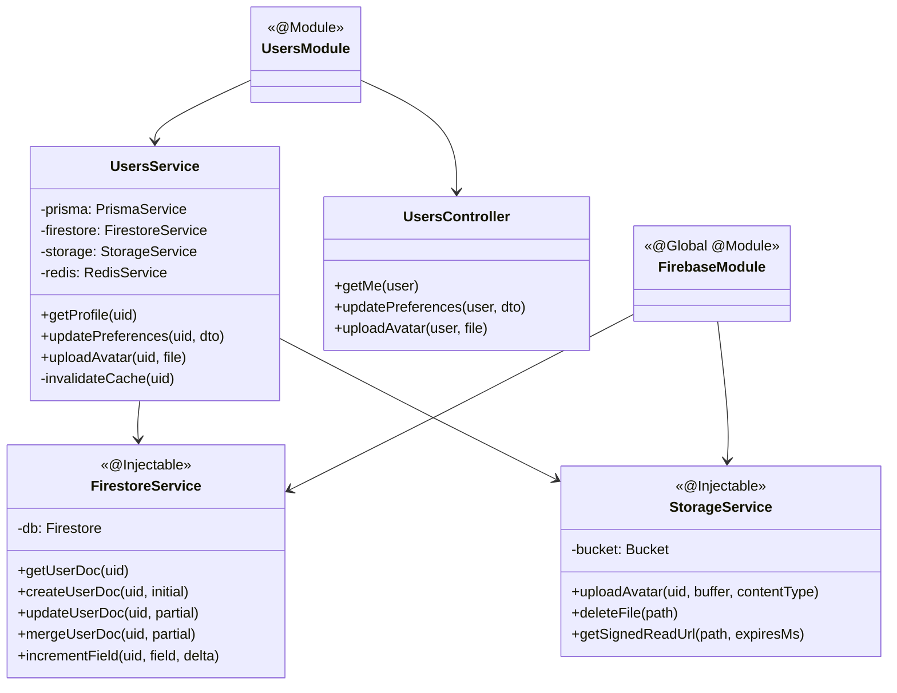

---
date: 2026-05-30
---
# Task: Server UsersModule (Profile, Firestore Sync, Avatar, Fastify Integration)

## 1. Mô tả ngắn gọn
Triển khai hệ thống quản lý hồ sơ người dùng (`UsersModule`) trên NestJS kết hợp Fastify, đồng bộ dữ liệu giữa PostgreSQL (`users_meta`) và Firestore (`users/{uid}`), và xử lý upload file avatar lên Cloud Storage.
- Tạo `FirebaseModule` toàn cục cung cấp `FirestoreService` và `StorageService`.
- Tích hợp `@fastify/multipart` và xây dựng custom decorator `@UploadedFileFastify` để hỗ trợ upload file avatar trên NestJS với Fastify.
- Phát triển `UsersService` với tính năng `getProfile` (kết hợp cache Redis), `updatePreferences` (dùng dot-notation cập nhật Firestore) và `uploadAvatar`.
- Thiết lập quy tắc phân quyền chặt chẽ trong `firestore.rules` và `storage.rules`.

## 2. Cấu trúc và Chức năng chi tiết (Classes & Methods)

### 2.1. `FirestoreService` (`firestore.service.ts`)
- `getUserDoc(uid)`: Đọc tài liệu `users/{uid}` từ Firestore.
- `createUserDoc(uid, initial)`: Khởi tạo tài liệu user với các giá trị mặc định và server timestamp.
- `updateUserDoc(uid, partial)`: Cập nhật tài liệu user (hỗ trợ dot-notation). Ném lỗi 404 nếu tài liệu không tồn tại.
- `mergeUserDoc(uid, partial)`: Merge dữ liệu vào tài liệu user (dùng `{ merge: true }`).
- `incrementField(uid, field, delta)`: Tăng giá trị của một thuộc tính số học trong Firestore (ví dụ: gems, streak).

### 2.2. `StorageService` (`storage.service.ts`)
- `uploadAvatar(uid, buffer, contentType)`: Upload buffer hình ảnh của user lên bucket Firebase Storage với path `avatars/${uid}/${Date.now()}.${ext}` và set `Cache-Control`.
- `deleteFile(path)`: Xóa file khỏi Storage.
- `getSignedReadUrl(path, expiresMs)`: Tạo URL có chữ ký để đọc file giới hạn thời gian.

### 2.3. `UsersService` (`users.service.ts`)
- `getProfile(uid)`: Trả về `UserDto` chuẩn hóa. Sử dụng `RedisService.cacheWrap` để cache kết quả truy vấn Postgres (`users_meta.tutorialStep`) và Firestore (`users/{uid}`) trong 5 phút.
- `updatePreferences(uid, dto)`: Xây dựng object cập nhật dạng dot-notation từ DTO, gọi `firestore.updateUserDoc`, xóa cache Redis, trả về profile mới.
- `uploadAvatar(uid, file)`: Kiểm tra kích thước (≤ 2MB) và loại file (jpeg, png, webp), upload lên Storage, cập nhật `photoURL` trong Firestore, xóa cache Redis và trả về URL mới.
- `invalidateCache(uid)`: Xóa cache profile của user khỏi Redis.

### 2.4. `UsersController` (`users.controller.ts`)
- `getMe(user)`: API `GET /users/me` trả về thông tin profile.
- `updatePreferences(user, dto)`: API `PATCH /users/preferences` cập nhật cấu hình hiển thị và học tập.
- `uploadAvatar(user, file)`: API `POST /users/avatar` nhận file stream từ decorator và upload avatar.

### 2.5. Decorators
- `@UploadedFileFastify()` (`uploaded-file.decorator.ts`): Trích xuất và convert stream file từ request của Fastify thành Buffer và metadata của file.

## 3. Diagrams

### Class Diagram

## 4. Lưu ý quan trọng (Gotchas & Giải pháp)

- **Gotcha 1 (Fastify vs Express File Upload)**: Mặc định NestJS hướng dẫn dùng `FileInterceptor` của Express/Multer để xử lý file upload. Tuy nhiên dự án dùng `FastifyAdapter` nên các decorator của Express sẽ crash.
  - **Giải pháp**: Cài đặt `@fastify/multipart`, đăng ký nó ở `main.ts` (`await app.register(multipart)`), và xây dựng custom decorator `@UploadedFileFastify` sử dụng `await req.file()` và `await file.toBuffer()` để chuyển stream sang buffer một cách an toàn.
- **Gotcha 2 (Firestore Nested Object Update)**: Khi cần cập nhật cấu hình con của preferences (ví dụ: `showPinyin`), nếu truyền trực tiếp `{ preferences: { showPinyin: false } }` cho Firestore, nó sẽ ghi đè và làm mất các trường khác trong `preferences` (như `narratorLanguage`, `ttsSpeed`).
  - **Giải pháp**: Sử dụng cú pháp dot-notation `{ 'preferences.showPinyin': false }` để bảo toàn dữ liệu của các thuộc tính đồng cấp.
- **Gotcha 3 (Circular Dependency của Firebase SDK)**: Lúc đầu `FirebaseAdminProvider` nằm trong `AuthModule`. Khi `UsersModule` cũng cần Firebase Admin, việc import chéo sẽ gây ra lỗi khởi tạo.
  - **Giải pháp**: Tách `FirebaseAdminProvider` ra một shared module toàn cục (`FirebaseModule`), giúp cả `AuthModule` và `UsersModule` đều có thể import `@Inject(FIREBASE_ADMIN)` an toàn.
