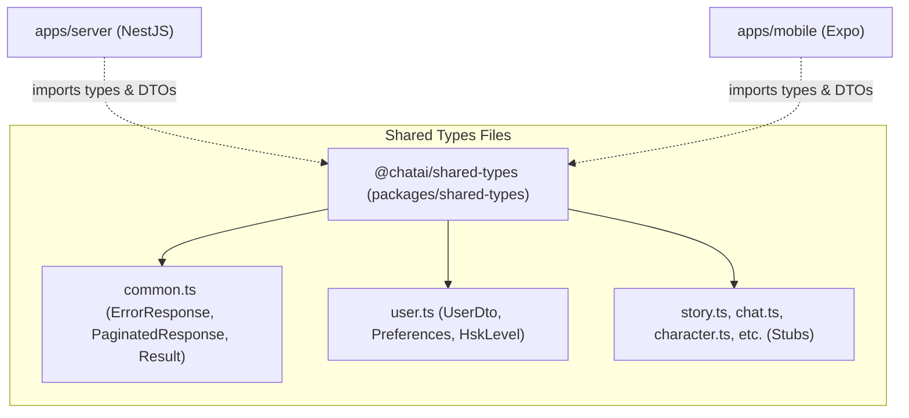

---
date: 2026-05-30
---
# Task: Shared Types Package (@chatai/shared-types)

Tạo và tích hợp một package chia sẻ kiểu dữ liệu (`@chatai/shared-types`) dùng chung giữa `apps/server` (backend NestJS) và `apps/mobile` (frontend Expo) để đảm bảo đồng bộ hóa cấu trúc dữ liệu và an toàn kiểu (type safety).

## 1. Tính năng & Cấu trúc Package

Package nằm ở thư mục [packages/shared-types](file:///d:/Web/chatAI/packages/shared-types) được cấu hình là một package nội bộ thông qua cơ chế pnpm workspaces (`workspace:*`).

### Chi tiết các file định nghĩa kiểu dữ liệu (Types & DTOs)

1. **[common.ts](file:///d:/Web/chatAI/packages/shared-types/src/common.ts)**:
   - `ErrorResponse`: Kiểu chuẩn hóa cho lỗi trả về từ API (chứa `code`, `message`, và `details` tùy chọn).
   - `PaginatedResponse<T>`: Kiểu cấu trúc phân trang chuẩn (chứa danh sách `items: T[]` và con trỏ `nextCursor` tùy chọn).
   - `Result<T, E>`: Union type thể hiện trạng thái thành công hoặc thất bại (`{ ok: true; value: T } | { ok: false; error: E }`).
   - `Timestamp`: Kiểu số biểu thị epoch ms.
   - `ISODate`: Kiểu chuỗi ISO Date.

2. **[user.ts](file:///d:/Web/chatAI/packages/shared-types/src/user.ts)**:
   - `HskLevel`: Tập hợp các cấp độ HSK từ `'HSK1'` đến `'HSK6'`.
   - `NarratorLanguage`: Ngôn ngữ của người dẫn chuyện (`'vi' | 'en' | 'zh'`).
   - `Preferences`: Tùy chọn học tập bao gồm `narratorLanguage`, `showPinyin`, và `ttsSpeed` (0.75 - 1.25).
   - `UserDto`: Đối tượng thông tin người dùng hoàn chỉnh bao gồm thông tin xác thực (`uid`, `email`, `displayName`, `photoURL`), các thông số học tập (`hskLevel`, `preferences`) và thông số gamification (`gems`, `currentStreak`, `highestStreak`, `streakFreezeCount`, `tutorialStep`).
   - `UpdatePreferencesDto`: DTO để cập nhật thông số preference dạng tùy chọn (`Partial`).

3. **Placeholder Files**:
   Các file placeholders được tạo sẵn nhằm phục vụ cho các phase tiếp theo bao gồm: `story.ts`, `character.ts`, `chat.ts`, `memory.ts`, `vocab.ts`, `mission.ts`, `shop.ts`, `journal.ts`.

4. **[index.ts](file:///d:/Web/chatAI/packages/shared-types/src/index.ts)**:
   - Đóng vai trò là file export chính (barrel export) để xuất toàn bộ các kiểu dữ liệu từ các file con.

---

## 2. Mermaid Diagram

Cấu trúc chia sẻ và phụ thuộc trong dự án:



---

## 3. Lưu ý quan trọng (Gotchas & Bugs)

1. **Lỗi `FastifyMultipartPlugin` Type Mismatch trong Server**:
   - **Vấn đề**: Khi thực hiện `tsc --noEmit` trên Server, trình biên dịch báo lỗi kiểu không khớp của plugin `@fastify/multipart` (v10.0.0) với FastifyAdapter trong NestJS do sự không đồng nhất về phiên bản Fastify nội bộ.
   - **Giải pháp**: Thực hiện ép kiểu `as any` tại dòng đăng ký plugin trong [main.ts](file:///d:/Web/chatAI/apps/server/src/main.ts):
     ```typescript
     await app.register(multipart as any);
     ```
     Điều này giúp compiler vượt qua lỗi kiểm tra kiểu giao diện giữa các phiên bản Fastify khác nhau mà không ảnh hưởng đến runtime.

2. **Lỗi Thiếu Dependency trong Mobile `package.json`**:
   - **Vấn đề**: Mobile `package.json` thiếu khai báo `@chatai/shared-types` mặc dù `tsconfig.json` có map path. Điều này có thể dẫn đến việc cài đặt sạch không nhận diện được symlink cục bộ.
   - **Giải pháp**: Khai báo rõ ràng `"@chatai/shared-types": "workspace:*"` trong phần `dependencies` của [package.json](file:///d:/Web/chatAI/apps/mobile/package.json) và chạy `pnpm install`.
