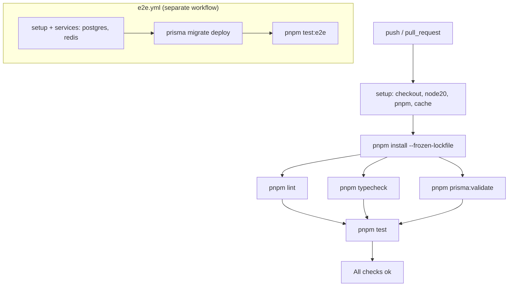
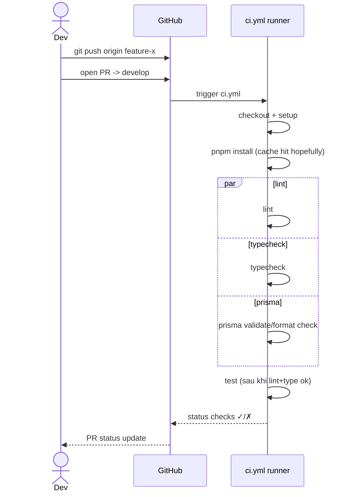

# P00.T8 — GitHub Actions CI

## 1. METADATA

| Field | Value |
|-------|-------|
| Task ID | P00.T8 |
| Tên task | GitHub Actions Continuous Integration |
| Phase | 0 |
| Depends on | P00.T1–P00.T7 |
| Complexity | Low |
| Risk | Low |

---

## 2. MỤC TIÊU & SCOPE

**In-scope**:
- Workflow `ci.yml` chạy trên `push` & `pull_request` cho `main`/`develop`:
  - Setup Node 20 + pnpm.
  - Install dependencies.
  - Lint toàn repo.
  - Typecheck (`tsc --noEmit` mỗi workspace).
  - Unit tests (server + mobile + shared packages).
  - Prisma `validate` + `format --check` cho `schema.prisma`.
- Workflow `services.yml` (optional, manual): spin-up postgres/redis services container và run e2e.
- Cache pnpm store + node_modules.

**Out-of-scope**:
- CD/EAS Build (P13).
- Coverage report upload (có thể optional).

---

## 3. FILES CẦN TẠO

| # | Path | Loại | Mục đích |
|---|------|------|----------|
| 1 | `.github/workflows/ci.yml` | workflow | Pipeline chính |
| 2 | `.github/workflows/e2e.yml` | workflow | Integration với services |
| 3 | `.github/workflows/codeql.yml` | workflow (optional) | Security scan |
| 4 | `.github/PULL_REQUEST_TEMPLATE.md` | doc | PR template |
| 5 | `.github/dependabot.yml` | config | Auto deps update weekly |

---

## 4. JOB FLOW DIAGRAM



Không có class. Bỏ qua.

---

## 5. WORKFLOW SPEC CHI TIẾT

### 5.1. `ci.yml`

```
name: CI
on:
  push:
    branches: [main, develop]
  pull_request:
    branches: [main, develop]

concurrency:
  group: ci-${{ github.ref }}
  cancel-in-progress: true

jobs:
  build-test:
    runs-on: ubuntu-latest
    timeout-minutes: 20
    steps:
      - uses: actions/checkout@v4
      - uses: pnpm/action-setup@v4
        with: { version: 9 }
      - uses: actions/setup-node@v4
        with:
          node-version: '20'
          cache: 'pnpm'
      - run: pnpm install --frozen-lockfile
      - run: pnpm -r lint
      - run: pnpm -r typecheck      # mỗi workspace có script "typecheck": "tsc --noEmit"
      - run: pnpm --filter server prisma:validate
      - run: pnpm --filter server prisma:format -- --check
      - run: pnpm -r test --if-present
```

**Notes**:
- Cache pnpm store via setup-node `cache: pnpm`.
- Mỗi workspace cần khai báo scripts `lint`, `typecheck`, `test`.

### 5.2. `e2e.yml`

```
name: E2E
on:
  workflow_dispatch:
  push:
    branches: [main]

jobs:
  e2e:
    runs-on: ubuntu-latest
    timeout-minutes: 30
    services:
      postgres:
        image: postgres:16-alpine
        env:
          POSTGRES_USER: chatai
          POSTGRES_PASSWORD: pw
          POSTGRES_DB: chatai_test
        ports: ['5432:5432']
        options: >-
          --health-cmd "pg_isready -U chatai"
          --health-interval 10s
          --health-timeout 5s
          --health-retries 5
      redis:
        image: redis:7-alpine
        ports: ['6379:6379']
        options: >-
          --health-cmd "redis-cli ping"
          --health-interval 5s
    env:
      DATABASE_URL: postgresql://chatai:pw@localhost:5432/chatai_test
      REDIS_URL: redis://localhost:6379
    steps:
      - uses: actions/checkout@v4
      - uses: pnpm/action-setup@v4
        with: { version: 9 }
      - uses: actions/setup-node@v4
        with: { node-version: '20', cache: 'pnpm' }
      - run: pnpm install --frozen-lockfile
      - run: pnpm --filter server prisma:migrate -- deploy
      - run: pnpm --filter server test:e2e
```

### 5.3. `dependabot.yml`

```
version: 2
updates:
  - package-ecosystem: npm
    directory: "/"
    schedule: { interval: weekly }
    open-pull-requests-limit: 5
    groups:
      dev-deps:
        dependency-type: development
      prod-deps:
        dependency-type: production
  - package-ecosystem: github-actions
    directory: "/"
    schedule: { interval: monthly }
```

### 5.4. `PULL_REQUEST_TEMPLATE.md`

Sections:
- **What** — change summary
- **Why** — context / link issue
- **How** — approach
- **Testing** — manual steps + which tests added
- **Checklist** — lint pass, types pass, tests pass, docs updated

---

## 6. SEQUENCE — PR open



---

## 7. ACCEPTANCE & TEST PLAN

### Acceptance Criteria
- [x] PR mới mở → CI tự chạy.
- [x] CI fail nếu lint hoặc type error.
- [x] CI fail nếu test fail.
- [x] Cache hit pnpm sau lần thứ 2 (thời gian install giảm rõ).
- [x] `services.yml` chạy được bằng "Run workflow" manual.
- [x] Branch protection `main` & `develop`: require CI pass.

### Manual Test
1. Tạo PR test, sửa 1 file thêm `const x: number = 'a'` → CI fail typecheck.
2. Revert → CI green.
3. Bump 1 dep → Dependabot tạo PR sau tuần.
