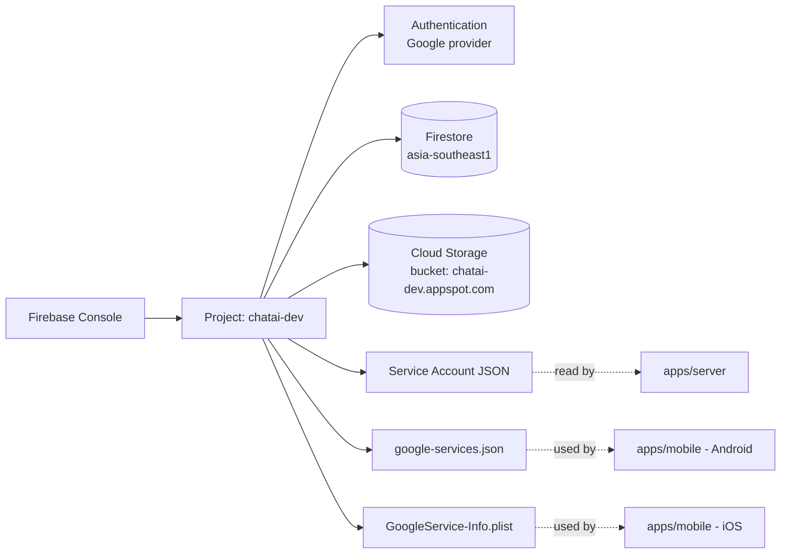
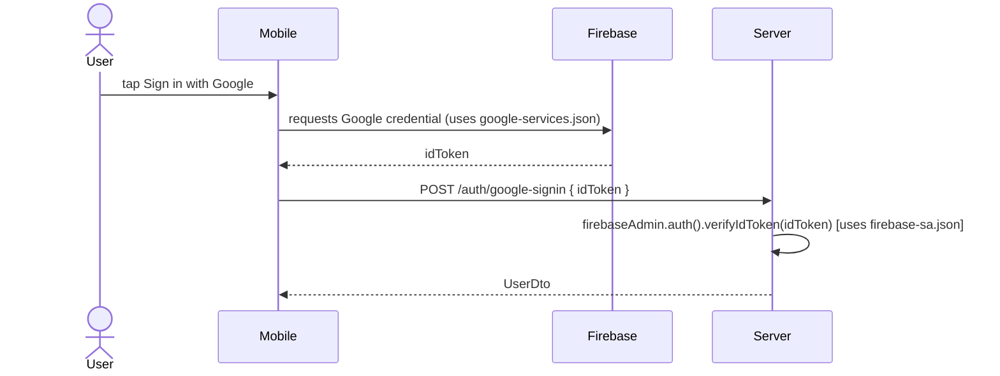

# P01.T1 — Firebase Project Setup ✅ DONE

## 1. METADATA

| Field | Value |
|-------|-------|
| Task ID | P01.T1 |
| Tên task | Firebase Project + Service Account |
| Phase | 1 — Auth & Profile |
| Depends on | P00 hoàn thành |
| Complexity | Low |
| Risk | Medium (cấu hình external service) |

---

## 2. MỤC TIÊU & SCOPE

**In-scope**:
- Tạo Firebase project trên console (manual).
- Bật Authentication (Google provider), Firestore (Native, region `asia-southeast1`), Cloud Storage.
- Tải Service Account JSON về `apps/server/firebase-sa.json`.
- Tải `google-services.json` (Android) và `GoogleService-Info.plist` (iOS) về `apps/mobile/`.
- Cập nhật `.env` server với các biến `FIREBASE_*`.

**Out-of-scope**:
- Code SDK init (P01.T2).
- Security rules (P01.T3).

---

## 3. FILES CẦN TẠO / SỬA

| # | Path | Loại | Mục đích |
|---|------|------|----------|
| 1 | `apps/server/firebase-sa.json` | secret | Service Account credential (đã gitignore) |
| 2 | `apps/mobile/google-services.json` | config | Android Firebase config (gitignore) |
| 3 | `apps/mobile/GoogleService-Info.plist` | config | iOS Firebase config (gitignore) |
| 4 | `apps/server/.env` | sửa | Thêm `FIREBASE_PROJECT_ID`, `FIREBASE_SERVICE_ACCOUNT_PATH`, `FIREBASE_STORAGE_BUCKET` |
| 5 | `apps/server/.env.example` | sửa | Placeholder values |
| 6 | `Document/Task/firebase_setup_runbook.md` | doc | Hướng dẫn step-by-step (link console) |

---

## 4. RESOURCE DIAGRAM

Không có class. Task config.

---

## 5. RUNBOOK (manual steps)

| Bước | Action | Output |
|------|--------|--------|
| 1 | Login console.firebase.google.com → Add project `chatai-dev` | Project created |
| 2 | Authentication → Sign-in method → Enable Google | Provider active |
| 3 | Firestore Database → Create → Native mode → `asia-southeast1` | DB ready |
| 4 | Cloud Storage → Get started → default bucket | Bucket created |
| 5 | Project Settings → Service accounts → Generate private key | JSON download |
| 6 | Move JSON → `apps/server/firebase-sa.json` | Local file |
| 7 | Project Settings → Add app → Android (`com.chatai.app`) → tải `google-services.json` | Mobile config |
| 8 | (Optional iOS) Add app → iOS → tải `GoogleService-Info.plist` | iOS config |
| 9 | Lấy debug keystore SHA-1: `keytool -list -v -keystore ~/.android/debug.keystore` → add vào Android app | Sign-in works |
| 10 | Update `apps/server/.env` 3 biến | Server đọc được |

---

## 6. SEQUENCE — token verification (sau khi có config)

---

## 7. ACCEPTANCE & TEST PLAN

### Acceptance Criteria
- [x] Console hiện project với Auth/Firestore/Storage active.
- [x] `cat apps/server/firebase-sa-dev.json | jq .project_id` → `chatai-24b76`.
- [x] `.gitignore` chặn 3 file secret (`firebase-sa-dev.json`, `google-services.json`, `GoogleService-Info.plist`).
- [x] `apps/server/.env.example` có 3 biến placeholder (không có giá trị thật).
- [x] Runbook README ghi rõ cho dev mới onboard.

### Manual Test
1. `git status` sau khi đặt 3 file secret → không track.
2. `node -e "console.log(require('./apps/server/firebase-sa-dev.json').project_id)"` → in `chatai-24b76`.
