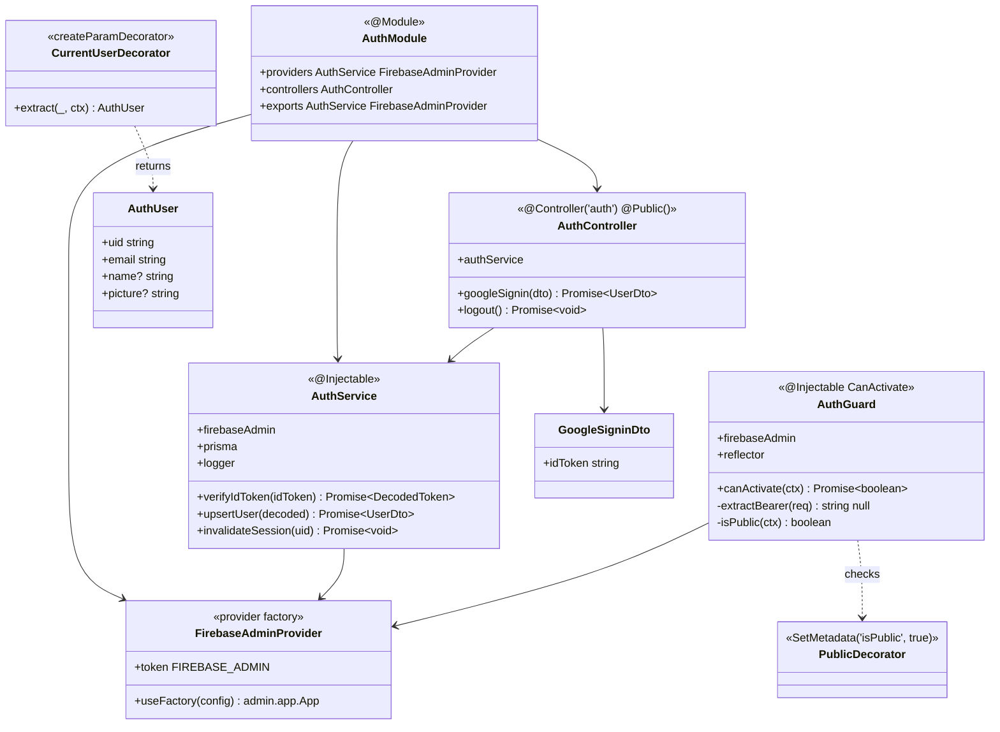
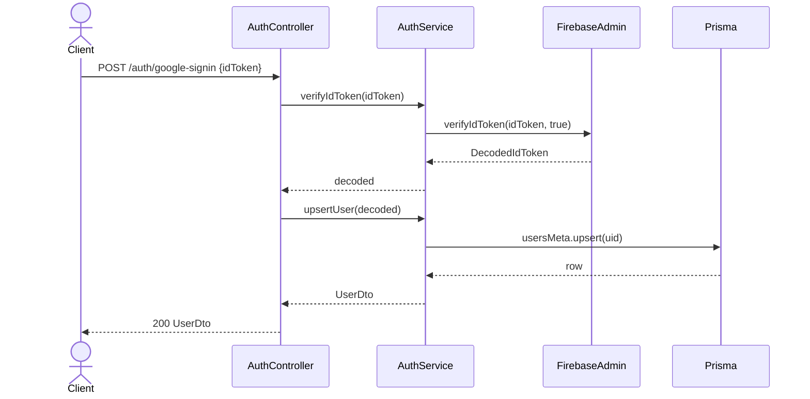
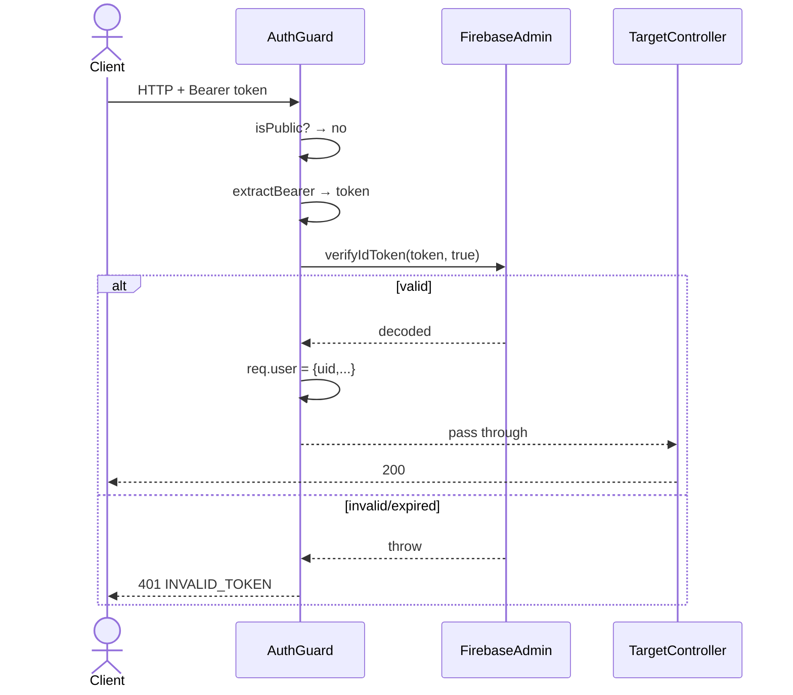

# P01.T2 — Server AuthModule (Firebase Admin SDK) ✅ DONE

## 1. METADATA

| Field | Value |
|-------|-------|
| Task ID | P01.T2 |
| Tên task | AuthModule + verify ID token + AuthGuard + decorators |
| Phase | 1 |
| Depends on | P01.T1, P00.T7 |
| Complexity | Medium |
| Risk | Medium (auth là security-critical) |

---

## 2. MỤC TIÊU & SCOPE

**In-scope**:
- Firebase Admin SDK provider (singleton init).
- `AuthService.verifyIdToken` + `upsertUser`.
- `AuthController` với `POST /auth/google-signin` và `POST /auth/logout`.
- Global `AuthGuard` (default require auth).
- Decorators `@Public()` (skip guard), `@CurrentUser()` (inject request user).
- Update guard apply via APP_GUARD ở `AppModule`.

**Out-of-scope**:
- Profile CRUD (P01.T3).
- Firestore sync (P01.T3 — chỉ `upsertUser` row Postgres ở task này).

---

## 3. FILES CẦN TẠO

| # | Path | Loại | Mục đích |
|---|------|------|----------|
| 1 | `apps/server/src/modules/auth/auth.module.ts` | module | Wrap controller + service + provider |
| 2 | `apps/server/src/modules/auth/auth.controller.ts` | controller | Endpoints |
| 3 | `apps/server/src/modules/auth/auth.service.ts` | service | Business logic |
| 4 | `apps/server/src/modules/auth/firebase-admin.provider.ts` | provider | Singleton admin app |
| 5 | `apps/server/src/modules/auth/dto/google-signin.dto.ts` | dto | `{ idToken }` |
| 6 | `apps/server/src/modules/auth/dto/user-response.dto.ts` | dto | UserDto shape (re-export shared-types) |
| 7 | `apps/server/src/shared/guards/auth.guard.ts` | guard | Verify Bearer token, attach request.user |
| 8 | `apps/server/src/shared/decorators/public.decorator.ts` | decorator | `SetMetadata('isPublic', true)` |
| 9 | `apps/server/src/shared/decorators/current-user.decorator.ts` | decorator | Param extractor |
| 10 | `apps/server/src/shared/types/auth-user.ts` | type | `{ uid, email, name?, picture? }` |
| 11 | `apps/server/src/app.module.ts` | sửa | Import AuthModule + APP_GUARD provider |
| 12 | `apps/server/src/modules/auth/auth.service.spec.ts` | test | Unit |
| 13 | `apps/server/src/shared/guards/auth.guard.spec.ts` | test | Unit |

---

## 4. CLASS DIAGRAM



**Tổng**: 7 class/provider mới + 2 decorator + 2 DTO/type.

---

## 5. CHI TIẾT CLASS

### 5.1. `FirebaseAdminProvider`

**File**: `firebase-admin.provider.ts`  
**Vai trò**: Provide `admin.app.App` singleton.

**Export**:
```
FIREBASE_ADMIN = Symbol('FIREBASE_ADMIN')

provider = {
  provide: FIREBASE_ADMIN,
  inject: [ConfigService],
  useFactory: (cfg): admin.app.App
}

Logic factory:
  1. saPath = cfg.get('firebaseServiceAccountPath')
  2. saJson = JSON.parse(fs.readFileSync(saPath, 'utf8'))
  3. if !admin.apps.length: admin.initializeApp({
       credential: admin.credential.cert(saJson),
       storageBucket: cfg.get('firebaseStorageBucket'),
       projectId: cfg.get('firebaseProjectId')
     })
  4. return admin.app()
```

---

### 5.2. `AuthService`

**File**: `auth.service.ts`  
**Decorator**: `@Injectable()`

**Constructor inject**:
- `@Inject(FIREBASE_ADMIN) firebaseAdmin: admin.app.App`
- `prisma: PrismaService`
- `logger: PinoLogger`

**Methods**:

#### `verifyIdToken(idToken)`
```
verifyIdToken(idToken: string): Promise<DecodedIdToken>

Input: idToken (string, required, JWT format)
Output: DecodedIdToken (firebase-admin type)

Logic:
  1. try { decoded = await firebaseAdmin.auth().verifyIdToken(idToken, true) }
     catch (e) { throw new AppException(ERR.INVALID_TOKEN, e.message) }
  2. if decoded.disabled → throw AppException(ERR.USER_DISABLED)
  3. return decoded

Side effects: none

Throws: INVALID_TOKEN (401), USER_DISABLED (403)
```

#### `upsertUser(decoded)`
```
upsertUser(decoded: DecodedIdToken): Promise<UserDto>

Input: decoded token (contains uid, email, name, picture)
Output: UserDto

Logic:
  1. uid = decoded.uid
  2. await prisma.usersMeta.upsert({
       where: { userId: uid },
       create: { userId: uid, tutorialStep: 0 },
       update: {} // không đụng tutorialStep
     })
  3. Build UserDto từ decoded + Postgres row (Firestore sync sẽ ở T3 — task này trả minimal UserDto):
     {
       uid,
       email: decoded.email ?? '',
       displayName: decoded.name ?? '',
       photoURL: decoded.picture ?? '',
       hskLevel: 'HSK1',           // default; T3 đọc Firestore real value
       preferences: { narratorLanguage:'vi', showPinyin:true, ttsSpeed:1.0 },
       gems: 0,
       currentStreak: 0,
       highestStreak: 0,
       streakFreezeCount: 0,
       tutorialStep: row.tutorialStep,
     }
  4. return dto

Side effects:
  - DB: INSERT users_meta (nếu first login) hoặc no-op UPDATE

Throws: rethrow Prisma errors
```

#### `invalidateSession(uid)`
```
invalidateSession(uid: string): Promise<void>

Logic: await firebaseAdmin.auth().revokeRefreshTokens(uid)
       (Token cũ vẫn valid 1h; client phải re-sign-in để có token mới.)

Use case: gọi từ /auth/logout hoặc admin action.
```

---

### 5.3. `AuthController`

**File**: `auth.controller.ts`  
**Decorator**: `@Controller('auth')`

**Methods**:

#### `googleSignin(dto)`
```
googleSignin(dto: GoogleSigninDto): Promise<UserDto>

Decorator: @Post('google-signin') @Public()
Input: body { idToken: string }

Logic:
  1. decoded = await authService.verifyIdToken(dto.idToken)
  2. user = await authService.upsertUser(decoded)
  3. return user
```

#### `logout(currentUser)`
```
logout(@CurrentUser() user: AuthUser): Promise<void>

Decorator: @Post('logout') @HttpCode(204)
Logic:
  - await authService.invalidateSession(user.uid)
  - return (no body)
```

---

### 5.4. `AuthGuard`

**File**: `auth.guard.ts`  
**Decorator**: `@Injectable()`

**Constructor inject**:
- `@Inject(FIREBASE_ADMIN) firebaseAdmin`
- `reflector: Reflector`

**Methods**:

#### `canActivate(ctx)`
```
canActivate(ctx: ExecutionContext): Promise<boolean>

Logic:
  1. if isPublic(ctx) → return true
  2. req = ctx.switchToHttp().getRequest()
  3. token = extractBearer(req)
  4. if !token → throw AppException(ERR.INVALID_TOKEN)
  5. try: decoded = await firebaseAdmin.auth().verifyIdToken(token, true)
     catch: throw AppException(ERR.INVALID_TOKEN)
  6. req.user = { uid: decoded.uid, email: decoded.email, name: decoded.name, picture: decoded.picture }
  7. return true
```

#### `extractBearer(req)` (private)
```
extractBearer(req): string | null

Logic:
  - auth = req.headers.authorization
  - if !auth || !auth.startsWith('Bearer ') → null
  - return auth.slice(7).trim() || null
```

#### `isPublic(ctx)` (private)
```
isPublic(ctx): boolean

Logic: reflector.getAllAndOverride('isPublic', [ctx.getHandler(), ctx.getClass()]) ?? false
```

**Registration**: ở `AppModule`:
```
providers: [{ provide: APP_GUARD, useClass: AuthGuard }]
```

---

### 5.5. `PublicDecorator`

```
export const Public = () => SetMetadata('isPublic', true)
```

### 5.6. `CurrentUserDecorator`

```
export const CurrentUser = createParamDecorator(
  (_data: unknown, ctx: ExecutionContext): AuthUser => {
    const req = ctx.switchToHttp().getRequest()
    return req.user
  }
)
```

### 5.7. `GoogleSigninDto`

```
class GoogleSigninDto {
  @IsString() @IsNotEmpty() @Length(20, 4096)
  idToken: string
}
```

### 5.8. `AuthUser` type

```
type AuthUser = { uid: string; email: string; name?: string; picture?: string }
```

---

## 6. SEQUENCE DIAGRAMS

### 6.1. Sign-in flow



### 6.2. Guard flow



---

## 7. ACCEPTANCE & TEST PLAN

### Acceptance Criteria
- [ ] `POST /auth/google-signin` với fake valid token (mock) → 200 UserDto.
- [ ] `POST /auth/google-signin` với invalid token → 401 `{ error: { code: 'INVALID_TOKEN' } }`.
- [ ] Bất kỳ endpoint không decorate `@Public()` mà gọi không token → 401.
- [ ] Decorate `@Public()` → endpoint pass guard.
- [ ] `users_meta` có row mới sau lần sign-in đầu tiên.
- [ ] Sign-in lại không tạo duplicate row.

### Unit Tests
| Test | Assert |
|------|--------|
| `verifyIdToken returns decoded on valid` | mock verifyIdToken resolve |
| `verifyIdToken throws INVALID_TOKEN on error` | mock throw |
| `verifyIdToken throws USER_DISABLED when disabled true` | mock decoded.disabled=true |
| `upsertUser creates row when none` | spy prisma.upsert |
| `upsertUser no-op when exists` | row found, no update fields |
| `AuthGuard returns true for @Public` | reflector mock |
| `AuthGuard rejects when no header` | throws INVALID_TOKEN |
| `AuthGuard rejects bad bearer format` | throws |
| `AuthGuard attaches req.user on valid` | req.user.uid set |
| `CurrentUser decorator extracts req.user` | resolves |

### Integration Test
- E2E: app bootstrap với mocked FIREBASE_ADMIN (override provider) → POST `/auth/google-signin` → 200, DB has row.

### Manual Test
1. Real Firebase token từ client → curl POST → success.
2. Expired token → 401.
3. Tamper token → 401.
