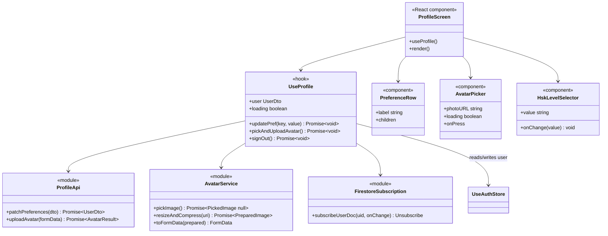
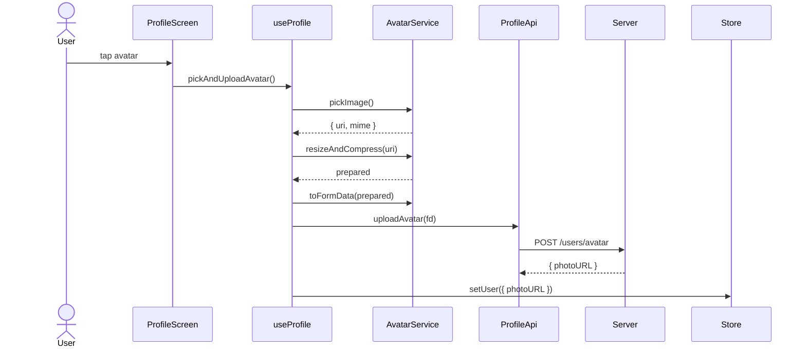

# P01.T5 — Client: Profile Screen + Preferences + Avatar Upload ✅ DONE

## 1. METADATA

| Field | Value |
|-------|-------|
| Task ID | P01.T5 |
| Tên task | ProfileScreen: hiển thị + edit preferences + upload avatar + Firestore realtime |
| Phase | 1 |
| Depends on | P01.T3, P01.T4 |
| Complexity | Medium |
| Risk | Low |

---

## 2. MỤC TIÊU & SCOPE

**In-scope**:
- `ProfileScreen` UI: avatar, name, email, preferences controls, logout button.
- `useProfile` hook: load + update preferences (debounced).
- Avatar pick → resize → upload flow.
- Firestore realtime subscription `users/{uid}` (sync gems/streak/tutorialStep).

**Out-of-scope**:
- Mission/streak details (P11).
- Tutorial coachmarks (P12).

---

## 3. FILES CẦN TẠO

| # | Path | Loại |
|---|------|------|
| 1 | `apps/mobile/src/features/profile/screens/ProfileScreen.tsx` | screen |
| 2 | `apps/mobile/src/features/profile/hooks/useProfile.ts` | hook |
| 3 | `apps/mobile/src/features/profile/services/profile.api.ts` | service (axios) |
| 4 | `apps/mobile/src/features/profile/services/avatar.service.ts` | service (image pick + resize) |
| 5 | `apps/mobile/src/features/profile/services/firestore.subscription.ts` | service (onSnapshot) |
| 6 | `apps/mobile/src/features/profile/components/PreferenceRow.tsx` | component |
| 7 | `apps/mobile/src/features/profile/components/AvatarPicker.tsx` | component |
| 8 | `apps/mobile/src/features/profile/components/HskLevelSelector.tsx` | component |

---

## 4. CLASS DIAGRAM



---

## 5. CHI TIẾT MODULE

### 5.1. `ProfileApi`

```
patchPreferences(dto: Partial<UpdatePreferencesDto>): Promise<UserDto>
  → apiClient.patch('/users/preferences', dto)

uploadAvatar(formData: FormData): Promise<{ photoURL: string }>
  → apiClient.post('/users/avatar', formData, { headers: {'Content-Type':'multipart/form-data'} })
```

### 5.2. `AvatarService`

**Tech**: `expo-image-picker`, `expo-image-manipulator`.

**Type**:
- `PickedImage = { uri: string; mimeType: string }`
- `PreparedImage = { uri: string; mimeType: 'image/jpeg'; sizeBytes: number }`

**Methods**:

#### `pickImage()`
```
pickImage(): Promise<PickedImage | null>

Logic:
  1. perm = await ImagePicker.requestMediaLibraryPermissionsAsync()
  2. if !perm.granted → throw PERMISSION_DENIED
  3. result = await ImagePicker.launchImageLibraryAsync({
       mediaTypes: 'Images', allowsEditing: true, aspect: [1,1], quality: 1
     })
  4. if result.canceled → return null
  5. asset = result.assets[0]
  6. return { uri: asset.uri, mimeType: asset.mimeType ?? 'image/jpeg' }
```

#### `resizeAndCompress(uri)`
```
resizeAndCompress(uri: string): Promise<PreparedImage>

Logic:
  - manip = await ImageManipulator.manipulateAsync(
      uri,
      [{ resize: { width: 512, height: 512 } }],
      { compress: 0.8, format: ImageManipulator.SaveFormat.JPEG }
    )
  - sizeBytes = await getFileSize(manip.uri)
  - return { uri: manip.uri, mimeType: 'image/jpeg', sizeBytes }
```

#### `toFormData(prepared)`
```
toFormData(prepared: PreparedImage): FormData

Logic:
  fd = new FormData()
  fd.append('file', {
    uri: prepared.uri,
    type: prepared.mimeType,
    name: `avatar_${Date.now()}.jpg`
  } as any)
  return fd
```

### 5.3. `FirestoreSubscription`

**Tech**: `@react-native-firebase/firestore` hoặc `firebase/firestore` JS SDK.

```
subscribeUserDoc(uid: string, onChange: (doc: UserDoc) => void): Unsubscribe

Logic:
  - unsub = firestore().collection('users').doc(uid).onSnapshot(snap => {
      if (snap.exists) onChange(snap.data() as UserDoc)
    }, err => logger.warn(err))
  - return unsub
```

### 5.4. `useProfile` hook

```
useProfile()

Returns: { user, loading, updatePref, pickAndUploadAvatar, signOut }

Logic:
  - user = useAuthStore(s => s.user)
  - setUser = useAuthStore(s => s.setUser)
  - logout = useAuthStore(s => s.logout)
  - local: loading (boolean)
  
  - useEffect on mount (uid):
    unsub = subscribeUserDoc(uid, doc => {
      // merge doc fields → user
      setUser({ ...user, ...doc, uid: user.uid, tutorialStep: doc.tutorialStep ?? user.tutorialStep })
    })
    return unsub
  
  - updatePref(key, value):
    optimistic: setUser({ ...user, preferences: { ...user.preferences, [key]: value } }) (hoặc top-level nếu hskLevel)
    debouncedSend(key, value)
      → profileApi.patchPreferences({ [key]: value })
      → server cập nhật Firestore → realtime sub sẽ confirm
    on error: revert
  
  - pickAndUploadAvatar():
    setLoading(true)
    try:
      picked = await avatarService.pickImage()
      if !picked → return
      prepared = await avatarService.resizeAndCompress(picked.uri)
      if prepared.sizeBytes > 2*1024*1024 → throw 'Quá lớn'
      fd = avatarService.toFormData(prepared)
      { photoURL } = await profileApi.uploadAvatar(fd)
      setUser({ ...user, photoURL })
    finally: setLoading(false)
  
  - signOut(): await logout()
```

### 5.5. UI components

#### `PreferenceRow`
- Layout horizontal: `label` (left) + `children` (right).

#### `AvatarPicker`
- Round image + edit pencil overlay.
- Loading overlay khi `loading`.

#### `HskLevelSelector`
- Modal hoặc bottom sheet với 6 lựa chọn.

### 5.6. `ProfileScreen` layout

```
ScrollView
  Header
    AvatarPicker(photoURL, onPress=pickAndUploadAvatar)
    Text displayName
    Text email
  Section "Cài đặt học"
    PreferenceRow "HSK Level" → HskLevelSelector
    PreferenceRow "Hiện Pinyin" → Switch
    PreferenceRow "Ngôn ngữ phụ đề" → Dropdown(vi/en/zh)
    PreferenceRow "Tốc độ TTS" → Slider 0.75-1.25
  Section "Tài khoản"
    LogoutButton onPress=signOut
```

---

## 6. SEQUENCE DIAGRAM

### 6.1. Toggle preferences with optimistic update

```mermaid
sequenceDiagram
    actor User
    participant PS as ProfileScreen
    participant Hook as useProfile
    participant Store as AuthStore
    participant API as ProfileApi
    participant Server
    participant FS as Firestore
    participant Sub as FirestoreSub

    User->>PS: toggle showPinyin → false
    PS->>Hook: updatePref('showPinyin', false)
    Hook->>Store: setUser(optimistic: showPinyin=false)
    Hook->>API: patch (debounce 300ms)
    API->>Server: PATCH /users/preferences
    Server->>FS: update users/uid
    FS-->>Sub: snapshot {showPinyin:false}
    Sub->>Store: setUser(confirmed)
    Server-->>API: 200 UserDto
    Note over Hook: server response chỉ verify; UI đã reflect
```

### 6.2. Upload avatar



---

## 7. ACCEPTANCE & TEST PLAN

### Acceptance
- [ ] ProfileScreen render đúng user info.
- [ ] Toggle showPinyin → UI thay đổi tức thì + Firestore reflect < 1s.
- [ ] Slider TTS speed → debounce 300ms 1 lần PATCH.
- [ ] HSK selector → server lưu, hiển thị giá trị mới sau khi chọn.
- [ ] Tap avatar → image picker mở; chọn ảnh → upload, avatar mới hiển thị.
- [ ] Ảnh > 2MB (sau resize không nên xảy ra) → toast error.
- [ ] Logout → quay về LoginScreen.
- [ ] Subscribe Firestore: PATCH từ tab khác (hoặc server tăng gems) → Profile screen thấy realtime.

### Unit Tests
| Test | Assert |
|------|--------|
| useProfile.updatePref optimistic | store updated immediately |
| useProfile.updatePref debounces | only 1 API call after 300ms of rapid toggles |
| AvatarService.resize returns ≤512x512 | mock ImageManipulator |
| AvatarService.pickImage returns null when canceled | |
| FirestoreSubscription invokes onChange | mock snapshot |

### Manual
1. Đổi HSK → app khác Firebase realtime nếu có (e.g. dev console) thấy update.
2. Mất mạng → toggle → revert sau timeout.
3. Avatar oversize giả lập (skip resize) → server reject 400, UI toast.
