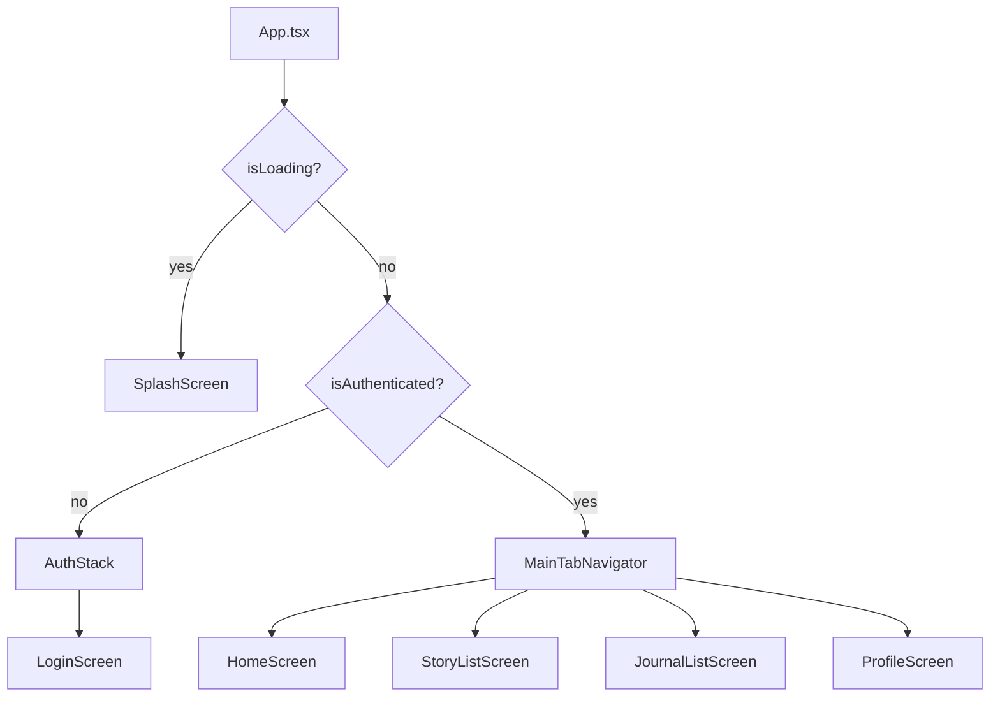
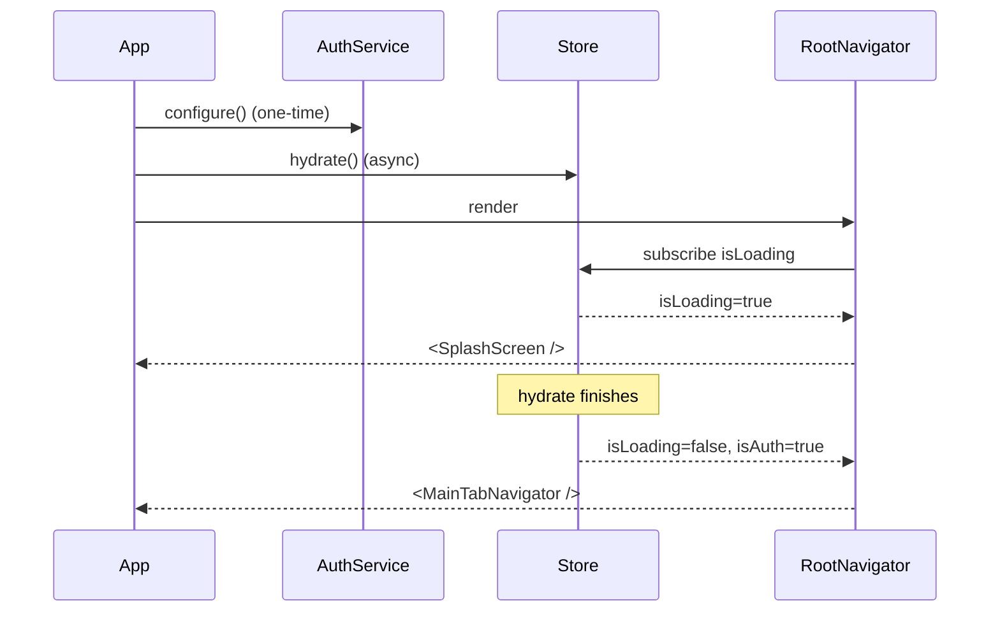

# P01.T6 — Client Navigation Structure (Auth + Main) ✅ DONE

## 1. METADATA

| Field | Value |
|-------|-------|
| Task ID | P01.T6 |
| Tên task | Navigation conditional + MainTab + Splash |
| Phase | 1 |
| Depends on | P01.T4 |
| Complexity | Low |
| Risk | Low |

---

## 2. MỤC TIÊU & SCOPE

**In-scope**:
- `RootNavigator` conditional: SplashScreen → AuthStack | MainTab.
- `AuthStack` (LoginScreen).
- `MainTabNavigator` 4 tabs placeholder: Home, Stories, Journal, Profile.
- `SplashScreen` (logo + spinner) chạy trong khi `hydrate()`.
- Type-safe `RootStackParamList`, `MainTabParamList`.

**Out-of-scope**:
- Stack screens nested cho từng tab (sẽ ở P2/P4/P7…).

---

## 3. FILES CẦN TẠO / SỬA

| # | Path | Loại |
|---|------|------|
| 1 | `apps/mobile/src/navigation/RootNavigator.tsx` | sửa (logic conditional) |
| 2 | `apps/mobile/src/navigation/AuthStack.tsx` | navigator |
| 3 | `apps/mobile/src/navigation/MainTabNavigator.tsx` | navigator |
| 4 | `apps/mobile/src/navigation/types.ts` | sửa (types đầy đủ) |
| 5 | `apps/mobile/src/screens/SplashScreen.tsx` | screen (đã có placeholder, polish) |
| 6 | `apps/mobile/src/features/home/screens/HomeScreen.tsx` | placeholder |
| 7 | `apps/mobile/src/features/story/screens/StoryListScreen.tsx` | placeholder |
| 8 | `apps/mobile/src/features/journal/screens/JournalListScreen.tsx` | placeholder |
| 9 | `apps/mobile/App.tsx` | sửa (call hydrate + configure GoogleSignin lúc boot) |

---

## 4. CLASS / NAVIGATOR DIAGRAM



---

## 5. CHI TIẾT COMPONENT/MODULE

### 5.1. `types.ts`

```
type RootStackParamList = {
  Splash: undefined
  Auth: NavigatorScreenParams<AuthStackParamList>
  Main: NavigatorScreenParams<MainTabParamList>
}

type AuthStackParamList = {
  Login: undefined
}

type MainTabParamList = {
  Home: undefined
  Stories: undefined
  Journal: undefined
  Profile: undefined
}

declare global {
  namespace ReactNavigation {
    interface RootParamList extends RootStackParamList {}
  }
}
```

### 5.2. `RootNavigator`

```
RootNavigator(): JSX.Element

Logic:
  - { isLoading, isAuthenticated } = useAuthStore(...)
  - if isLoading → render <SplashScreen />
  - else:
    <NavigationContainer>
      <Stack.Navigator screenOptions={{ headerShown: false }}>
        {isAuthenticated
          ? <Stack.Screen name="Main" component={MainTabNavigator} />
          : <Stack.Screen name="Auth" component={AuthStack} />}
      </Stack.Navigator>
    </NavigationContainer>
```

### 5.3. `AuthStack`

```
AuthStack(): JSX.Element

<Stack.Navigator screenOptions={{ headerShown: false }}>
  <Stack.Screen name="Login" component={LoginScreen} />
</Stack.Navigator>
```

### 5.4. `MainTabNavigator`

```
MainTabNavigator(): JSX.Element

<Tab.Navigator screenOptions={{ headerShown: true, tabBarActiveTintColor: theme.colors.primary }}>
  <Tab.Screen name="Home"     component={HomeScreen}    options={{ tabBarIcon: ... }} />
  <Tab.Screen name="Stories"  component={StoryListScreen} />
  <Tab.Screen name="Journal"  component={JournalListScreen} />
  <Tab.Screen name="Profile"  component={ProfileScreen} />
</Tab.Navigator>
```

### 5.5. `SplashScreen`

```
SplashScreen(): JSX.Element

Layout: full-screen logo center + ActivityIndicator below.
No interactive elements.
```

### 5.6. Placeholder screens

`HomeScreen`, `StoryListScreen`, `JournalListScreen`: chỉ Text "Coming soon" + tên feature (sẽ build sau).

### 5.7. `App.tsx` updates

```
function App() {
  useEffect(() => {
    authService.configure()
    useAuthStore.getState().hydrate()
    // wire token getter
    setAuthTokenGetter(() => useAuthStore.getState().token)
  }, [])

  return (
    <SafeAreaProvider>
      <StatusBar style="auto" />
      <RootNavigator />
    </SafeAreaProvider>
  )
}
```

---

## 6. SEQUENCE — App boot



---

## 7. ACCEPTANCE & TEST PLAN

### Acceptance
- [ ] Cold start có token → Splash → MainTab.
- [ ] Cold start không token → Splash → LoginScreen.
- [ ] Login success → tự động chuyển sang MainTab (do state thay đổi).
- [ ] Logout → tự động về LoginScreen.
- [ ] 4 tabs render đúng, navigate ok.
- [ ] No flicker / double mount (kiểm tra console).

### Tests
- Hard tests cho navigator phức tạp; chấp nhận manual:
  1. Đổi state thủ công trong devtools → verify nav switch.
  2. Tab tap mỗi tab → screen tương ứng mount.

### Manual
1. Tốc độ chuyển Splash → MainTab < 1.5s (cold start với token cached).
2. Memory: switching tabs nhiều lần không leak (React DevTools).
