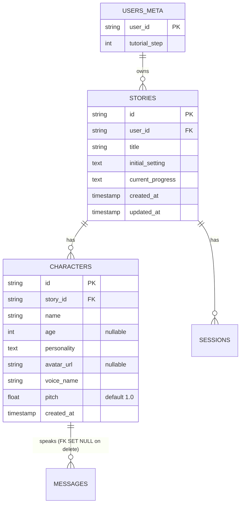
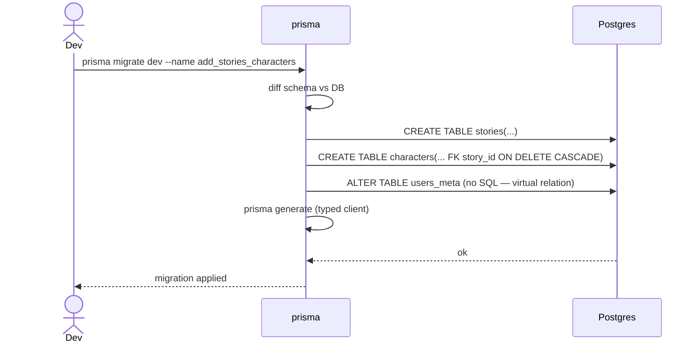

# P02.T1 — DB Schema: Stories + Characters ✅ DONE

## 1. METADATA

| Field | Value |
|-------|-------|
| Task ID | P02.T1 |
| Phase | 2 — Story & Character |
| Depends on | P01 hoàn thành |
| Complexity | Low |
| Risk | Medium (schema lock-in) |

---

## 2. MỤC TIÊU & SCOPE

**In-scope**:
- Thêm 2 Prisma models: `Story`, `Character` vào `schema.prisma`.
- Update `UsersMeta` model thêm relation `stories Story[]`.
- Migration `add_stories_characters`.
- Onset chuẩn bị relation cho `Session` & `Message` (chưa tạo bảng — chỉ định nghĩa khai báo `Session[]`/`Message[]` ngoài quote để compile lúc P04).

**Out-of-scope**:
- Service / controller (P02.T2, T3).
- Avatar storage (T3).

---

## 3. FILES CẦN TẠO / SỬA

| # | Path | Loại |
|---|------|------|
| 1 | `apps/server/prisma/schema.prisma` | sửa: thêm 2 model |
| 2 | `apps/server/prisma/migrations/<ts>_add_stories_characters/migration.sql` | gen |

---

## 4. ERD DIAGRAM



Không có class — task schema. Không có sequence diagram.

---

## 5. SCHEMA SPEC CHI TIẾT

### 5.1. `Story` model

| Field | Type | Constraint | Mô tả |
|-------|------|------------|-------|
| `id` | `String @id @default(uuid())` | PK | UUID v4 |
| `userId` | `String @map("user_id")` | FK → users_meta.user_id | Owner |
| `title` | `String` | required, ≤100 (DTO) | |
| `initialSetting` | `String @db.Text` | required, ≤5000 (DTO) | Bối cảnh khởi đầu |
| `currentProgress` | `String @db.Text @default("")` | | Tiến trình tích luỹ qua EndChat |
| `createdAt` | `DateTime @default(now())` | | |
| `updatedAt` | `DateTime @updatedAt` | | |

**Relations**:
- `user UsersMeta @relation(fields: [userId], references: [userId], onDelete: Cascade)`
- `characters Character[]`
- (Reserved cho P04) `sessions Session[]` — thêm khi tạo Session model.

**Indexes**: `@@index([userId])` để list nhanh.  
**Map**: `@@map("stories")`.

### 5.2. `Character` model

| Field | Type | Constraint |
|-------|------|------------|
| `id` | `String @id @default(uuid())` | PK |
| `storyId` | `String @map("story_id")` | FK → stories.id, **onDelete: Cascade** |
| `name` | `String` | ≤50 |
| `age` | `Int?` | optional, 1..999 |
| `personality` | `String @db.Text` | ≤3000 |
| `avatarUrl` | `String? @map("avatar_url")` | |
| `voiceName` | `String @map("voice_name")` | enum-validated ở DTO |
| `pitch` | `Float @default(1.0)` | 0.8..1.5 |
| `createdAt` | `DateTime @default(now())` | |

**Relations**:
- `story Story @relation(fields: [storyId], references: [id], onDelete: Cascade)`
- (Reserved P04) `messages Message[]` (Message.characterId optional, onDelete: SetNull để giữ message history khi xoá char).

**Indexes**: `@@index([storyId])`.  
**Map**: `@@map("characters")`.

### 5.3. `UsersMeta` update

Thêm:
```
stories Story[]
```

---

## 6. MIGRATION SEQUENCE



---

## 7. ACCEPTANCE & TEST PLAN

### Acceptance
- [ ] `prisma migrate dev` tạo migration mới, apply success.
- [ ] `prisma studio`: thấy 2 bảng + relations.
- [ ] Cascade test:
  1. INSERT story
  2. INSERT 2 characters của story
  3. DELETE story → 2 characters bị xoá theo.
- [ ] Voice enum validation thực hiện ở DTO (P02.T3), DB lưu chuỗi tự do — verify constraint không có ở DB.
- [ ] Re-run `prisma generate` → type `Prisma.Story`, `Prisma.Character` available.

### Tests (lightweight)
- E2E migrate apply on fresh DB → pass.
- Integration: tạo story + character qua Prisma client (test repo) → cascade delete works.
