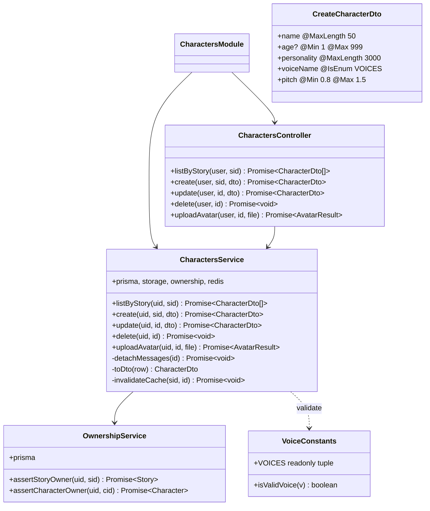
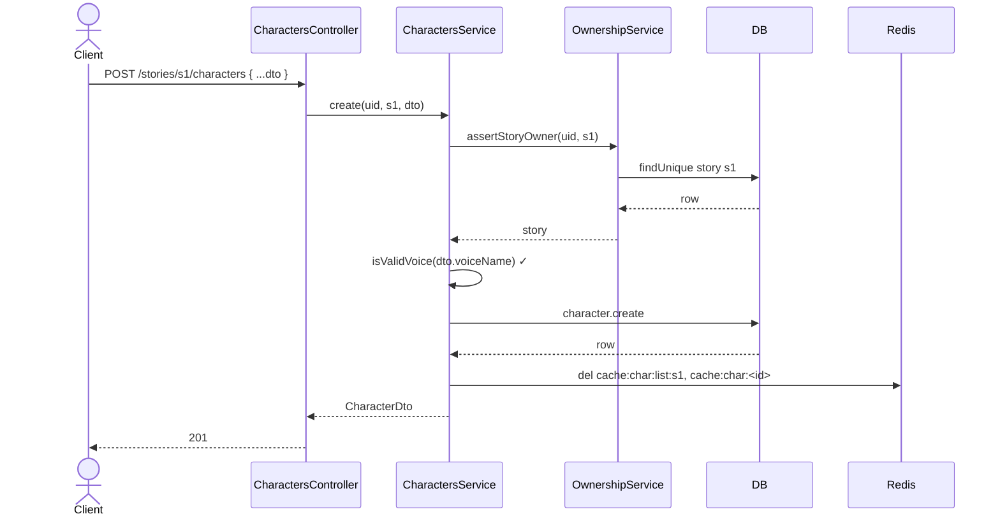
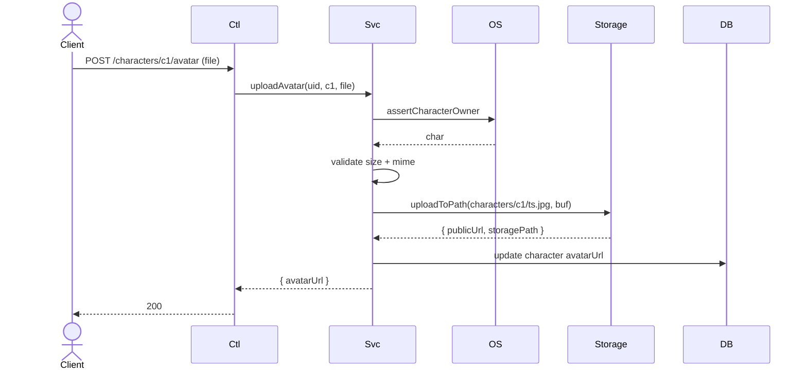

# P02.T3 — Server CharactersModule (CRUD + Avatar + Voice Validation) ✅ DONE

## 1. METADATA

| Field | Value |
|-------|-------|
| Task ID | P02.T3 |
| Phase | 2 |
| Depends on | P02.T2 |
| Complexity | High |
| Risk | Medium |

---

## 2. MỤC TIÊU & SCOPE

**In-scope**:
- `CharactersModule` với 5 endpoints:
  - `GET /stories/:storyId/characters`
  - `POST /stories/:storyId/characters`
  - `PATCH /characters/:id`
  - `DELETE /characters/:id` (set messages.character_id = NULL trước khi xoá — chuẩn bị sẵn, hiện chưa có bảng messages → guard try/catch giống P02.T2).
  - `POST /characters/:id/avatar` (upload).
- Voice enum validation.
- Copy `reference_index.json` → `packages/prompts/reference_index.json` để TTS dùng.
- `OwnershipService` (helper) để chia sẻ check qua chain story→user.

**Out-of-scope**:
- TTS test-voice endpoint (P03.T3).

---

## 3. FILES CẦN TẠO

| # | Path | Loại |
|---|------|------|
| 1 | `apps/server/src/modules/characters/characters.module.ts` | module |
| 2 | `apps/server/src/modules/characters/characters.controller.ts` | controller |
| 3 | `apps/server/src/modules/characters/characters.service.ts` | service |
| 4 | `apps/server/src/modules/characters/dto/create-character.dto.ts` | dto |
| 5 | `apps/server/src/modules/characters/dto/update-character.dto.ts` | dto |
| 6 | `apps/server/src/modules/characters/dto/character-response.dto.ts` | dto |
| 7 | `apps/server/src/modules/characters/voice.constants.ts` | const enum |
| 8 | `apps/server/src/shared/ownership/ownership.service.ts` | service |
| 9 | `apps/server/src/shared/ownership/ownership.module.ts` | module global |
| 10 | `packages/prompts/reference_index.json` | data copy |
| 11 | `packages/prompts/package.json` | new (workspace pkg) |
| 12 | `packages/prompts/src/index.ts` | barrel |
| 13 | `apps/server/src/modules/characters/*.spec.ts` | tests |

---

## 4. CLASS DIAGRAM



**Tổng**: 5 class + 3 DTO + 1 const + 1 module bonus (ownership).

---

## 5. CHI TIẾT CLASS

### 5.1. `VoiceConstants`

```
const VOICES = ['Achernar','Aoede','Charon','Fenrir','Kore','Leda','Zephyr'] as const
type VoiceName = typeof VOICES[number]
function isValidVoice(v: string): v is VoiceName { return (VOICES as readonly string[]).includes(v) }
```

### 5.2. `OwnershipService` (Global module, dùng cho Phase sau)

#### `assertStoryOwner(uid, sid)`
```
Logic:
  - story = prisma.story.findUnique({ where: { id: sid } })
  - if !story → throw NOT_FOUND
  - if story.userId !== uid → throw FORBIDDEN
  - return story
```

#### `assertCharacterOwner(uid, cid)`
```
Logic:
  - char = prisma.character.findUnique({ where: { id: cid }, include: { story: true } })
  - if !char → throw NOT_FOUND
  - if char.story.userId !== uid → throw FORBIDDEN
  - return char
```

### 5.3. DTOs

#### `CreateCharacterDto`
```
@IsString() @MaxLength(50) @IsNotEmpty() name: string
@IsOptional() @IsInt() @Min(1) @Max(999) age?: number
@IsString() @MaxLength(3000) @IsNotEmpty() personality: string
@IsIn(VOICES) voiceName: VoiceName
@IsNumber() @Min(0.8) @Max(1.5) pitch: number
```

#### `UpdateCharacterDto`
Tất cả `@IsOptional()` tương ứng.

#### `CharacterDto`
Trả về full row (id, storyId, name, age, personality, avatarUrl, voiceName, pitch, createdAt ISO).

### 5.4. `CharactersService` methods

#### `listByStory(uid, sid)`
```
- await ownership.assertStoryOwner(uid, sid)
- rows = prisma.character.findMany({ where: { storyId: sid }, orderBy: { createdAt: 'asc' } })
- return rows.map(toDto)
```

#### `create(uid, sid, dto)`
```
- await ownership.assertStoryOwner(uid, sid)
- if !isValidVoice(dto.voiceName) → throw INVALID_PAYLOAD
- row = prisma.character.create({ data: { storyId: sid, ...dto, avatarUrl: null } })
- await invalidateCache(sid, row.id)
- return toDto(row)
```

#### `update(uid, id, dto)`
```
- char = await ownership.assertCharacterOwner(uid, id)
- if dto.voiceName && !isValidVoice → throw
- updated = prisma.character.update({ where: { id }, data: dto })
- invalidateCache(char.storyId, id)
- return toDto(updated)
```

#### `delete(uid, id)`
```
- char = await ownership.assertCharacterOwner(uid, id)
- await prisma.$transaction(async (tx) => {
    await detachMessages(tx, id)   // SET character_id = NULL (skip nếu bảng Message chưa có)
    await tx.character.delete({ where: { id } })
  })
- invalidateCache(char.storyId, id)
```

#### `detachMessages(tx, id)` (private, defensive)
```
try { await tx.message.updateMany({ where: { characterId: id }, data: { characterId: null } }) }
catch { /* bảng chưa có ở phase 2 — bỏ qua */ }
```

#### `uploadAvatar(uid, id, file)`
```
- char = await ownership.assertCharacterOwner(uid, id)
- validate file (size ≤ 2MB, mime image/*) — tương tự P01.T3
- buffer = file.buffer (đã resize 256x256 ở client; server fallback resize bằng sharp 256x256)
- path = `characters/${id}/${Date.now()}.jpg`
- urls = await storage.uploadToPath(path, buffer, 'image/jpeg')  
  (StorageService bổ sung method `uploadToPath` generic; refactor uploadAvatar cũ thành wrapper.)
- await prisma.character.update({ where: { id }, data: { avatarUrl: urls.publicUrl } })
- invalidateCache(char.storyId, id)
- return { avatarUrl: urls.publicUrl }
```

#### `invalidateCache(sid, id?)`
```
- await redis.del(`cache:char:list:${sid}`)
- if id: await redis.del(`cache:char:${id}`)
```

### 5.5. `CharactersController`

```
@Controller()
class CharactersController {
  @Get('stories/:storyId/characters')
  listByStory(@CurrentUser() u, @Param('storyId') sid)

  @Post('stories/:storyId/characters')
  create(@CurrentUser() u, @Param('storyId') sid, @Body() dto: CreateCharacterDto)

  @Patch('characters/:id')
  update(@CurrentUser() u, @Param('id') id, @Body() dto: UpdateCharacterDto)

  @Delete('characters/:id') @HttpCode(204)
  delete(@CurrentUser() u, @Param('id') id)

  @Post('characters/:id/avatar') @UseInterceptors(FileInterceptor('file', { limits: { fileSize: 2*1024*1024 } }))
  uploadAvatar(@CurrentUser() u, @Param('id') id, @UploadedFile() file)
}
```

### 5.6. `@chatai/prompts` package init

`packages/prompts/package.json`:
```
{ "name": "@chatai/prompts", "version": "0.0.0", "private": true, "main": "./src/index.ts" }
```

`packages/prompts/src/index.ts`:
```
import referenceIndex from '../reference_index.json'
export { referenceIndex }
export type ReferenceIndex = typeof referenceIndex
```

Copy file từ `Document/dataset_chinese/reference_index.json` → `packages/prompts/reference_index.json`. (Server P03 sẽ import.)

Server `package.json` add: `"@chatai/prompts": "workspace:*"`.

---

## 6. SEQUENCE DIAGRAMS

### 6.1. Create character



### 6.2. Upload avatar



---

## 7. ACCEPTANCE & TEST PLAN

### Acceptance
- [ ] POST create with invalid voiceName → 400.
- [ ] POST create with pitch=2.0 → 400.
- [ ] Cross-user access to story → 403.
- [ ] Delete character không lỗi nếu bảng Message chưa có.
- [ ] Upload avatar → image accessible qua URL.
- [ ] `@chatai/prompts` import được `referenceIndex`.

### Unit Tests
| Test | Assert |
|------|--------|
| isValidVoice all 7 voices | true |
| isValidVoice rejects 'Random' | false |
| OwnershipService.assertStoryOwner throws FORBIDDEN for other user | |
| CharactersService.delete wraps detachMessages in transaction | |
| create rejects invalid voice | INVALID_PAYLOAD |
| uploadAvatar rejects oversize | INVALID_PAYLOAD |

### E2E
- Sequence: create story → create char → list → update → upload avatar → delete.
