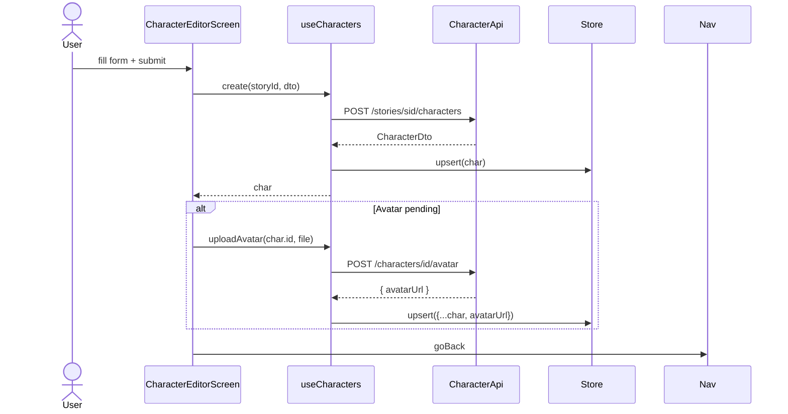

# P02.T5 — Client: CharacterEditor + VoiceSelector + PitchSlider ✅ DONE

## 1. METADATA

| Field | Value |
|-------|-------|
| Task ID | P02.T5 |
| Phase | 2 |
| Depends on | P02.T3, P02.T4 |
| Complexity | Medium |
| Risk | Low |

---

## 2. MỤC TIÊU & SCOPE

**In-scope**:
- `CharacterEditorScreen` (create + edit cùng 1 màn).
- `useCharacters` hook + `characterStore`.
- Components: `CharacterCard`, `CharacterListSection`, `VoiceSelector`, `PitchSlider`, `AvatarPicker` (reuse từ Profile).
- "Nghe thử giọng" button — placeholder disabled (P03.T3 sẽ wire).

**Out-of-scope**:
- TTS preview (P03).

---

## 3. FILES CẦN TẠO

| # | Path | Loại |
|---|------|------|
| 1 | `apps/mobile/src/features/character/screens/CharacterEditorScreen.tsx` | screen |
| 2 | `apps/mobile/src/features/character/hooks/useCharacters.ts` | hook |
| 3 | `apps/mobile/src/features/character/store/character.store.ts` | store |
| 4 | `apps/mobile/src/features/character/services/character.api.ts` | service |
| 5 | `apps/mobile/src/features/character/services/character.schemas.ts` | zod |
| 6 | `apps/mobile/src/features/character/components/CharacterCard.tsx` | component |
| 7 | `apps/mobile/src/features/character/components/CharacterListSection.tsx` | component (dùng trong StoryDetail) |
| 8 | `apps/mobile/src/features/character/components/VoiceSelector.tsx` | component |
| 9 | `apps/mobile/src/features/character/components/PitchSlider.tsx` | component |
| 10 | `apps/mobile/src/features/character/constants/voices.ts` | const |
| 11 | `apps/mobile/src/navigation/StoryStack.tsx` | sửa: thêm CharacterEditor route |

---

## 4. CLASS DIAGRAM

```mermaid
classDiagram
    class CharacterEditorScreen {
        +params: {storyId, characterId?}
        +useForm + zod
        +onSubmit
        +onPlayPreview (disabled phase 2)
    }
    class CharacterListSection {
        +storyId
        +renders CharacterCard list + add btn
    }
    class CharacterCard {
        +character
        +onPress -> edit
        +onDelete
    }
    class VoiceSelector {
        +value
        +onChange
        +renders 7 VoiceCard
    }
    class PitchSlider {
        +value
        +onChange
    }
    class UseCharacters {
        +charactersByStory(sid)
        +load(sid)
        +create(sid, dto)
        +update(id, dto)
        +delete(id)
        +uploadAvatar(id, file)
    }
    class CharacterStore {
        +charactersByStoryId Record<sid, CharacterDto[]>
        +loading boolean
        +setForStory(sid, list)
        +upsert(c)
        +remove(id, sid)
    }
    class CharacterApi {
        +listByStory(sid)
        +create(sid, dto)
        +update(id, dto)
        +delete(id)
        +uploadAvatar(id, formData)
    }
    class VoicesConst {
        +VOICES [{name, gender, hint}]
    }
    class CharacterSchemas {
        +createSchema
    }

    CharacterEditorScreen --> VoiceSelector
    CharacterEditorScreen --> PitchSlider
    CharacterEditorScreen --> AvatarPicker
    CharacterEditorScreen --> UseCharacters
    CharacterListSection --> CharacterCard
    CharacterListSection --> UseCharacters
    UseCharacters --> CharacterStore
    UseCharacters --> CharacterApi
    VoiceSelector --> VoicesConst
```

---

## 5. CHI TIẾT MODULE

### 5.1. `VoicesConst`

```
type Gender = 'male' | 'female' | 'neutral'
type VoiceMeta = { name: VoiceName; gender: Gender; sampleHint: string }

VOICES: VoiceMeta[] = [
  { name: 'Achernar', gender: 'female', sampleHint: 'Nữ trẻ trung' },
  { name: 'Aoede',    gender: 'female', sampleHint: 'Nữ ấm áp' },
  { name: 'Charon',   gender: 'male',   sampleHint: 'Nam trầm' },
  { name: 'Fenrir',   gender: 'male',   sampleHint: 'Nam mạnh mẽ' },
  { name: 'Kore',     gender: 'female', sampleHint: 'Nữ dịu dàng' },
  { name: 'Leda',     gender: 'female', sampleHint: 'Nữ tinh nghịch' },
  { name: 'Zephyr',   gender: 'neutral',sampleHint: 'Trung tính' },
]
```

### 5.2. `CharacterSchemas`

```
createSchema = z.object({
  name: z.string().min(1).max(50),
  age: z.union([z.number().int().min(1).max(999), z.nan()]).optional(),
  personality: z.string().min(1).max(3000),
  voiceName: z.enum(VOICES.map(v=>v.name)),
  pitch: z.number().min(0.8).max(1.5),
})
```

### 5.3. `CharacterApi`

```
listByStory(sid) → GET /stories/{sid}/characters
create(sid, dto) → POST /stories/{sid}/characters
update(id, dto)  → PATCH /characters/{id}
delete(id)       → DELETE /characters/{id}
uploadAvatar(id, formData) → POST /characters/{id}/avatar
```

### 5.4. `CharacterStore`

```
State:
  byStory: Record<storyId, CharacterDto[]>
  loadingByStory: Record<storyId, boolean>

Actions:
  setForStory(sid, list)
  upsert(c) — find storyId, replace or insert
  remove(id, sid)
```

### 5.5. `useCharacters`

Returns:
- `charactersByStory(sid)`: read from store.
- `load(sid)`: setLoading, fetch, setForStory.
- `create(sid, dto)`: api.create → store.upsert.
- `update(id, dto)`: api.update → store.upsert.
- `delete(id, sid)`: api.delete → store.remove.
- `uploadAvatar(id, file)`: prepare image (avatarService), api.uploadAvatar → fetch char again or merge result.

### 5.6. `VoiceSelector`

Props: `{ value: VoiceName; onChange: (v: VoiceName) => void }`

UI:
- Horizontal FlatList of 7 cards (chunked or scroll).
- Each card: gender icon + name + hint, highlight when selected.

### 5.7. `PitchSlider`

Props: `{ value: number; onChange: (v: number) => void; min=0.8, max=1.5, step=0.05 }`

UI:
- `Slider` (react-native) with 3 labels (Thấp / Bình thường / Cao).
- Real-time display value (2 decimals).

### 5.8. `CharacterEditorScreen`

Route params: `{ storyId: string; characterId?: string }` (edit if id present).

Logic:
- Initial state: `mode = characterId ? 'edit' : 'create'`.
- If edit → load char data via store; prefill form.
- Form fields (rhf):
  - `name`, `age` (numeric), `personality`, `voiceName`, `pitch`.
  - Avatar: separate (chỉnh sửa avatar không qua form values, gọi `uploadAvatar` riêng sau khi tạo char).
- Submit:
  - create → api.create → if avatarUrl pending → upload after success.
  - edit → api.update.
- "Nghe thử giọng" button: disabled in P02, hiển thị tooltip "Sẽ có ở phase TTS".

### 5.9. `CharacterListSection`

Used in `StoryDetailScreen`.  
Props: `{ storyId, navigate }`.  
Logic:
- useEffect: load(storyId) once.
- Render list of `CharacterCard` + "+ Thêm nhân vật" tile → navigate `CharacterEditor` with storyId only.
- Each `CharacterCard` tap → CharacterEditor edit; long-press / swipe → delete confirm.

### 5.10. `StoryStack` update

Thêm route:
```
<Stack.Screen name="CharacterEditor" component={CharacterEditorScreen} />
```

---

## 6. SEQUENCE — Create character



---

## 7. ACCEPTANCE & TEST PLAN

### Acceptance
- [ ] StoryDetail → tap "Thêm nhân vật" → CharacterEditor mở.
- [ ] Submit form đầy đủ → character hiện trong StoryDetail.
- [ ] VoiceSelector hiển thị 7 voices, chọn → highlight.
- [ ] PitchSlider 0.80–1.50 step 0.05.
- [ ] Edit char → form prefill chính xác.
- [ ] Delete char (confirm) → biến mất.
- [ ] Avatar upload → ảnh hiện trong card.
- [ ] "Nghe thử giọng" disabled với tooltip.

### Tests
| Test | Assert |
|------|--------|
| createSchema rejects pitch=2 | parse fail |
| createSchema accepts pitch=1.0 | parse ok |
| VoiceSelector onChange called | press card |
| useCharacters.delete removes from store | |

### Manual
1. Tạo 5 char trong 1 story → list render đúng.
2. Network fail khi upload avatar → toast, char vẫn tạo (avatar null).
