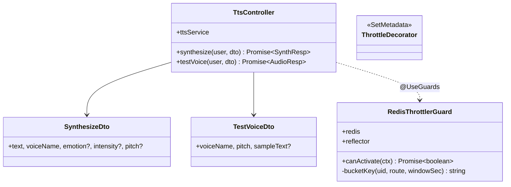
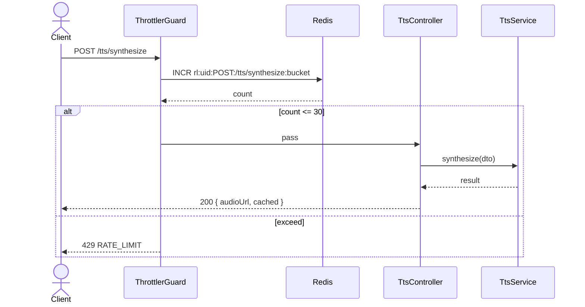

# P03.T3 — Server TTS Controller + Rate Limiting ✅ DONE

## 1. METADATA

| Field | Value |
|-------|-------|
| Task ID | P03.T3 |
| Phase | 3 |
| Depends on | P03.T2 |
| Complexity | Low |
| Risk | Low |

---

## 2. MỤC TIÊU & SCOPE

**In-scope**:
- `TtsController` 2 endpoints: `POST /tts/synthesize`, `POST /tts/test-voice`.
- DTOs.
- Rate limit 30 req/min/user (custom Redis-based hoặc `@nestjs/throttler` Redis storage).

**Out-of-scope**:
- Client wire (T4).
- Storage rules (T5).

---

## 3. FILES CẦN TẠO

| # | Path | Loại |
|---|------|------|
| 1 | `apps/server/src/modules/tts/tts.controller.ts` | controller |
| 2 | `apps/server/src/modules/tts/dto/synthesize.dto.ts` | dto |
| 3 | `apps/server/src/modules/tts/dto/test-voice.dto.ts` | dto |
| 4 | `apps/server/src/shared/throttler/redis-throttler.guard.ts` | guard |
| 5 | `apps/server/src/shared/throttler/throttle.decorator.ts` | decorator |
| 6 | `apps/server/src/modules/tts/tts.controller.spec.ts` | test |

---

## 4. CLASS DIAGRAM



---

## 5. CHI TIẾT MODULE

### 5.1. DTOs

#### `SynthesizeDto`
```
class SynthesizeDto {
  @IsString() @MaxLength(500) @IsNotEmpty() text: string
  @IsIn(VOICES) voiceName: VoiceName
  @IsOptional() @IsIn(EMOTIONS) emotion?: Emotion
  @IsOptional() @IsIn(INTENSITIES) intensity?: Intensity
  @IsOptional() @IsNumber() @Min(0.8) @Max(1.5) pitch?: number
}
```

#### `TestVoiceDto`
```
class TestVoiceDto {
  @IsIn(VOICES) voiceName: VoiceName
  @IsNumber() @Min(0.8) @Max(1.5) pitch: number
  @IsOptional() @IsString() @MaxLength(100) sampleText?: string
}
```

### 5.2. `RedisThrottlerGuard`

**Vai trò**: Per-user rate limit window-based.

**Constructor inject**: redis, reflector, logger.

#### `canActivate(ctx)`
```
Logic:
  1. meta = reflector.getAllAndOverride('throttle', [ctx.getHandler(), ctx.getClass()])
     // meta = { limit: 30, windowSec: 60 } hoặc undefined → bỏ qua
  2. if !meta → return true
  3. req = ctx.switchToHttp().getRequest(); uid = req.user?.uid ?? req.ip
  4. route = `${req.method}:${req.routeOptions?.url ?? req.url}`
  5. key = `rl:${uid}:${route}:${windowBucket(meta.windowSec)}`
     windowBucket = Math.floor(Date.now() / 1000 / windowSec) * windowSec
  6. count = await redis.incr(key)
  7. if count === 1: await redis.expire(key, meta.windowSec)
  8. if count > meta.limit:
       throw AppException(ERR.RATE_LIMIT, `Max ${meta.limit} req per ${meta.windowSec}s`)
  9. return true
```

### 5.3. `ThrottleDecorator`

```
export const Throttle = (limit: number, windowSec: number) => SetMetadata('throttle', { limit, windowSec })
```

### 5.4. `TtsController`

```
@Controller('tts')
@UseGuards(RedisThrottlerGuard)
class TtsController {
  constructor(private ttsService: TtsService) {}

  @Post('synthesize')
  @Throttle(30, 60)
  async synthesize(@CurrentUser() u, @Body() dto: SynthesizeDto) {
    const r = await this.ttsService.synthesize(dto)
    return { audioUrl: r.url, cached: r.fromCache }
  }

  @Post('test-voice')
  @Throttle(30, 60)
  async testVoice(@CurrentUser() u, @Body() dto: TestVoiceDto) {
    const r = await this.ttsService.testVoice(dto.voiceName, dto.pitch, dto.sampleText)
    return { audioUrl: r.url }
  }
}
```

---

## 6. SEQUENCE — synthesize with rate limit



---

## 7. ACCEPTANCE & TEST PLAN

### Acceptance
- [ ] POST /tts/synthesize text "你好" voice Achernar → 200 + audioUrl.
- [ ] 31st request within 60s → 429.
- [ ] Sau 60s → reset.
- [ ] POST /tts/test-voice → audioUrl phát được.
- [ ] Invalid voice → 400.
- [ ] No auth → 401.

### Unit Tests
| Test | Assert |
|------|--------|
| Throttler increments redis key | spy |
| Throttler throws on exceed | RATE_LIMIT |
| Throttler skips when no meta | true |
| SynthesizeDto validates pitch range | |
| Controller passes dto to service | spy |

### E2E
- Loop 35 requests → 30 OK + 5 × 429.
