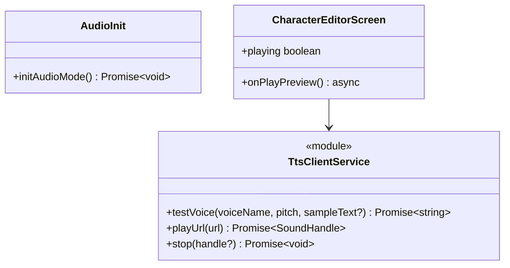
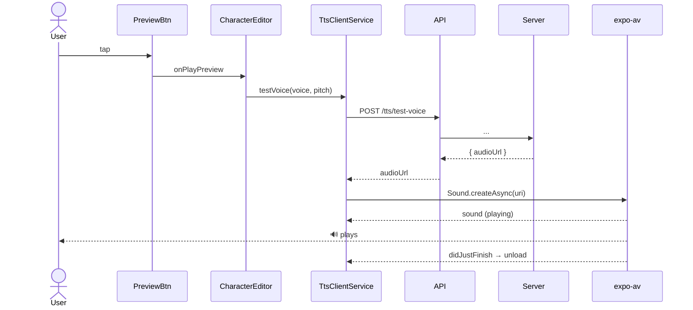

# P03.T4 — Client TtsService + "Nghe thử giọng" wire ✅ DONE

## 1. METADATA

| Field | Value |
|-------|-------|
| Task ID | P03.T4 |
| Phase | 3 |
| Depends on | P03.T3, P02.T5 |
| Complexity | Low |
| Risk | Low |

---

## 2. MỤC TIÊU & SCOPE

**In-scope**:
- `ttsClientService` với `testVoice(voiceName, pitch, sampleText?)` và `playUrl(url)` (single-shot).
- Bật nút "Nghe thử giọng" trong `CharacterEditorScreen`.
- Cài `expo-av`, init Audio mode.

**Out-of-scope**:
- Playback queue (P05).

---

## 3. FILES CẦN TẠO / SỬA

| # | Path | Loại |
|---|------|------|
| 1 | `apps/mobile/src/features/character/services/tts.service.ts` | service |
| 2 | `apps/mobile/src/features/character/screens/CharacterEditorScreen.tsx` | sửa |
| 3 | `apps/mobile/src/utils/audio-init.ts` | util (Audio.setAudioModeAsync) |
| 4 | `apps/mobile/App.tsx` | sửa: gọi audio init |
| 5 | `apps/mobile/package.json` | sửa: deps `expo-av` |

---

## 4. CLASS DIAGRAM



---

## 5. CHI TIẾT MODULE

### 5.1. `audio-init.ts`

```
initAudioMode(): Promise<void>
  Audio.setAudioModeAsync({
    allowsRecordingIOS: false,
    interruptionModeIOS: InterruptionModeIOS.DoNotMix,
    playsInSilentModeIOS: true,
    shouldDuckAndroid: true,
    interruptionModeAndroid: InterruptionModeAndroid.DoNotMix,
    playThroughEarpieceAndroid: false,
    staysActiveInBackground: false,
  })
```

Gọi 1 lần trong `App.tsx` `useEffect`.

### 5.2. `TtsClientService`

**State module-level**:
- `currentSound: Audio.Sound | null = null`

**Methods**:

#### `testVoice(voiceName, pitch, sampleText?)`
```
Logic:
  res = await apiClient.post('/tts/test-voice', { voiceName, pitch, sampleText })
  return res.audioUrl
Throws: re-throw network/server errors
```

#### `playUrl(url)`
```
Logic:
  1. if currentSound → await stop()
  2. { sound } = await Audio.Sound.createAsync({ uri: url }, { shouldPlay: true })
  3. currentSound = sound
  4. sound.setOnPlaybackStatusUpdate(status => {
       if (status.didJustFinish || status.error) {
         sound.unloadAsync()
         if (currentSound === sound) currentSound = null
       }
     })
  5. return sound (handle)
```

#### `stop()`
```
Logic:
  - if currentSound:
    try { await currentSound.stopAsync() } catch {}
    try { await currentSound.unloadAsync() } catch {}
    currentSound = null
```

### 5.3. `CharacterEditorScreen` updates

Local state: `previewLoading: boolean`.

```
onPlayPreview():
  if (previewLoading) return
  setPreviewLoading(true)
  try {
    url = await ttsClientService.testVoice(form.voiceName, form.pitch)
    await ttsClientService.playUrl(url)
  } catch (e) {
    if (e.code === 'TTS_ENGINE_DOWN') toast('Hệ thống TTS đang bảo trì')
    else if (e.code === 'RATE_LIMIT') toast('Quá nhiều yêu cầu, thử lại sau')
    else toast('Không phát được giọng đọc')
  } finally {
    setPreviewLoading(false)
  }
```

Button "Nghe thử giọng" enabled khi `voiceName && pitch && !previewLoading`. Loading icon khi loading.

---

## 6. SEQUENCE — Preview



---

## 7. ACCEPTANCE & TEST PLAN

### Acceptance
- [ ] Chọn voice + pitch → tap Nghe thử → loading → audio phát.
- [ ] Tap lần nữa khi đang phát → audio cũ stop, audio mới phát.
- [ ] Server down → toast error, button enabled lại.
- [ ] Cached: 2nd tap cùng voice/pitch nhanh hơn (cached URL).

### Manual
1. Đổi pitch 1.0 → 1.3 → nghe khác nhau.
2. Mute device → silent mode iOS → vẫn nghe (do `playsInSilentModeIOS: true`).
