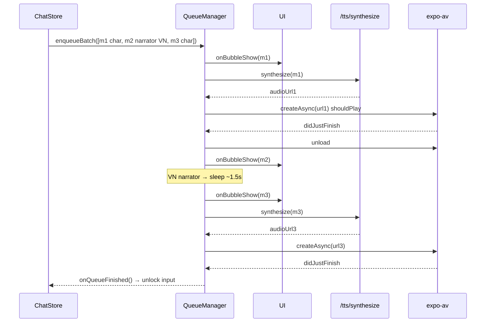

# P05.T1 — Client: PlaybackQueueManager

## 1. METADATA

| Field | Value |
|-------|-------|
| Task ID | P05.T1 ✅ DONE |
| Phase | 5 — Chat UI & Playback |
| Depends on | P04.T8, P03.T4 |
| Complexity | High |
| Risk | High (state machine + audio lifecycle) |

---

## 2. MỤC TIÊU & SCOPE

**In-scope**:
- `PlaybackQueueManager` class quản lý queue messages, phát TTS audio tuần tự, callback bubble show + queue finished.
- Fetch audio URL cho character message (TTS API), narrator zh/en (TTS narrator voice), narrator vi → no audio (delay theo char count).
- Cleanup & stop().

**Out-of-scope**:
- UI rendering (T2).
- Word tooltip (T3).
- InputBar lock (T4).

---

## 3. FILES CẦN TẠO

| # | Path |
|---|------|
| 1 | `apps/mobile/src/features/chat/services/playback-queue.manager.ts` |
| 2 | `apps/mobile/src/features/chat/services/tts-fetch.service.ts` (gọi `/tts/synthesize`) |
| 3 | `apps/mobile/src/features/chat/services/playback-queue.manager.spec.ts` |

---

## 4. CLASS DIAGRAM

```mermaid
classDiagram
    class PlaybackQueueManager {
        -queue: ChatMessage[]
        -isPlaying boolean
        -isStopped boolean
        -currentSound Audio.Sound null
        -onBubbleShow(msg) callback
        -onQueueFinished() callback
        -charsForVoiceLookup: Map~charId, {voice,pitch}~
        +constructor(callbacks)
        +setCharactersMap(map)
        +enqueueBatch(msgs)
        +stop()
        -playNext() Promise
        -playOne(msg) Promise
        -fetchAudioUrl(msg) Promise~string null~
        -estimateNarratorDelayMs(text) number
    }
    class PlaybackCallbacks {
        +onBubbleShow(msg)
        +onQueueFinished()
        +onError?(err)
    }
    class TtsFetchService {
        <<module>>
        +synthesize(req) Promise~{ audioUrl, cached }~
    }
    class ChatMessage {
        kind, characterId?, characterName?, text, emotion?, intensity?
    }

    PlaybackQueueManager --> TtsFetchService
    PlaybackQueueManager ..> PlaybackCallbacks
```

---

## 5. CHI TIẾT

### 5.1. `TtsFetchService`

```
synthesize(req: { text, voiceName, emotion?, intensity?, pitch? }): Promise<{ audioUrl, cached }>
  → POST /tts/synthesize
  → { audioUrl, cached }
```

### 5.2. `PlaybackQueueManager`

#### Constructor

```
constructor(opts: {
  onBubbleShow: (msg: ChatMessage) => void
  onQueueFinished: () => void
  onError?: (err: unknown) => void
  charactersVoice: Map<string, { voiceName: VoiceName; pitch: number }>
})
```

State init: `queue = []`, `isPlaying = false`, `isStopped = false`, `currentSound = null`.

#### `setCharactersMap(map)`

Refresh khi store update.

#### `enqueueBatch(msgs)`

```
enqueueBatch(msgs: ChatMessage[]): void

Logic:
  if isStopped → return (manager đã shutdown)
  queue.push(...msgs)
  if !isPlaying:
    isPlaying = true
    void this.playNext()  // fire-and-forget
```

#### `stop()`

```
stop(): Promise<void>

Logic:
  isStopped = true
  queue = []
  if currentSound:
    try { await currentSound.stopAsync() } catch {}
    try { await currentSound.unloadAsync() } catch {}
    currentSound = null
  isPlaying = false
```

#### `playNext()` (private, recursive)

```
playNext(): Promise<void>

Logic:
  if isStopped → return
  if queue.length === 0:
    isPlaying = false
    onQueueFinished()
    return
  msg = queue.shift()!
  try:
    await playOne(msg)
  catch (e):
    onError?.(e)
    // continue queue anyway (don't stop on single TTS fail)
  return await playNext()
```

#### `playOne(msg)` (private)

```
playOne(msg: ChatMessage): Promise<void>

Logic:
  1. onBubbleShow(msg)  // UI render bubble với animation
  2. if msg.kind !== 'assistant':
       // user/ooc/system: just bubble show, no audio, no delay
       return
  3. audioUrl = await fetchAudioUrl(msg)
  4. if audioUrl:
       { sound } = await Audio.Sound.createAsync({ uri: audioUrl }, { shouldPlay: true })
       if isStopped: await sound.unloadAsync(); return
       currentSound = sound
       await new Promise<void>((resolve) => {
         sound.setOnPlaybackStatusUpdate(status => {
           if (status.didJustFinish || status.error) resolve()
         })
       })
       try { await sound.unloadAsync() } catch {}
       if currentSound === sound: currentSound = null
     else:
       // No audio (narrator VN) → delay
       delayMs = estimateNarratorDelayMs(msg.text)
       await sleepInterruptible(delayMs)
```

#### `fetchAudioUrl(msg)` (private)

```
fetchAudioUrl(msg: ChatMessage): Promise<string | null>

Logic:
  if msg.kind !== 'assistant' → return null
  // Narrator detection: characterName === 'Narrator' (hoặc characterId === null)
  isNarrator = (msg.characterName === 'Narrator' || msg.characterId == null)
  
  if isNarrator:
    // detect language: nếu text contains Chinese chars → narrator zh voice (mặc định 'Achernar', pitch 1.0)
    // else if pure VN (heuristic: chỉ ASCII + diacritics) → return null (no audio)
    if containsChinese(msg.text):
      try {
        r = await TtsFetchService.synthesize({ text: msg.text, voiceName: NARRATOR_DEFAULT_VOICE, emotion: 'Neutral', intensity: 'medium', pitch: 1.0 })
        return r.audioUrl
      } catch { return null }
    else:
      return null
  
  // Character message
  charVoice = charactersVoice.get(msg.characterId!)
  if !charVoice: return null  // unknown char (e.g. temp) → no audio MVP
  try:
    r = await TtsFetchService.synthesize({
      text: msg.text,
      voiceName: charVoice.voiceName,
      emotion: msg.emotion ?? 'Neutral',
      intensity: msg.intensity ?? 'medium',
      pitch: charVoice.pitch
    })
    return r.audioUrl
  catch (e):
    if e.code === 'RATE_LIMIT' → null (silent skip)
    return null
```

#### `estimateNarratorDelayMs(text)` (private)

```
return Math.min(Math.max(text.length * 80, 800), 5000)
// 80ms per char, min 800ms, max 5000ms
```

#### Helper `sleepInterruptible(ms)`

```
return new Promise<void>(resolve => {
  const t = setTimeout(resolve, ms)
  // (advanced) wire to isStopped check via interval; MVP just resolve naturally
})
```

#### Constants

```
NARRATOR_DEFAULT_VOICE: VoiceName = 'Achernar'
containsChinese(s): boolean → /[\u4E00-\u9FFF]/.test(s)
```

---

## 6. SEQUENCE — Enqueue 3 messages



---

## 7. ACCEPTANCE & TEST PLAN

### Acceptance
- [ ] enqueueBatch nhiều messages → phát tuần tự, không overlap.
- [ ] Narrator VN → bubble hiện + delay ~1.5s → tiếp.
- [ ] TTS fail 1 message → skip, vẫn phát message sau.
- [ ] stop() giữa queue → audio cừng stop, queue clear, onQueueFinished không gọi (hoặc gọi nếu chỉ stop, decide).
- [ ] enqueueBatch khi đang playing → append cuối queue (continue).

### Unit Tests (mock TtsFetchService + Audio.Sound)
| Test | Assert |
|------|--------|
| enqueue 1 char msg → fetch + play + finish callback | spy seq |
| enqueue VN narrator → no fetch, delay called | timer mock |
| TTS rejects → continues with next | no throw, queue empty |
| stop mid-play → unloadAsync called | spy |
| enqueue while playing → appended | length grows |
