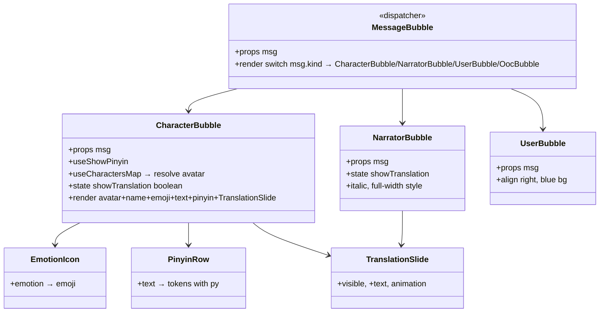
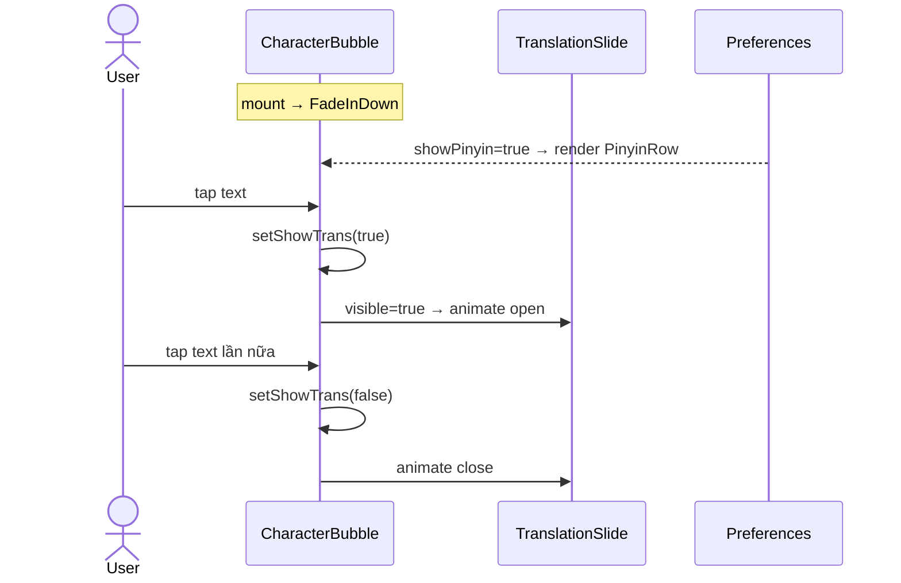

# P05.T2 — Client: MessageBubble Full UI

## 1. METADATA

| Field | Value |
|-------|-------|
| Task ID | P05.T2 ✅ DONE |
| Phase | 5 |
| Depends on | P05.T1 |
| Complexity | Medium |
| Risk | Low |

---

## 2. MỤC TIÊU & SCOPE

**In-scope**:
- Refactor `MessageBubble` thành 3 components: `CharacterBubble`, `NarratorBubble`, `UserBubble` + index dispatcher.
- Hiển thị emotion icon, pinyin row (toggle global preference), translation slide-down (tap).
- Avatar character bên trái bubble.
- Animation fade-in + slide-up (react-native-reanimated).

**Out-of-scope**:
- Word tooltip (T3).
- Audio play (T1 đã quản lý).

---

## 3. FILES CẦN TẠO / SỬA

| # | Path |
|---|------|
| 1 | `apps/mobile/src/features/chat/components/MessageBubble.tsx` (dispatcher) — sửa |
| 2 | `apps/mobile/src/features/chat/components/CharacterBubble.tsx` |
| 3 | `apps/mobile/src/features/chat/components/NarratorBubble.tsx` |
| 4 | `apps/mobile/src/features/chat/components/UserBubble.tsx` |
| 5 | `apps/mobile/src/features/chat/components/EmotionIcon.tsx` |
| 6 | `apps/mobile/src/features/chat/components/PinyinRow.tsx` |
| 7 | `apps/mobile/src/features/chat/components/TranslationSlide.tsx` |
| 8 | `apps/mobile/src/features/chat/utils/emotion-emoji.ts` |
| 9 | `apps/mobile/src/features/chat/utils/pinyin.ts` (tiny lookup; may use `pinyin-pro` package) |
| 10 | `apps/mobile/src/features/profile/store/preferences.store.ts` (sửa: thêm showPinyin) hoặc tạo `useShowPinyin` từ Firestore prefs |
| 11 | `apps/mobile/package.json` — sửa: thêm `react-native-reanimated`, `pinyin-pro` |

---

## 4. COMPONENT DIAGRAM



---

## 5. CHI TIẾT

### 5.1. `emotion-emoji.ts`

```
EMOTION_EMOJI: Record<Emotion, string> = {
  Angry: '😠', Shouting: '😡', Disgusted: '🤢', Sad: '😢',
  Scared: '😨', Surprised: '😲', Shy: '😳', Affectionate: '🥰',
  Happy: '😊', Excited: '🤩', Serious: '😐', Neutral: '🙂',
}
emojiFor(emotion?: string): string => EMOTION_EMOJI[emotion ?? 'Neutral'] ?? '🙂'
```

### 5.2. `pinyin.ts`

```
Use pinyin-pro:
  import { pinyin } from 'pinyin-pro'
  
toPinyin(text: string): string =>
  pinyin(text, { toneType: 'symbol', type: 'string', nonZh: 'consecutive' })

// Per-char split for tap mapping (sẽ dùng ở T3):
toPinyinTokens(text: string): Array<{ ch: string; py: string }>
```

Cache results in module-level Map<text, string> (max 1000 entries LRU).

### 5.3. `EmotionIcon`

```
Props: { emotion?: string; size?: number }
Render: <Text style={{ fontSize: size ?? 16 }}>{emojiFor(emotion)}</Text>
```

### 5.4. `PinyinRow`

```
Props: { text: string }
Logic:
  py = useMemo(() => toPinyin(text), [text])
Render: <Text style={styles.pinyin}>{py}</Text>
```

### 5.5. `TranslationSlide`

```
Props: { translation?: string|null; visible: boolean }
Anim: react-native-reanimated `useSharedValue(height)`; visible true → animate to natural height
Render:
  if !translation → null
  <Animated.View style={animStyle}>
    <Text style={styles.translation}>{translation}</Text>
  </Animated.View>
```

### 5.6. `CharacterBubble`

```
Props: { msg: AssistantMessage }
Hooks:
  showPinyinGlobal = usePreferences(p => p.showPinyin)  // default true
  charMap = useCharactersMap()  // Map<charId, CharacterDto>
  char = msg.characterId ? charMap.get(msg.characterId) : undefined
  [showTrans, setShowTrans] = useState(false)

Layout:
  Row align left, max width 80%
  <Avatar uri={char?.avatarUrl} size={32} />
  <View style={{ flex: 1 }}>
    <Row>
      <Text bold>{msg.characterName}</Text>
      <EmotionIcon emotion={msg.emotion} />
    </Row>
    <Pressable onPress={() => setShowTrans(s => !s)}>
      <Text style={styles.zh}>{msg.text}</Text>
      {showPinyinGlobal && <PinyinRow text={msg.text} />}
    </Pressable>
    <TranslationSlide translation={msg.translation} visible={showTrans} />
  </View>
Anim: <Animated.View entering={FadeInDown.duration(250)}>
```

### 5.7. `NarratorBubble`

```
Same as character minus avatar + minus pinyin (narrator VN không cần pinyin). 
Nếu narrator zh → show pinyin.
Italic + gray background.
```

### 5.8. `UserBubble`

```
Align right, primaryColor bg.
Render text only.
Anim: FadeInDown.
```

### 5.9. `MessageBubble` dispatcher

```
switch msg.kind:
  case 'assistant':
    if (msg.characterName === 'Narrator' || msg.characterId == null) → <NarratorBubble msg={msg}/>
    else → <CharacterBubble msg={msg}/>
  case 'user': <UserBubble msg={msg}/>
  case 'persistent_ooc' | 'ephemeral_ooc' | 'system': <OocBubble msg={msg}/> (existing)
```

### 5.10. Preferences store update

```
interface PreferencesState {
  showPinyin: boolean
  showTranslation: boolean
  ...
  setShowPinyin(v: boolean)
}
Default showPinyin: true, sync với Firestore user_profiles.preferences.showPinyin (Phase 1.T5).
```

---

## 6. SEQUENCE — Bubble interactivity



---

## 7. ACCEPTANCE & TEST PLAN

### Acceptance
- [ ] Character bubble hiển thị avatar + tên + emoji + text Hán + pinyin (nếu showPinyin).
- [ ] Tap text → translation slide xuống.
- [ ] Tap lại → đóng.
- [ ] Toggle showPinyin trong Profile → tất cả bubbles update không cần reload.
- [ ] Narrator VN → italic gray, không pinyin.
- [ ] Narrator zh → pinyin show.
- [ ] User bubble align right, không có translation.
- [ ] Animation enter mượt 60fps.

### Manual
- 20 messages → scroll smooth, không lag.
- Tap nhanh 5 bubbles → mở/đóng đúng.

### Unit
- `emojiFor` returns fallback for unknown emotion.
- `toPinyin` cache hit thứ 2 nhanh hơn.
