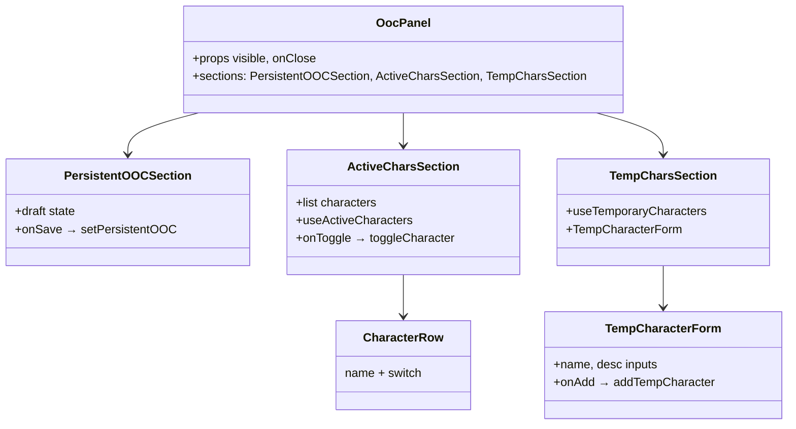
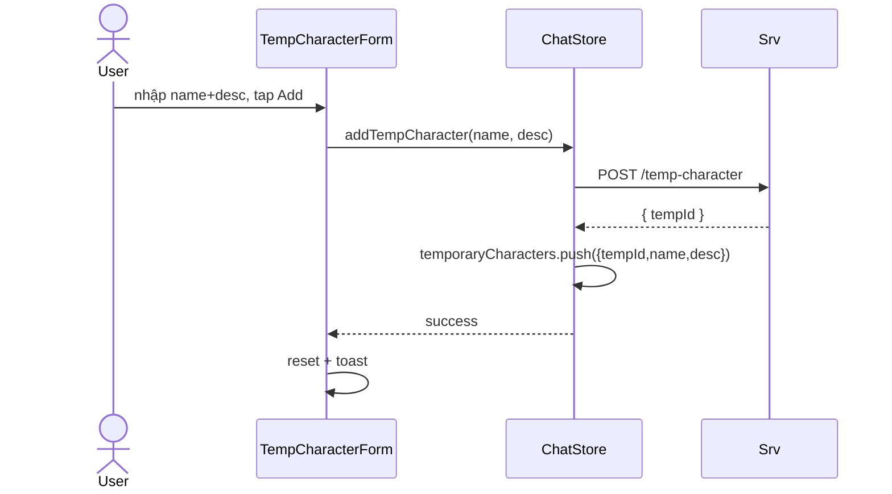

# P05.T5 — Client: OOC Sidebar Panel (Persistent + Active Chars + Temp Chars)

## 1. METADATA

| Field | Value |
|-------|-------|
| Task ID | P05.T5 ✅ DONE |
| Phase | 5 |
| Depends on | P05.T4 |
| Complexity | Medium |
| Risk | Low |

---

## 2. MỤC TIÊU & SCOPE

**In-scope**:
- `OocPanel` slide-in từ phải (RN Modal + Animated translateX) hoặc bottom sheet.
- 3 sections: Persistent OOC (TextArea + Save), Active Characters (checkbox list), Temporary Characters (form thêm + list).
- Trigger từ icon ⚙️ header ChatRoom.
- Sync với store + Firestore (persistent OOC server-side đã save).

**Out-of-scope**:
- Character avatar upload trong temp form.

---

## 3. FILES CẦN TẠO / SỬA

| # | Path |
|---|------|
| 1 | `apps/mobile/src/features/chat/components/OocPanel.tsx` (refactor full) |
| 2 | `apps/mobile/src/features/chat/components/CharacterRow.tsx` |
| 3 | `apps/mobile/src/features/chat/components/TempCharacterForm.tsx` |
| 4 | `apps/mobile/src/features/chat/store/chat.store.ts` — sửa: thêm `temporaryCharacters` state + actions |
| 5 | `apps/mobile/src/features/chat/screens/ChatRoomScreen.tsx` — sửa: nút ⚙️ header |

---

## 4. COMPONENT DIAGRAM



---

## 5. CHI TIẾT

### 5.1. ChatStore additions

```
state:
  temporaryCharacters: Array<{ tempId: string; name: string; description: string }>
  charactersFull: CharacterDto[]  // load 1 lần khi vào room (from CharactersService)

actions:
  loadStoryCharacters(): async fetch GET /characters?storyId=...
  addTempCharacter(name, desc): post API → on success push to state
```

### 5.2. `OocPanel`

```
Props: { visible, onClose }
Layout:
  Modal animationType="slide" presentationStyle="overFullScreen"
  Overlay tap → onClose
  Container right side width 80%
    Header "Bối cảnh & Nhân vật" + ✖
    ScrollView:
      <PersistentOOCSection />
      <ActiveCharsSection />
      <TempCharsSection />
```

### 5.3. `PersistentOOCSection`

```
[draft, setDraft] = useState(persistentOOC from store)
useEffect: when modal opens reset draft = current
TextArea multiline maxLength=200 chars
Button Save:
  await store.setPersistentOOC(draft)
  toast 'Đã lưu bối cảnh'
Button Clear:
  await store.setPersistentOOC('')
```

### 5.4. `ActiveCharsSection`

```
characters = useChatStore(s => s.charactersFull)
active = useChatStore(s => new Set(s.activeCharacters))
Render:
  for c of characters:
    <CharacterRow
      name={c.name}
      avatarUrl={c.avatarUrl}
      checked={active.has(c.id)}
      onChange={(on) => store.toggleCharacter(c.id, on)}
    />
```

### 5.5. `TempCharsSection`

```
temps = useChatStore(s => s.temporaryCharacters)
Render:
  Section title "Nhân vật tạm thời"
  for t of temps:
    <View><Text>{t.name}</Text><Text small>{t.description}</Text></View>
  <TempCharacterForm onAdd={(name, desc) => store.addTempCharacter(name, desc)} />
```

### 5.6. `TempCharacterForm`

```
state: name, desc
validate name 1..50, desc 1..500
Button Add disabled if invalid
onAdd:
  await onAdd(name, desc)
  reset form
  toast 'Đã thêm'
```

### 5.7. `ChatRoomScreen` header

```
Header right cluster:
  IconButton "⚙️" onPress={() => setOocVisible(true)}
  IconButton "🔚" onPress={() => navigate('EndChat', { sessionId })}  // Phase 7 wire
<OocPanel visible={oocVisible} onClose={() => setOocVisible(false)} />
```

---

## 6. SEQUENCE — Add temp character



---

## 7. ACCEPTANCE & TEST PLAN

### Acceptance
- [ ] Tap ⚙️ → panel trượt vào.
- [ ] Persistent OOC: nhập "trời mưa" → Save → tin tiếp AI mô tả bối cảnh mưa.
- [ ] Toggle character off → tin tiếp không có lời từ char đó.
- [ ] Toggle on → có lại.
- [ ] Thêm temp "Mèo Mun, mèo đen 3 tuổi" → tin tiếp temp xuất hiện trong cảnh.
- [ ] Đóng panel → reopen → state preserved.
- [ ] Đổi persistent OOC nhanh 2 lần → lần cuối thắng (no race).

### Manual / Visual
- Anim smooth 60fps.
- Keyboard mở không che TextArea.
