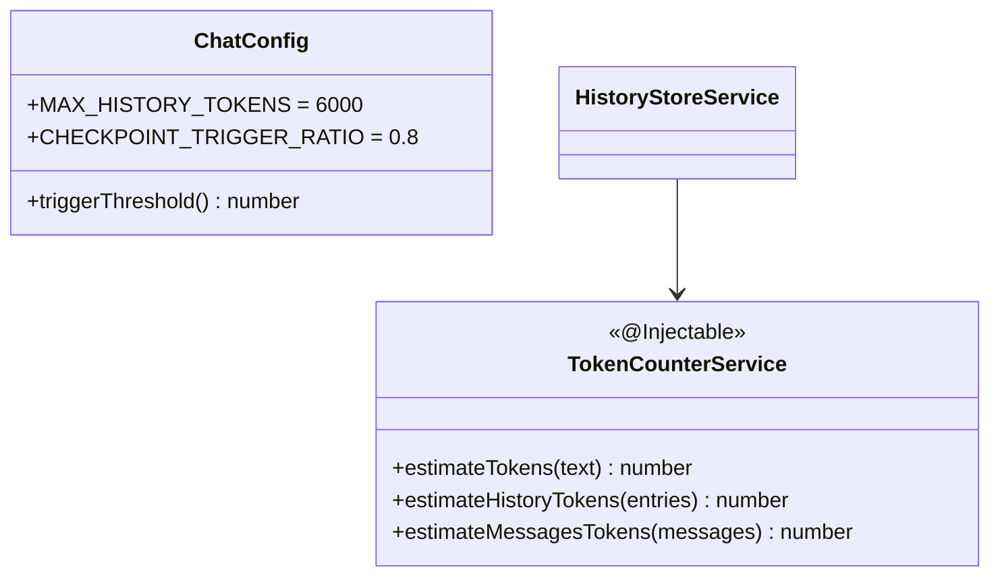
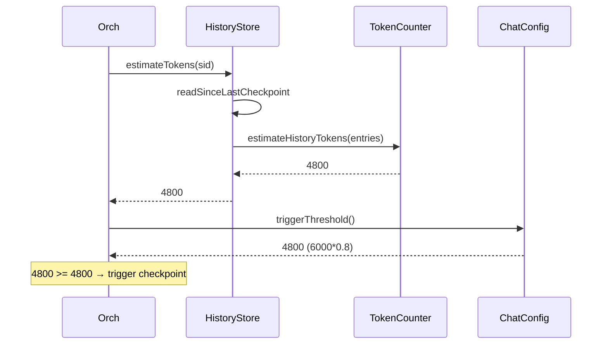

# P06.T1 — TokenCounterService + Threshold Config

> **Review**: DONE — xem `Task/WorkPlan/P06_R_review_refactor.md`

## 1. METADATA

| Field | Value |
|-------|-------|
| Task ID | P06.T1 |
| Phase | 6 — Checkpoint |
| Depends on | P05 hoàn thành |
| Complexity | Low |
| Risk | Low |

---

## 2. MỤC TIÊU & SCOPE

**In-scope**:
- `TokenCounterService` heuristic estimate token count cho text & history entries.
- Config keys `MAX_HISTORY_TOKENS` (6000), `CHECKPOINT_TRIGGER_RATIO` (0.8).
- Refactor `HistoryStoreService.estimateTokens` → delegate sang TokenCounterService.

**Out-of-scope**:
- Real tokenizer (BPE) — heuristic đủ cho phase này.

---

## 3. FILES CẦN TẠO / SỬA

| # | Path |
|---|------|
| 1 | `apps/server/src/modules/chat/services/token-counter.service.ts` |
| 2 | `apps/server/src/config/chat.config.ts` (hoặc thêm vào ConfigModule existing) |
| 3 | `apps/server/src/modules/chat/services/history-store.service.ts` — sửa |
| 4 | `apps/server/src/modules/chat/services/token-counter.service.spec.ts` |

---

## 4. CLASS DIAGRAM



---

## 5. CHI TIẾT

### 5.1. `ChatConfig`

```
@Injectable()
class ChatConfig {
  MAX_HISTORY_TOKENS: number  // from env
  CHECKPOINT_TRIGGER_RATIO: number
  
  constructor(cfg: ConfigService) {
    this.MAX_HISTORY_TOKENS = +cfg.get('MAX_HISTORY_TOKENS', 6000)
    this.CHECKPOINT_TRIGGER_RATIO = +cfg.get('CHECKPOINT_TRIGGER_RATIO', 0.8)
  }
  
  triggerThreshold(): number {
    return Math.floor(this.MAX_HISTORY_TOKENS * this.CHECKPOINT_TRIGGER_RATIO)
  }
}
```

### 5.2. `TokenCounterService`

```
estimateTokens(text: string): number
  Logic:
    chineseChars = (text.match(/[\u4E00-\u9FFF]/g) || []).length
    otherChars = text.length - chineseChars
    return Math.ceil(chineseChars / 1.5 + otherChars / 4)

estimateHistoryTokens(entries: HistoryEntry[]): number
  Logic:
    sum = 0
    for e in entries:
      switch e.type:
        case 'user': sum += estimateTokens(e.data.text) + (e.data.ephemeralOOC ? estimateTokens(e.data.ephemeralOOC) : 0)
        case 'assistant_batch':
          for m in e.data.messages: sum += estimateTokens(m.text) + (m.translation ? estimateTokens(m.translation) : 0)
        case 'persistent_ooc' / 'ephemeral_ooc': sum += estimateTokens(e.data.text)
        case 'checkpoint': sum += estimateTokens(e.data.summary)
        case 'system': sum += 50  // small fixed
    return sum

estimateMessagesTokens(messages: LlmMessage[]): number
  Logic:
    sum = 0
    for m in messages: sum += estimateTokens(m.content) + 4  // 4 overhead per message
    return sum
```

### 5.3. Refactor `HistoryStoreService`

```
constructor inject TokenCounterService

estimateTokens(sid): Promise<number>:
  entries = await readSinceLastCheckpoint(sid)
  return tokenCounter.estimateHistoryTokens(entries)
```

---

## 6. SEQUENCE



---

## 7. ACCEPTANCE & TEST PLAN

### Acceptance
- [ ] estimateTokens("你好世界") ≈ Math.ceil(4/1.5) = 3
- [ ] estimateTokens("Hello world") ≈ Math.ceil(11/4) = 3
- [ ] estimateTokens("你好 hello") ≈ ceil(2/1.5 + 6/4) = ceil(1.34 + 1.5) = 3
- [ ] Config defaults 6000 + 0.8 → threshold 4800.

### Unit Tests
- Various text inputs → expected token counts.
- estimateHistoryTokens cho synthetic entries → sum correct.
- estimateMessagesTokens includes per-message overhead.
