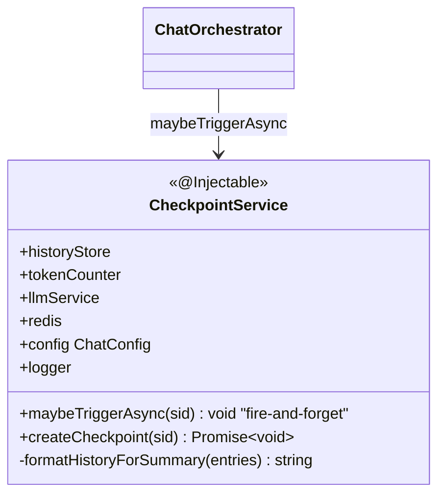
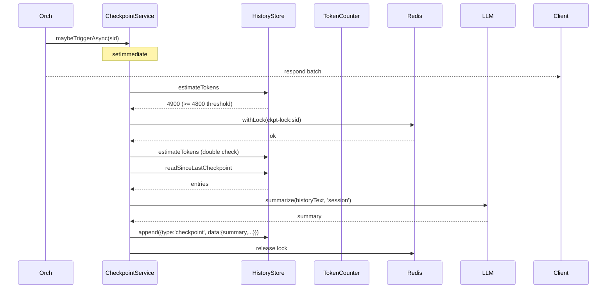

# P06.T2 — Checkpoint Writer (Small AI Summarize)

> **Review**: DONE — xem `Task/WorkPlan/P06_R_review_refactor.md`

## 1. METADATA

| Field | Value |
|-------|-------|
| Task ID | P06.T2 |
| Phase | 6 |
| Depends on | P06.T1 |
| Complexity | Medium |
| Risk | Medium |

---

## 2. MỤC TIÊU & SCOPE

**In-scope**:
- Trong `ChatOrchestratorService.handleUserTurn` sau khi append assistant_batch → kiểm tra token threshold → trigger checkpoint async (fire-and-forget).
- `createCheckpoint(sessionId)` method: format history → summarize (Small AI) → append checkpoint entry.
- Template `summary_session.md`.
- Locking: cùng session chỉ chạy 1 checkpoint tại 1 thời điểm (Redis lock `chat:ckpt-lock:{sid}`).

**Out-of-scope**:
- BullMQ background worker (Phase 8 cho memory). Checkpoint dùng setImmediate inline.

---

## 3. FILES CẦN TẠO / SỬA

| # | Path |
|---|------|
| 1 | `apps/server/src/modules/chat/services/checkpoint.service.ts` (tách logic) |
| 2 | `apps/server/src/modules/chat/services/chat-orchestrator.service.ts` — sửa: gọi checkpoint sau turn |
| 3 | `packages/prompts/v1/summary_session.md` |
| 4 | `apps/server/src/modules/chat/services/checkpoint.service.spec.ts` |

---

## 4. CLASS DIAGRAM



---

## 5. CHI TIẾT

### 5.1. `CheckpointService.maybeTriggerAsync(sid)`

```
maybeTriggerAsync(sid: string): void

Logic:
  // Schedule but don't await
  setImmediate(async () => {
    try {
      tokens = await historyStore.estimateTokens(sid)
      threshold = config.triggerThreshold()
      if tokens < threshold: return
      
      // Acquire single-flight lock
      result = await redis.withLock(`chat:ckpt-lock:${sid}`, 120_000, async () => {
        // Double check after lock
        tokens2 = await historyStore.estimateTokens(sid)
        if tokens2 < threshold: return { skipped: true }
        await createCheckpoint(sid)
        return { created: true }
      })
      logger.debug({ sid, result }, 'checkpoint maybe done')
    } catch (e) {
      logger.error({ sid, err: e }, 'Checkpoint trigger failed')
    }
  })
```

### 5.2. `createCheckpoint(sid)`

```
createCheckpoint(sid: string): Promise<void>

Logic:
  1. entries = await historyStore.readSinceLastCheckpoint(sid)
  2. // entries may start with checkpoint if exists; drop that for summary scope
     contentEntries = entries[0]?.type === 'checkpoint' ? entries.slice(1) : entries
  3. if contentEntries.length === 0 → return  // nothing to summarize
  4. tokensBefore = tokenCounter.estimateHistoryTokens(contentEntries)
  5. historyText = formatHistoryForSummary(contentEntries)
  6. summary = await llmService.summarize(historyText, 'session')
     // safety: trim, max 4000 chars
     if summary.length > 4000: summary = summary.slice(0, 4000) + '...'
  7. await historyStore.append(sid, {
       type: 'checkpoint',
       timestamp: Date.now(),
       data: { summary, tokensBefore, entriesCovered: contentEntries.length }
     })
  8. logger.info({ sid, tokensBefore, entries: contentEntries.length }, 'Checkpoint saved')

Throws: rethrow on summarize fail (caller catch)
```

### 5.3. `formatHistoryForSummary(entries)`

```
Logic:
  lines = []
  for e in entries:
    switch e.type:
      case 'user':
        lines.push(`User: ${e.data.text}`)
        if e.data.ephemeralOOC: lines.push(`(Ngữ cảnh: ${e.data.ephemeralOOC})`)
      case 'assistant_batch':
        for m in e.data.messages:
          emotion = m.emotion ? ` (${m.emotion})` : ''
          lines.push(`${m.characterName}${emotion}: ${m.text}`)
      case 'persistent_ooc': lines.push(`[Bối cảnh: ${e.data.text}]`)
      case 'ephemeral_ooc': lines.push(`[OOC tạm: ${e.data.text}]`)
      // skip system, checkpoint
  return lines.join('\n')
```

### 5.4. `summary_session.md`

```markdown
Bạn là trợ lý tóm tắt. Hãy tóm tắt đoạn hội thoại roleplay sau thành 1 đoạn 200-400 từ tiếng Việt.

GIỮ LẠI:
- Tên nhân vật chính + trạng thái cảm xúc cuối cùng
- Sự kiện chính theo thứ tự thời gian
- Quyết định + thay đổi bối cảnh quan trọng
- Mối quan hệ giữa các nhân vật

BỎ QUA:
- Lời chào, câu hỏi xã giao lặp lại
- Chi tiết phụ
- Từ vựng đơn lẻ

CHỈ TRẢ TÓM TẮT, KHÔNG MARKDOWN, KHÔNG TIÊU ĐỀ.

=== HỘI THOẠI ===
```

### 5.5. ChatOrchestrator integration

```
At end of handleUserTurn (sau bước emit events):
  this.checkpointService.maybeTriggerAsync(ctx.sessionId)
  return result
```

Fire-and-forget: không await để không ảnh hưởng latency response.

---

## 6. SEQUENCE — Checkpoint async



---

## 7. ACCEPTANCE & TEST PLAN

### Acceptance
- [ ] Chat 20+ lượt làm tokens > 4800 → sau lượt cuối, jsonl xuất hiện entry `type:checkpoint`.
- [ ] Lượt tiếp theo: prompt size giảm đáng kể (verify token estimate < 2000 sau checkpoint).
- [ ] AI vẫn nhớ sự kiện chính từ summary.
- [ ] 2 turns gần nhau cùng vượt threshold → chỉ 1 checkpoint được tạo (lock + double-check).
- [ ] LLM summarize fail → log error, không crash main flow, không append checkpoint.

### Unit Tests (mock deps)
- estimateTokens < threshold → no LLM call.
- estimateTokens >= threshold → llm.summarize called + append.
- Lock prevents concurrent → 2nd call returns skipped.
- formatHistoryForSummary produces readable lines.

### Integration (real Ollama + Redis)
- Seed 30 messages → trigger turn → polling đợi checkpoint xuất hiện trong jsonl.
