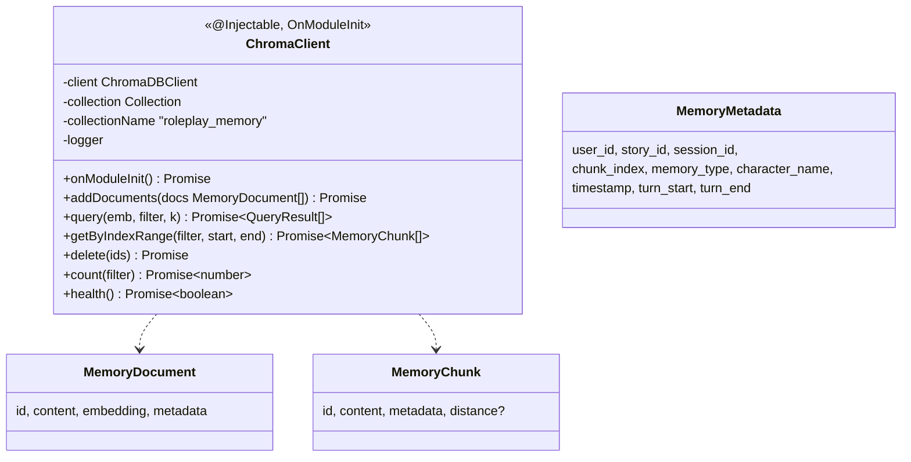
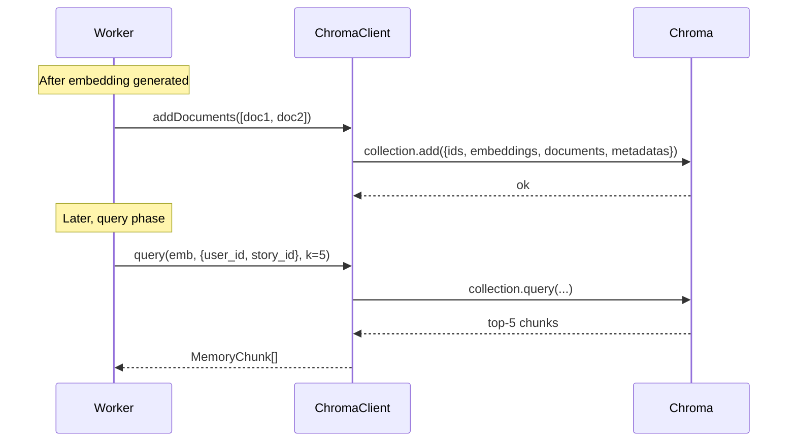

# P08.T1 — ChromaDB Client + Collection Setup

> **Review**: DONE — xem `Task/WorkPlan/P08_R_review_refactor.md`

## 1. METADATA

| Field | Value |
|-------|-------|
| Task ID | P08.T1 |
| Phase | 8 — Memory & RAG |
| Depends on | P07 hoàn thành |
| Complexity | Medium |
| Risk | Medium |

---

## 2. MỤC TIÊU & SCOPE

**In-scope**:
- `MemoryModule` setup.
- `ChromaClient` (OnModuleInit): connect ChromaDB, getOrCreateCollection `roleplay_memory` cosine.
- Methods: `addDocuments`, `query`, `getByIndexRange`, `delete(ids)`, `count(filter)`.
- `MemoryMetadata` type + `MemoryDocument`.

**Out-of-scope**:
- Embedding (T2).
- Worker (T3).

---

## 3. FILES CẦN TẠO

| # | Path |
|---|------|
| 1 | `apps/server/src/modules/memory/memory.module.ts` |
| 2 | `apps/server/src/modules/memory/chroma.client.ts` |
| 3 | `apps/server/src/modules/memory/types/memory-document.ts` |
| 4 | `apps/server/src/config/chroma.config.ts` |
| 5 | `apps/server/src/modules/memory/chroma.client.spec.ts` |
| 6 | `docker-compose.dev.yml` — sửa: thêm service `chroma:` image `chromadb/chroma:latest` port 8000 |

---

## 4. CLASS DIAGRAM



---

## 5. CHI TIẾT

### 5.1. Types

```
type MemoryType = 'plot' | 'character'

type MemoryMetadata = {
  user_id: string
  story_id: string
  session_id: string
  chunk_index: number
  memory_type: MemoryType
  character_name: string | null
  timestamp: number
  turn_start: number
  turn_end: number
}

type MemoryDocument = {
  id: string
  content: string
  embedding: number[]
  metadata: MemoryMetadata
}

type MemoryChunk = {
  id: string
  content: string
  metadata: MemoryMetadata
  distance?: number  // cosine distance từ query
}

type ChromaFilter = Partial<MemoryMetadata> | Record<string, unknown>  // hỗ trợ $gte/$lte cho chunk_index
```

### 5.2. `ChromaClient`

#### `onModuleInit()`

```
- url = config.get('CHROMA_URL')  // http://chroma:8000
- this.client = new ChromaApi.ChromaClient({ path: url })
- try:
    this.collection = await this.client.getOrCreateCollection({
      name: 'roleplay_memory',
      metadata: { 'hnsw:space': 'cosine' }
    })
- catch e:
    logger.error({ err: e }, 'Chroma connect failed')
    throw  // fail startup
```

#### `addDocuments(docs)`

```
addDocuments(docs: MemoryDocument[]): Promise<void>

Input validation:
  - if docs.length === 0 → return
  - each doc must have id, embedding (non-empty), content, metadata

Logic:
  try:
    await this.collection.add({
      ids: docs.map(d => d.id),
      embeddings: docs.map(d => d.embedding),
      documents: docs.map(d => d.content),
      metadatas: docs.map(d => d.metadata),
    })
  catch e:
    throw new AppException(ERR.CHROMA_WRITE_FAIL, e.message)
```

#### `query(emb, filter, k)`

```
query(emb: number[], filter: ChromaFilter, k = 5): Promise<MemoryChunk[]>

Logic:
  res = await this.collection.query({
    queryEmbeddings: [emb],
    where: filter,
    nResults: k
  })
  // res shape: { ids: string[][], distances: number[][], documents: string[][], metadatas: object[][] }
  return res.ids[0].map((id, i) => ({
    id,
    content: res.documents[0][i],
    metadata: res.metadatas[0][i] as MemoryMetadata,
    distance: res.distances[0][i]
  }))

Catch chroma errors → throw CHROMA_QUERY_FAIL
```

#### `getByIndexRange(filter, startIdx, endIdx)`

```
getByIndexRange(filter: ChromaFilter, startIdx: number, endIdx: number): Promise<MemoryChunk[]>

Logic:
  // Chroma $gte/$lte chỉ hỗ trợ 1 operator/key. Phải combine với $and:
  finalWhere = {
    $and: [
      ...Object.entries(filter).map(([k, v]) => ({ [k]: v })),
      { chunk_index: { $gte: startIdx } },
      { chunk_index: { $lte: endIdx } }
    ]
  }
  res = await this.collection.get({ where: finalWhere })
  return res.ids.map((id, i) => ({
    id,
    content: res.documents[i],
    metadata: res.metadatas[i] as MemoryMetadata
  }))
```

#### `delete(ids)`

```
delete(ids: string[]): Promise<void>
  if ids.length === 0 → return
  await this.collection.delete({ ids })
```

#### `count(filter)`

```
count(filter): Promise<number>
  res = await this.collection.get({ where: filter, limit: 1 })  // chroma không có count direct
  // fallback: get all ids → length. Hoặc dùng res.ids if available.
  // Simpler implementation:
  res2 = await this.collection.get({ where: filter, include: [] })
  return res2.ids.length
```

(Trade-off: count quét full → optimize later với separate metric store.)

#### `health()`

```
try:
  await this.client.heartbeat()
  return true
catch:
  return false
```

### 5.3. Error codes (add to registry)

- `CHROMA_WRITE_FAIL`
- `CHROMA_QUERY_FAIL`
- `CHROMA_UNAVAILABLE`

### 5.4. docker-compose.dev.yml addition

```
services:
  chroma:
    image: chromadb/chroma:latest
    ports: ['8000:8000']
    volumes: ['./.data/chroma:/chroma/chroma']
    environment:
      IS_PERSISTENT: TRUE
```

---

## 6. SEQUENCE — Add + Query



---

## 7. ACCEPTANCE & TEST PLAN

### Acceptance
- [ ] Module start → Chroma reachable, collection exists (re-runnable).
- [ ] addDocuments 3 docs → query trả ≥1 doc relevant.
- [ ] Filter `{user_id: 'A'}` → KHÔNG trả docs `user_id: 'B'`.
- [ ] getByIndexRange filter `{user_id, memory_type:'plot', chunk_index in [5..10]}` → đúng items.
- [ ] delete([id1, id2]) → query không còn trả.
- [ ] Chroma down lúc query → throw CHROMA_QUERY_FAIL (caller graceful degrade).

### Tests
- Integration (real chroma container) cho add/query/getByIndexRange/delete.
- Mock chroma client unit tests cho method signatures.
