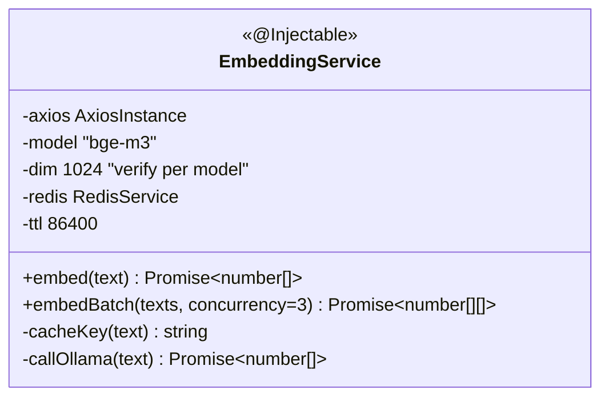
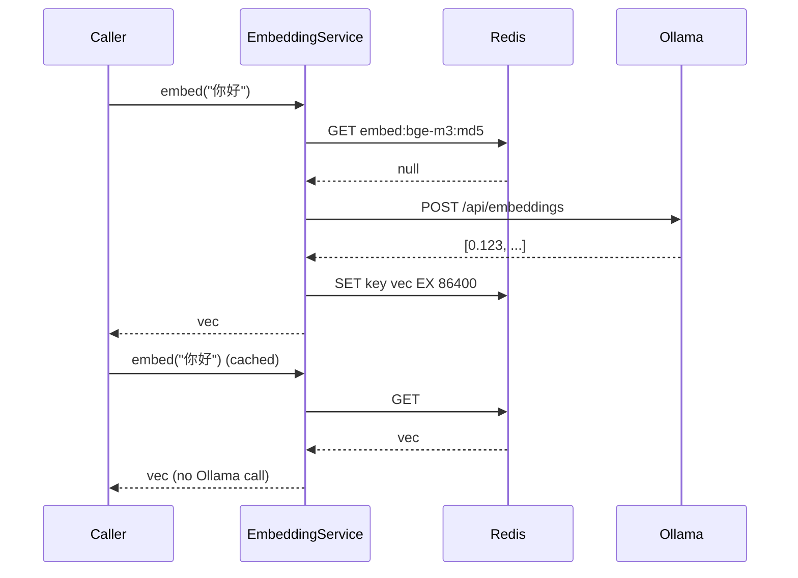

# P08.T2 — EmbeddingService (Ollama bge-m3 + Redis Cache)

> **Review**: DONE — xem `Task/WorkPlan/P08_R_review_refactor.md`

## 1. METADATA

| Field | Value |
|-------|-------|
| Task ID | P08.T2 |
| Phase | 8 |
| Depends on | P08.T1 |
| Complexity | Low |
| Risk | Medium (model download) |

---

## 2. MỤC TIÊU & SCOPE

**In-scope**:
- `EmbeddingService.embed(text)` + `embedBatch(texts, concurrency=3)`.
- Redis cache `embed:{md5(text)}` TTL 24h.
- Error mapping `EMBED_UNAVAILABLE`.
- Pre-req doc: `ollama pull bge-m3`.

---

## 3. FILES CẦN TẠO

| # | Path |
|---|------|
| 1 | `apps/server/src/modules/memory/embedding.service.ts` |
| 2 | `apps/server/src/modules/memory/embedding.service.spec.ts` |
| 3 | `Document/technical documentation/setup_models.md` (cập nhật) |

---

## 4. CLASS DIAGRAM



---

## 5. CHI TIẾT

### 5.1. Constructor

```
constructor(cfg, redis):
  this.axios = axios.create({ baseURL: cfg.get('OLLAMA_URL'), timeout: 30_000 })
  this.model = cfg.get('EMBED_MODEL', 'bge-m3')
  this.redis = redis
```

### 5.2. `embed(text)`

```
embed(text: string): Promise<number[]>

Input: text.length > 0; nếu > 8000 chars → truncate to 8000 (most embed models cap)

Logic:
  trimmed = text.trim().slice(0, 8000)
  if !trimmed → throw INVALID_PAYLOAD
  
  key = cacheKey(trimmed)
  cached = await redis.get(key)
  if cached: return JSON.parse(cached)
  
  vec = await callOllama(trimmed)
  if !Array.isArray(vec) || vec.length === 0 → throw EMBED_UNAVAILABLE
  
  await redis.set(key, JSON.stringify(vec), 86400)
  return vec
```

### 5.3. `cacheKey(text)`

```
return `embed:${this.model}:${crypto.createHash('md5').update(text).digest('hex')}`
```

### 5.4. `callOllama(text)`

```
Logic:
  try:
    res = await this.axios.post('/api/embeddings', { model: this.model, prompt: text })
    return res.data.embedding as number[]
  catch e:
    if e.code in [ECONNREFUSED, ECONNABORTED] → throw AppException(ERR.EMBED_UNAVAILABLE, e.code)
    throw AppException(ERR.EMBED_UNAVAILABLE, e.message)
```

### 5.5. `embedBatch(texts, concurrency=3)`

```
embedBatch(texts: string[], concurrency = 3): Promise<number[][]>

Logic:
  // Use p-limit pattern
  limit = pLimit(concurrency)
  return await Promise.all(texts.map(t => limit(() => this.embed(t))))
```

(Cài `p-limit` package.)

### 5.6. Error code addition

`EMBED_UNAVAILABLE` → maps 503.

### 5.7. Setup docs

Add to `setup_models.md`:
```
ollama pull bge-m3
# Verify: curl http://localhost:11434/api/embeddings -d '{"model":"bge-m3","prompt":"test"}'
```

---

## 6. SEQUENCE — embed with cache



---

## 7. ACCEPTANCE & TEST PLAN

### Acceptance
- [ ] embed("你好") returns float array length matches model dim (1024 cho bge-m3).
- [ ] Second call same text → cache hit (verify Ollama not called).
- [ ] Different text → different vector.
- [ ] embedBatch 5 texts → concurrency ≤ 3.
- [ ] Ollama down → EMBED_UNAVAILABLE.
- [ ] Empty string → INVALID_PAYLOAD.
- [ ] 10_000-char text → truncated to 8000, succeeds.

### Tests
- Unit: mock axios + Redis.
- Integration with real Ollama (sau khi pull bge-m3).
